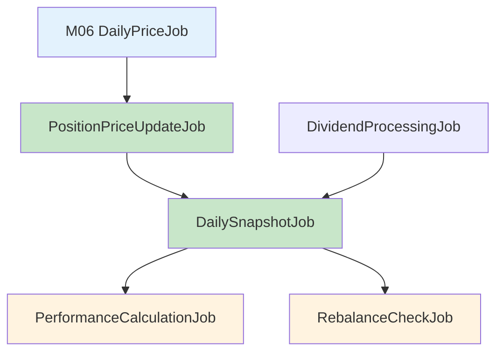

# M18 投資組合管理 Job 排程配置

## 文件資訊
| 項目 | 內容 |
|------|------|
| 模組代號 | M18 |
| 模組名稱 | 投資組合管理 Portfolio Management |
| 文件版本 | 1.0 |
| 建立日期 | 2026-01-15 |

---

## Job 總覽

| # | Job 名稱 | 排程時間 | 說明 | 優先序 |
|---|---------|---------|------|--------|
| 1 | PositionPriceUpdateJob | 每日 13:35 | 更新持倉現價與市值 | P0 |
| 2 | DailySnapshotJob | 每日 14:00 | 產生每日投組快照 | P0 |
| 3 | PerformanceCalculationJob | 每日 14:30 | 計算績效指標 (TWR/MWR) | P1 |
| 4 | DividendProcessingJob | 每日 09:00 | 處理股利發放 | P1 |
| 5 | RebalanceCheckJob | 每日 15:00 | 檢查再平衡條件 | P2 |
| 6 | MonthlyAttributionJob | 每月 1 日 06:00 | 計算月度 Brinson 歸因 | P2 |
| 7 | ReportCleanupJob | 每日 03:00 | 清理過期報告檔案 | P3 |
| 8 | SnapshotArchiveJob | 每月 1 日 04:00 | 歸檔歷史快照 | P3 |

---

## Job 詳細設計

### 1. PositionPriceUpdateJob

**用途：** 收盤後更新所有持倉的現價與市值計算。

```yaml
Job:
  name: PositionPriceUpdateJob
  group: M18_PORTFOLIO
  schedule:
    cron: "0 35 13 ? * MON-FRI"
    timezone: Asia/Taipei
  config:
    timeout: 10m
    retryCount: 3
    retryDelay: 30s
    concurrent: false
  dependencies:
    - M06_DailyPriceJob  # 確保股價已更新
```

**執行邏輯：**
```java
@Component
public class PositionPriceUpdateJob implements Job {

    @Override
    public void execute(JobExecutionContext context) {
        log.info("開始更新持倉價格");
        LocalDate today = LocalDate.now();

        // 1. 取得所有活躍投組的持倉
        List<Position> positions = positionRepository
            .findAllActivePositions();

        int updated = 0;
        int errors = 0;

        for (Position pos : positions) {
            try {
                // 2. 取得最新收盤價
                StockPrice price = stockPriceRepository
                    .findByStockIdAndDate(pos.getStockId(), today)
                    .orElse(null);

                if (price != null) {
                    pos.setCurrentPrice(price.getClose());
                    pos.setMarketValue(pos.getShares().multiply(price.getClose()));
                    pos.setUnrealizedPnL(pos.getMarketValue().subtract(pos.getTotalCost()));
                    pos.setUnrealizedPnLPct(
                        pos.getTotalCost().compareTo(BigDecimal.ZERO) > 0
                            ? pos.getUnrealizedPnL().divide(pos.getTotalCost(), 6, RoundingMode.HALF_UP)
                            : BigDecimal.ZERO
                    );
                    positionRepository.save(pos);
                    updated++;
                }
            } catch (Exception e) {
                log.error("持倉價格更新失敗: positionId={}", pos.getId(), e);
                errors++;
            }
        }

        log.info("持倉價格更新完成: updated={}, errors={}", updated, errors);
    }
}
```

**監控指標：**
| 指標 | 告警閾值 | 說明 |
|------|---------|------|
| execution_time | > 5 分鐘 | 執行時間過長 |
| error_count | > 10 | 更新失敗數過多 |
| update_rate | < 95% | 更新成功率過低 |

---

### 2. DailySnapshotJob

**用途：** 每日收盤後產生投組快照，記錄當日市值與報酬。

```yaml
Job:
  name: DailySnapshotJob
  group: M18_PORTFOLIO
  schedule:
    cron: "0 0 14 ? * MON-FRI"
    timezone: Asia/Taipei
  config:
    timeout: 15m
    retryCount: 3
    retryDelay: 60s
    concurrent: false
  dependencies:
    - PositionPriceUpdateJob  # 確保持倉價格已更新
```

**執行邏輯：**
```java
@Component
public class DailySnapshotJob implements Job {

    @Override
    public void execute(JobExecutionContext context) {
        log.info("開始產生每日快照");
        LocalDate today = LocalDate.now();

        List<Portfolio> portfolios = portfolioRepository
            .findByStatus(PortfolioStatus.ACTIVE);

        int created = 0;
        int errors = 0;

        for (Portfolio portfolio : portfolios) {
            try {
                // 檢查是否已有今日快照
                if (snapshotRepository.existsByPortfolioIdAndDate(portfolio.getId(), today)) {
                    log.debug("快照已存在: portfolioId={}, date={}", portfolio.getId(), today);
                    continue;
                }

                // 產生快照
                snapshotService.generateSnapshot(portfolio, today);
                created++;

            } catch (Exception e) {
                log.error("快照產生失敗: portfolioId={}", portfolio.getId(), e);
                errors++;
            }
        }

        // 更新 Job 執行統計
        context.setResult(Map.of(
            "portfoliosProcessed", portfolios.size(),
            "snapshotsCreated", created,
            "errors", errors
        ));

        log.info("每日快照產生完成: created={}, errors={}", created, errors);
    }
}
```

**Quartz 配置：**
```java
@Configuration
public class DailySnapshotJobConfig {

    @Bean
    public JobDetail dailySnapshotJobDetail() {
        return JobBuilder.newJob(DailySnapshotJob.class)
            .withIdentity("DailySnapshotJob", "M18_PORTFOLIO")
            .withDescription("產生每日投組快照")
            .storeDurably()
            .build();
    }

    @Bean
    public Trigger dailySnapshotTrigger() {
        return TriggerBuilder.newTrigger()
            .forJob(dailySnapshotJobDetail())
            .withIdentity("DailySnapshotTrigger", "M18_PORTFOLIO")
            .withSchedule(CronScheduleBuilder
                .cronSchedule("0 0 14 ? * MON-FRI")
                .inTimeZone(TimeZone.getTimeZone("Asia/Taipei")))
            .build();
    }
}
```

---

### 3. PerformanceCalculationJob

**用途：** 計算各期間績效指標（TWR、MWR、風險指標等）。

```yaml
Job:
  name: PerformanceCalculationJob
  group: M18_PORTFOLIO
  schedule:
    cron: "0 30 14 ? * MON-FRI"
    timezone: Asia/Taipei
  config:
    timeout: 30m
    retryCount: 2
    retryDelay: 120s
    concurrent: false
    batchSize: 50
  dependencies:
    - DailySnapshotJob
```

**執行邏輯：**
```java
@Component
public class PerformanceCalculationJob implements Job {

    private static final List<String> PERIODS = List.of(
        "DAILY", "WEEKLY", "MONTHLY", "YTD", "1Y", "INCEPTION"
    );

    @Override
    public void execute(JobExecutionContext context) {
        log.info("開始計算績效指標");
        LocalDate today = LocalDate.now();

        List<Portfolio> portfolios = portfolioRepository
            .findByStatus(PortfolioStatus.ACTIVE);

        int calculated = 0;
        int errors = 0;

        for (Portfolio portfolio : portfolios) {
            for (String period : PERIODS) {
                try {
                    LocalDate startDate = calculateStartDate(today, period, portfolio);

                    // 計算 TWR
                    BigDecimal twr = performanceService.calculateTWR(
                        portfolio.getId(), startDate, today).getTwr();

                    // 計算 MWR
                    BigDecimal mwr = performanceService.calculateMWR(
                        portfolio.getId(), startDate, today);

                    // 計算風險指標
                    RiskMetrics risk = performanceService.calculateRiskMetrics(
                        portfolio.getId(), startDate, today);

                    // 儲存績效記錄
                    Performance perf = new Performance();
                    perf.setId(IdGenerator.generate("perf"));
                    perf.setPortfolioId(portfolio.getId());
                    perf.setCalcDate(today);
                    perf.setPeriodType(period);
                    perf.setPeriodStart(startDate);
                    perf.setPeriodEnd(today);
                    perf.setTwr(twr);
                    perf.setMwr(mwr);
                    perf.setVolatility(risk.getVolatility());
                    perf.setSharpeRatio(risk.getSharpe());
                    perf.setSortinoRatio(risk.getSortino());
                    perf.setMaxDrawdown(risk.getMaxDrawdown());
                    perf.setBeta(risk.getBeta());
                    perf.setAlpha(risk.getAlpha());

                    // 基準比較
                    if (portfolio.getBenchmarkId() != null) {
                        BigDecimal bmReturn = benchmarkService
                            .getReturn(portfolio.getBenchmarkId(), startDate, today);
                        perf.setBenchmarkId(portfolio.getBenchmarkId());
                        perf.setBenchmarkReturn(bmReturn);
                        perf.setExcessReturn(twr.subtract(bmReturn));
                    }

                    performanceRepository.save(perf);
                    calculated++;

                } catch (Exception e) {
                    log.error("績效計算失敗: portfolioId={}, period={}",
                        portfolio.getId(), period, e);
                    errors++;
                }
            }
        }

        log.info("績效計算完成: calculated={}, errors={}", calculated, errors);
    }

    private LocalDate calculateStartDate(LocalDate today, String period, Portfolio portfolio) {
        return switch (period) {
            case "DAILY" -> today.minusDays(1);
            case "WEEKLY" -> today.minusWeeks(1);
            case "MONTHLY" -> today.minusMonths(1);
            case "YTD" -> today.withDayOfYear(1);
            case "1Y" -> today.minusYears(1);
            case "INCEPTION" -> portfolio.getCreatedAt().toLocalDate();
            default -> today.minusMonths(1);
        };
    }
}
```

---

### 4. DividendProcessingJob

**用途：** 掃描除息日、處理股利發放、執行股利再投資。

```yaml
Job:
  name: DividendProcessingJob
  group: M18_PORTFOLIO
  schedule:
    cron: "0 0 9 ? * MON-FRI"
    timezone: Asia/Taipei
  config:
    timeout: 15m
    retryCount: 3
    retryDelay: 60s
    concurrent: false
```

**執行邏輯：**
```java
@Component
public class DividendProcessingJob implements Job {

    @Override
    public void execute(JobExecutionContext context) {
        log.info("開始處理股利");
        LocalDate today = LocalDate.now();

        // 1. 處理今日除息
        processExDividend(today);

        // 2. 處理今日發放
        processDividendPayment(today);

        log.info("股利處理完成");
    }

    private void processExDividend(LocalDate date) {
        // 取得今日除息的股票
        List<DividendEvent> events = dividendService.getExDividendStocks(date);

        for (DividendEvent event : events) {
            // 找出持有該股票的投組
            List<Position> positions = positionRepository
                .findByStockIdAndSharesGreaterThan(event.getStockId(), BigDecimal.ZERO);

            for (Position pos : positions) {
                try {
                    // 建立股利記錄
                    dividendService.createDividendRecord(pos, event);
                } catch (Exception e) {
                    log.error("股利記錄建立失敗: positionId={}, event={}",
                        pos.getId(), event.getStockId(), e);
                }
            }
        }
    }

    private void processDividendPayment(LocalDate date) {
        // 取得今日應發放的股利
        List<Dividend> dividends = dividendRepository
            .findByPayDateAndStatus(date, DividendStatus.PENDING);

        for (Dividend dividend : dividends) {
            try {
                dividendService.processDividendPayment(dividend);
            } catch (Exception e) {
                log.error("股利發放處理失敗: dividendId={}", dividend.getId(), e);
            }
        }
    }
}
```

---

### 5. RebalanceCheckJob

**用途：** 檢查投組權重偏離，為啟用自動再平衡的投組產生建議。

```yaml
Job:
  name: RebalanceCheckJob
  group: M18_PORTFOLIO
  schedule:
    cron: "0 0 15 ? * MON-FRI"
    timezone: Asia/Taipei
  config:
    timeout: 10m
    retryCount: 2
    concurrent: false
```

**執行邏輯：**
```java
@Component
public class RebalanceCheckJob implements Job {

    @Override
    public void execute(JobExecutionContext context) {
        log.info("開始檢查再平衡");

        // 取得啟用自動再平衡的投組
        List<Portfolio> portfolios = portfolioRepository
            .findByStatusAndAutoRebalance(PortfolioStatus.ACTIVE, true);

        int checked = 0;
        int needsRebalance = 0;

        for (Portfolio portfolio : portfolios) {
            try {
                RebalanceRecommendation result = rebalanceService
                    .analyzeRebalance(portfolio.getId());

                if (result.isNeedsRebalance()) {
                    needsRebalance++;

                    // 發送再平衡提醒
                    notificationService.sendRebalanceAlert(
                        portfolio.getId(),
                        result
                    );

                    log.info("投組需要再平衡: portfolioId={}, deviations={}",
                        portfolio.getId(), result.getRecommendations().size());
                }

                checked++;

            } catch (Exception e) {
                log.error("再平衡檢查失敗: portfolioId={}", portfolio.getId(), e);
            }
        }

        log.info("再平衡檢查完成: checked={}, needsRebalance={}", checked, needsRebalance);
    }
}
```

---

### 6. MonthlyAttributionJob

**用途：** 每月計算 Brinson 績效歸因分析。

```yaml
Job:
  name: MonthlyAttributionJob
  group: M18_PORTFOLIO
  schedule:
    cron: "0 0 6 1 * ?"
    timezone: Asia/Taipei
  config:
    timeout: 60m
    retryCount: 2
    retryDelay: 300s
    concurrent: false
```

**執行邏輯：**
```java
@Component
public class MonthlyAttributionJob implements Job {

    @Override
    public void execute(JobExecutionContext context) {
        log.info("開始計算月度績效歸因");

        // 計算上個月的歸因
        LocalDate today = LocalDate.now();
        LocalDate monthStart = today.minusMonths(1).withDayOfMonth(1);
        LocalDate monthEnd = today.minusMonths(1).with(TemporalAdjusters.lastDayOfMonth());

        List<Portfolio> portfolios = portfolioRepository
            .findByStatusAndBenchmarkIdIsNotNull(PortfolioStatus.ACTIVE);

        int calculated = 0;
        int errors = 0;

        for (Portfolio portfolio : portfolios) {
            try {
                attributionService.calculateBrinsonAttribution(
                    portfolio.getId(), monthStart, monthEnd);
                calculated++;

            } catch (Exception e) {
                log.error("歸因計算失敗: portfolioId={}", portfolio.getId(), e);
                errors++;
            }
        }

        log.info("月度歸因計算完成: calculated={}, errors={}", calculated, errors);
    }
}
```

---

### 7. ReportCleanupJob

**用途：** 清理過期的報告檔案。

```yaml
Job:
  name: ReportCleanupJob
  group: M18_PORTFOLIO
  schedule:
    cron: "0 0 3 * * ?"
    timezone: Asia/Taipei
  config:
    timeout: 30m
    retryCount: 1
    concurrent: false
    retentionDays: 7
```

**執行邏輯：**
```java
@Component
public class ReportCleanupJob implements Job {

    @Value("${m18.report.retention-days:7}")
    private int retentionDays;

    @Override
    public void execute(JobExecutionContext context) {
        log.info("開始清理過期報告");

        OffsetDateTime cutoff = OffsetDateTime.now().minusDays(retentionDays);

        // 1. 查詢過期報告
        List<Report> expiredReports = reportRepository
            .findByStatusAndExpiresAtBefore(ReportStatus.COMPLETED, cutoff);

        int deleted = 0;
        int errors = 0;

        for (Report report : expiredReports) {
            try {
                // 刪除檔案
                if (report.getFilePath() != null) {
                    storageService.deleteFile(report.getFilePath());
                }

                // 更新狀態
                report.setStatus(ReportStatus.EXPIRED);
                report.setFilePath(null);
                reportRepository.save(report);

                deleted++;

            } catch (Exception e) {
                log.error("報告清理失敗: reportId={}", report.getId(), e);
                errors++;
            }
        }

        log.info("報告清理完成: deleted={}, errors={}", deleted, errors);
    }
}
```

---

### 8. SnapshotArchiveJob

**用途：** 歸檔超過 3 年的快照資料。

```yaml
Job:
  name: SnapshotArchiveJob
  group: M18_PORTFOLIO
  schedule:
    cron: "0 0 4 1 * ?"
    timezone: Asia/Taipei
  config:
    timeout: 120m
    retryCount: 1
    concurrent: false
    archiveAfterYears: 3
```

**執行邏輯：**
```java
@Component
public class SnapshotArchiveJob implements Job {

    @Value("${m18.snapshot.archive-after-years:3}")
    private int archiveAfterYears;

    @Override
    public void execute(JobExecutionContext context) {
        log.info("開始歸檔歷史快照");

        LocalDate cutoffDate = LocalDate.now().minusYears(archiveAfterYears);

        // 1. 壓縮並匯出舊資料
        int archivedSnapshots = archiveOldSnapshots(cutoffDate);
        int archivedPositions = archiveOldSnapshotPositions(cutoffDate);

        // 2. 刪除已歸檔資料
        snapshotPositionRepository.deleteBySnapshotDateBefore(cutoffDate);
        // 主表 snapshots 保留但移至歸檔分區

        log.info("快照歸檔完成: snapshots={}, positions={}",
            archivedSnapshots, archivedPositions);
    }

    private int archiveOldSnapshots(LocalDate cutoffDate) {
        // 實作壓縮歸檔邏輯
        String archiveFile = String.format("snapshots_archive_%s.parquet",
            cutoffDate.format(DateTimeFormatter.ISO_DATE));

        return snapshotRepository.archiveBefore(cutoffDate, archiveFile);
    }
}
```

---

## Job 執行順序

### 每日執行時序

```
09:00  DividendProcessingJob
         ↓
13:35  PositionPriceUpdateJob
         ↓
14:00  DailySnapshotJob
         ↓
14:30  PerformanceCalculationJob
         ↓
15:00  RebalanceCheckJob
```

### 依賴關係圖



---

## 監控與告警

### Dashboard 指標

| 指標名稱 | 說明 | 告警條件 |
|---------|------|---------|
| job_execution_time | Job 執行時間 | > 2x 平均值 |
| job_failure_count | Job 失敗次數 | > 2 次/天 |
| snapshot_coverage | 快照覆蓋率 | < 98% |
| performance_calc_lag | 績效計算延遲 | > 30 分鐘 |
| dividend_processing_errors | 股利處理錯誤 | > 0 |

### 告警設定

```yaml
alerts:
  - name: DailySnapshotJobFailed
    condition: job_status{job="DailySnapshotJob"} == "FAILED"
    severity: critical
    notification:
      - email
      - slack

  - name: PerformanceCalcDelayed
    condition: time() - job_last_success{job="PerformanceCalculationJob"} > 3600
    severity: warning
    notification:
      - slack

  - name: HighJobExecutionTime
    condition: job_execution_time{group="M18_PORTFOLIO"} > threshold * 2
    severity: warning
    notification:
      - slack
```

---

## 故障處理

### 常見問題與解決方案

| 問題 | 原因 | 解決方案 |
|------|------|---------|
| 快照產生失敗 | 股價資料未更新 | 等待 M06 Job 完成後重試 |
| 績效計算錯誤 | 快照資料不連續 | 補建缺失快照後重算 |
| 股利重複處理 | Job 重複執行 | 檢查冪等性保護 |
| 歸因計算超時 | 投組數量過多 | 增加批次處理 |

### 手動補執行

```bash
# 補執行特定日期的快照
curl -X POST http://localhost:8080/api/v1/admin/jobs/DailySnapshotJob/execute \
  -H "Content-Type: application/json" \
  -d '{"date": "2026-01-14"}'

# 重算特定投組績效
curl -X POST http://localhost:8080/api/v1/admin/jobs/PerformanceCalculationJob/execute \
  -H "Content-Type: application/json" \
  -d '{"portfolioId": "pf_001", "periods": ["MONTHLY", "YTD"]}'
```

---

## 效能建議

1. **批次處理：** 大量投組使用分批處理，避免記憶體溢出
2. **並行計算：** 績效計算可並行處理不同投組
3. **快取利用：** 股價資料使用 Redis 快取減少查詢
4. **資料分區：** 快照表按月分區提升查詢效能
5. **增量計算：** 績效指標支援增量更新而非全量重算
