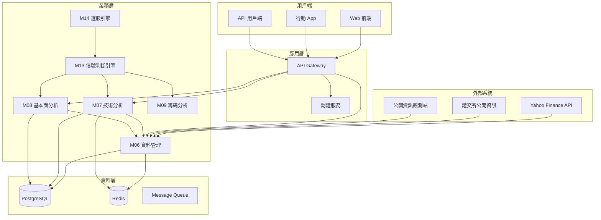
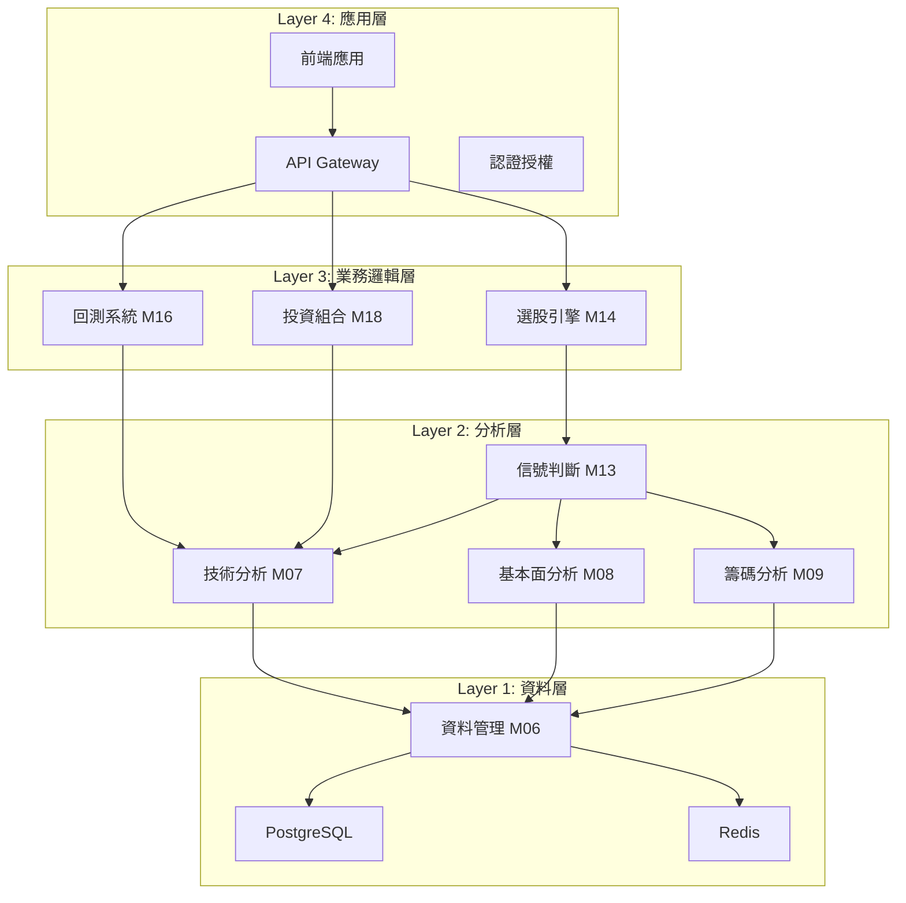
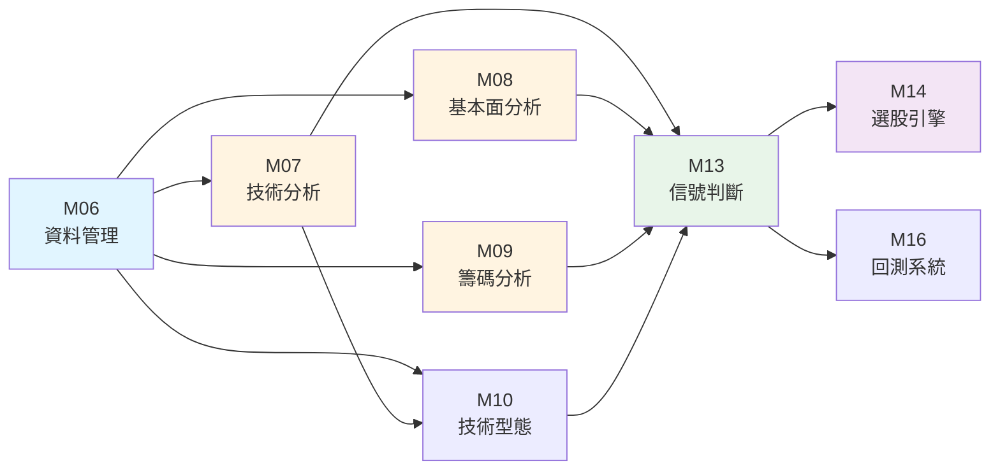
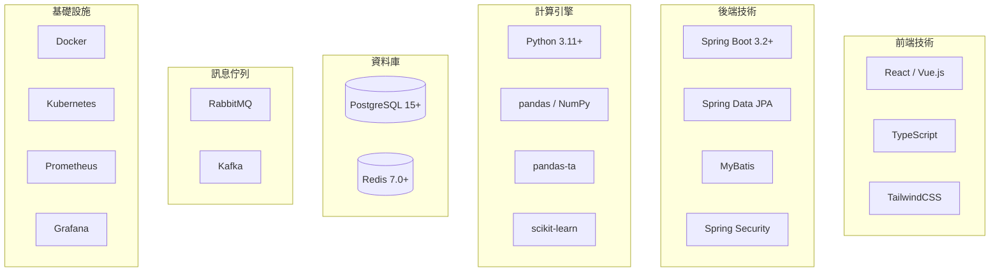
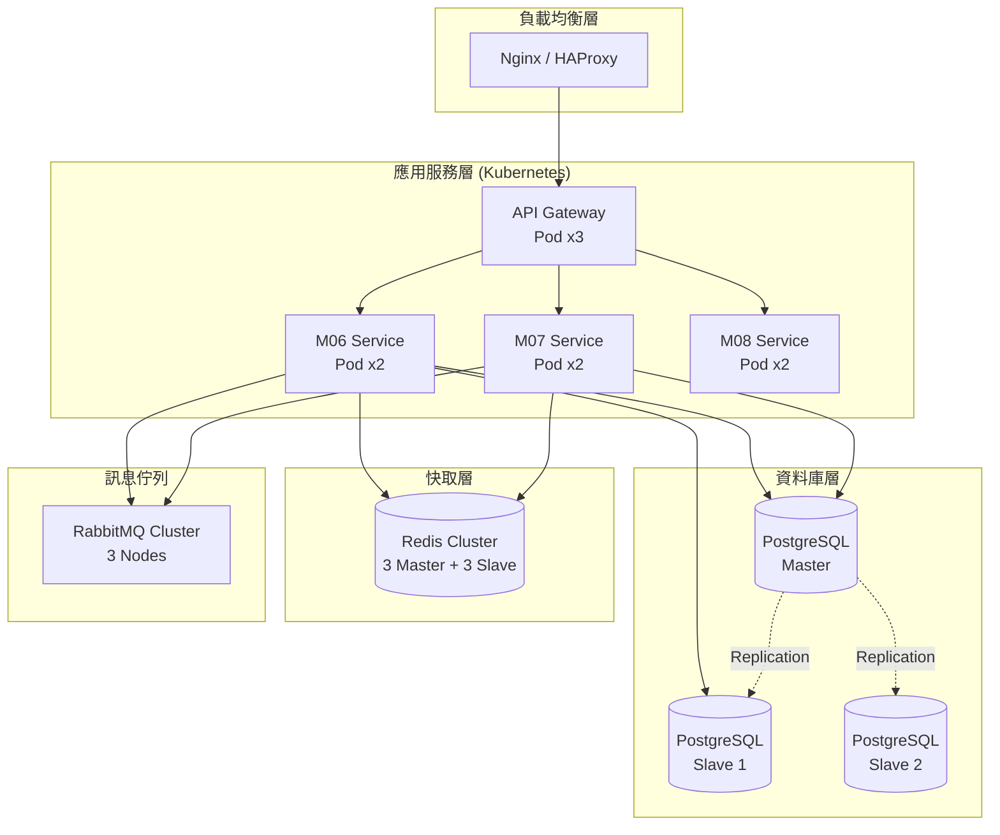
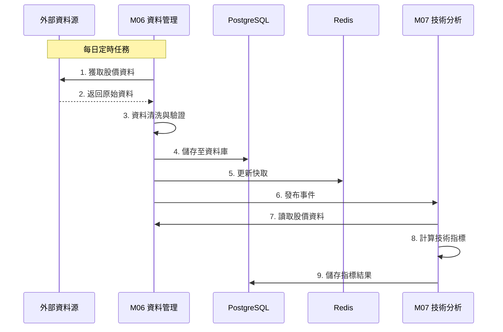
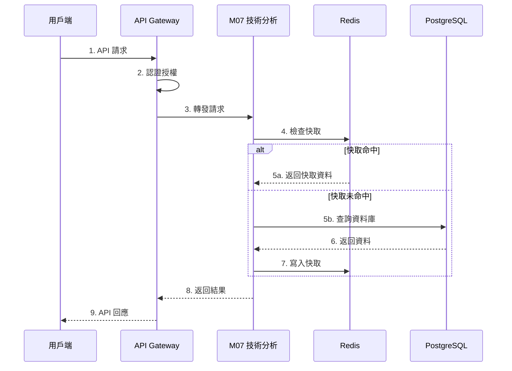

# 00-系統架構圖

> **文件編號**: ARCH-00  
> **文件名稱**: 系統架構圖  
> **版本**: v2.0  
> **最後更新**: 2025-12-31  
> **狀態**: Draft

---

## 📑 目錄

1. [系統整體架構](#1-系統整體架構)
2. [分層架構](#2-分層架構)
3. [模組架構](#3-模組架構)
4. [技術架構](#4-技術架構)
5. [部署架構](#5-部署架構)
6. [資料流架構](#6-資料流架構)

---

## 1. 系統整體架構

### 1.1 高階架構圖

### 1.2 系統特性

| 特性 | 說明 |
|-----|------|
| **架構模式** | 微服務架構 + 分層架構 |
| **通訊協定** | REST API / gRPC (模組間) |
| **資料庫** | PostgreSQL 15+ (主要), Redis 7.0 (快取) |
| **訊息佇列** | RabbitMQ / Kafka (事件驅動) |
| **容器化** | Docker + Kubernetes |
| **程式語言** | Java 17+ (Spring Boot), Python 3.11+ (計算引擎) |

---

## 2. 分層架構

### 2.1 四層架構設計

### 2.2 各層職責

| 層級 | 名稱 | 職責 | 核心模組 |
|-----|------|-----|---------|
| **L4** | 應用層 | 用戶介面、請求路由、認證授權 | API Gateway, 前端 |
| **L3** | 業務邏輯層 | 選股、回測、投資組合管理 | M14, M16, M18 |
| **L2** | 分析層 | 技術分析、基本面分析、信號產生 | M07, M08, M09, M13 |
| **L1** | 資料層 | 資料獲取、儲存、查詢 | M06, PostgreSQL, Redis |

---

## 3. 模組架構

### 3.1 模組依賴關係圖

### 3.2 模組分類

| 分類 | 模組 | 說明 |
|-----|------|------|
| **基礎層** | M06 | 資料管理模組（無依賴） |
| **分析層** | M07, M08, M09, M10 | 各類分析模組（依賴 M06） |
| **決策層** | M13 | 信號判斷引擎（依賴分析層） |
| **應用層** | M14, M16, M18 | 選股、回測、投資組合（依賴決策層） |

---

## 4. 技術架構

### 4.1 技術堆疊

### 4.2 技術選型理由

| 技術 | 選型理由 |
|-----|---------|
| **Spring Boot** | 成熟的企業級框架，生態完整，易於維護 |
| **PostgreSQL** | 支援 JSONB、陣列、分區，適合金融資料 |
| **Redis** | 高效能快取，支援多種資料結構 |
| **MyBatis** | 靈活的 SQL 控制，適合複雜查詢 |
| **pandas-ta** | 豐富的技術指標庫，計算效率高 |
| **Kubernetes** | 容器編排，支援自動擴展與故障恢復 |

---

## 5. 部署架構

### 5.1 生產環境部署圖

### 5.2 環境規劃

| 環境 | 用途 | 配置 |
|-----|------|-----|
| **開發環境** | 開發測試 | 單機部署，最小資源 |
| **測試環境** | 整合測試 | 模擬生產，中等資源 |
| **預發環境** | 上線前驗證 | 與生產一致 |
| **生產環境** | 正式服務 | 高可用架構，多節點 |

---

## 6. 資料流架構

### 6.1 資料獲取流程

### 6.2 API 查詢流程

---

## 📚 相關文檔

- [技術架構](../specs/technical/00-技術架構.md)
- [全系統契約](../specs/technical/00-全系統契約.md)
- [資料庫架構](./database-schema.md)
- [NFR非功能性需求](../specs/technical/00-NFR非功能性需求.md)

---

**文件維護者**: 系統架構師  
**最後更新**: 2025-12-31  
**下次審核**: 2026-02-28
