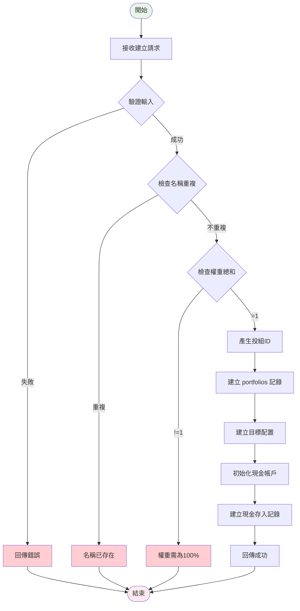
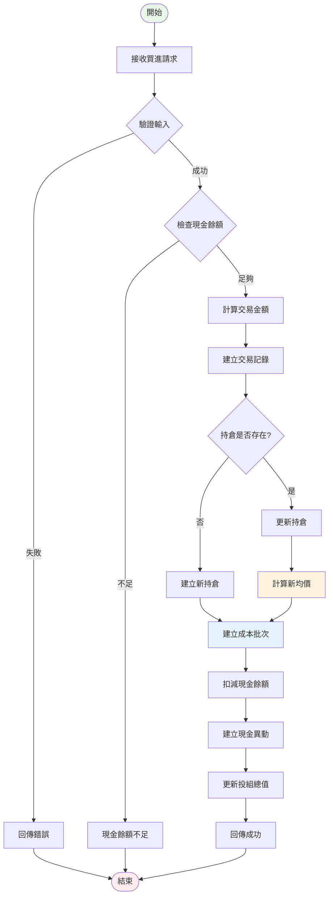
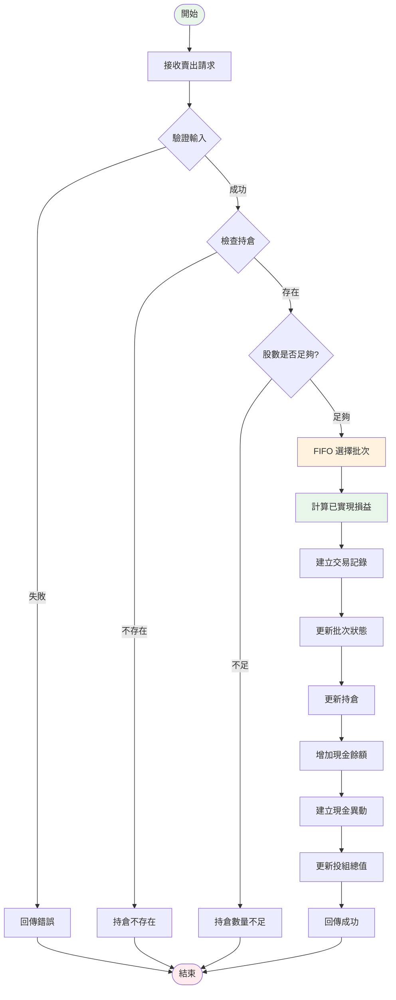
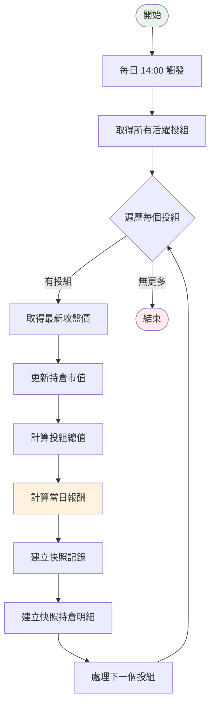
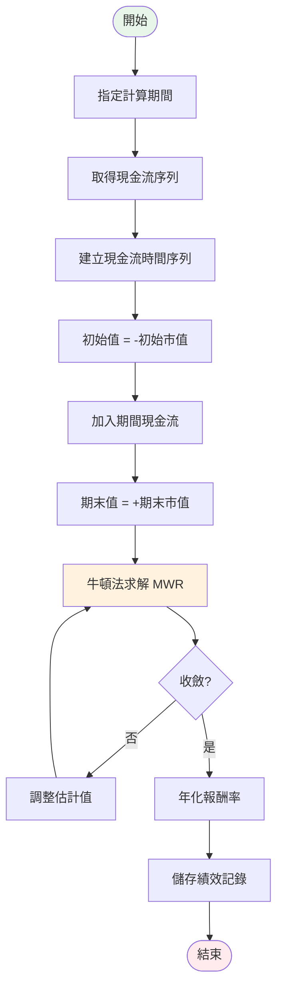
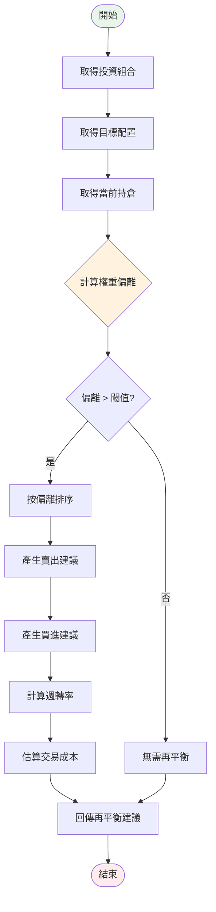
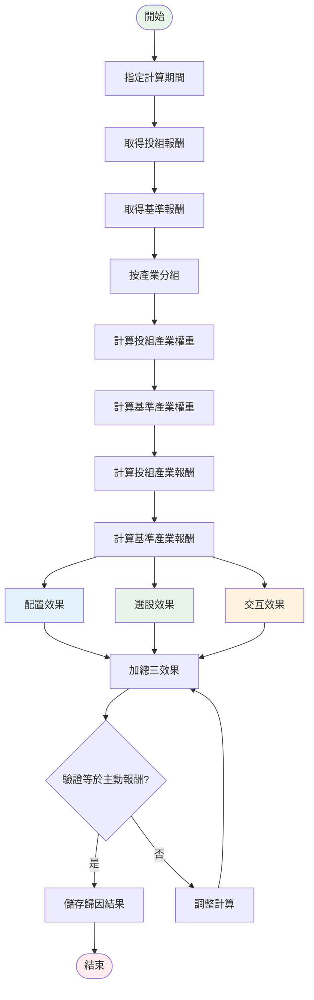
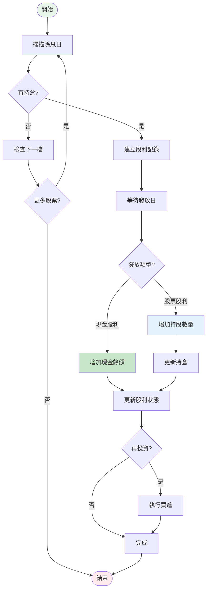
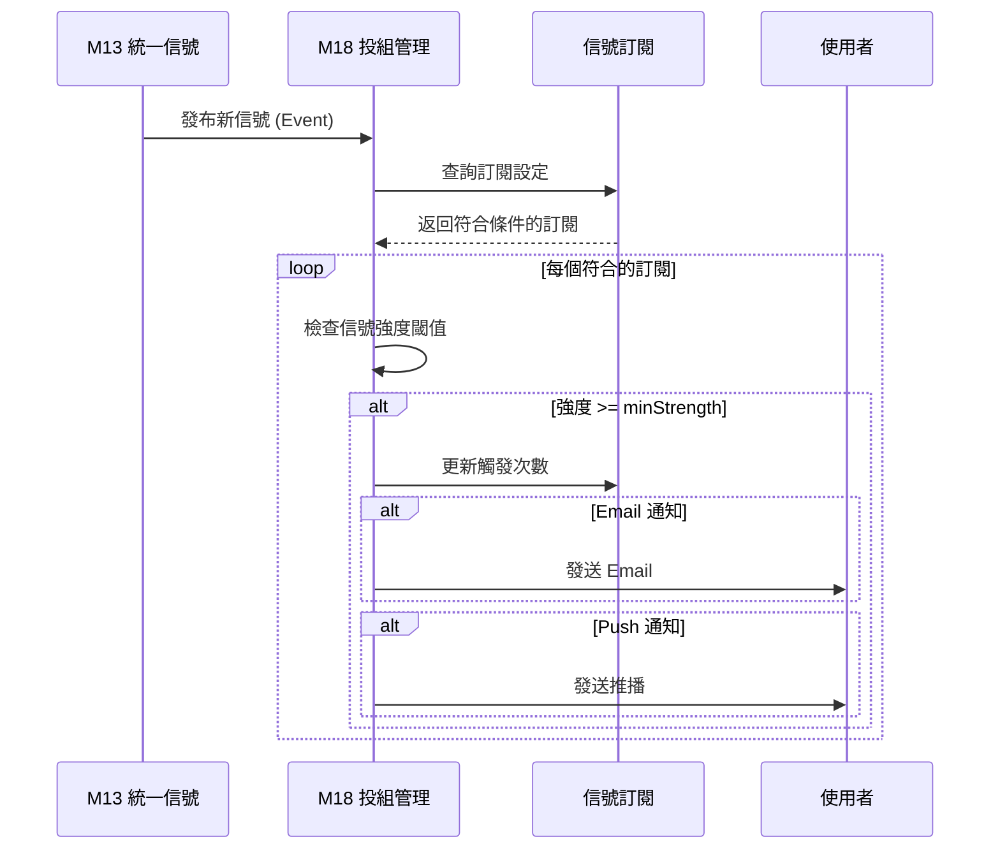
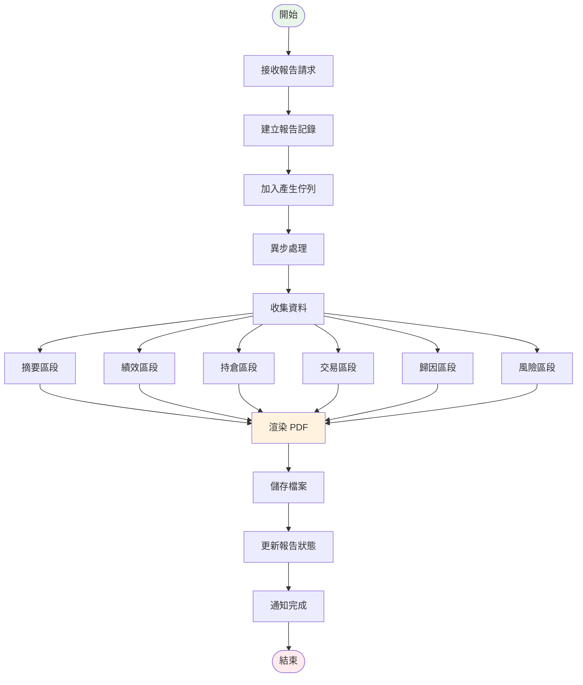

# M18 投資組合管理 業務流程

## 文件資訊
| 項目 | 內容 |
|------|------|
| 模組代號 | M18 |
| 模組名稱 | 投資組合管理 Portfolio Management |
| 文件版本 | 1.0 |
| 建立日期 | 2026-01-15 |

---

## 流程總覽

| # | 流程名稱 | 觸發方式 | 說明 |
|---|---------|---------|------|
| 1 | 投資組合建立 | API 呼叫 | 建立新投資組合 |
| 2 | 交易處理 (買進) | API 呼叫 | 買進股票，計算移動加權平均成本 |
| 3 | 交易處理 (賣出) | API 呼叫 | 賣出股票，FIFO 計算已實現損益 |
| 4 | 每日快照產生 | 排程 Job | 收盤後產生投組快照 |
| 5 | 績效計算 (TWR) | 排程 Job | 計算時間加權報酬率 |
| 6 | 績效計算 (MWR) | 排程 Job | 計算金額加權報酬率 |
| 7 | 再平衡分析 | API 呼叫 | 分析權重偏離並產生建議 |
| 8 | Brinson 績效歸因 | 排程 Job | 計算配置/選股/交互效果 |
| 9 | 股利處理 | 排程 Job | 追蹤並處理股利發放 |
| 10 | 信號訂閱處理 | 事件驅動 | 接收 M13 信號並通知 |
| 11 | 報告產生 | API 呼叫 | 產生 PDF/Excel 報告 |

---

## 1. 投資組合建立流程

### 流程圖



### 處理邏輯

```java
@Transactional
public Portfolio createPortfolio(CreatePortfolioRequest request) {
    // 1. 驗證名稱唯一性
    if (portfolioRepository.existsByName(request.getName())) {
        throw new BusinessException("M18-001", "投資組合名稱已存在");
    }

    // 2. 驗證目標權重總和
    BigDecimal totalWeight = request.getTargetAllocations().stream()
        .map(TargetAllocationDto::getTargetWeight)
        .reduce(BigDecimal.ZERO, BigDecimal::add);

    if (totalWeight.compareTo(BigDecimal.ONE) != 0) {
        throw new BusinessException("M18-002", "目標權重總和必須為 1");
    }

    // 3. 建立投資組合
    Portfolio portfolio = new Portfolio();
    portfolio.setId(IdGenerator.generate("pf"));
    portfolio.setName(request.getName());
    portfolio.setDescription(request.getDescription());
    portfolio.setCurrency(request.getCurrency());
    portfolio.setBenchmarkId(request.getBenchmarkId());
    portfolio.setInitialCash(request.getInitialCash());
    portfolio.setCashBalance(request.getInitialCash());
    portfolio.setTotalValue(request.getInitialCash());
    portfolio.setStatus(PortfolioStatus.ACTIVE);
    portfolio.applySettings(request.getSettings());

    portfolioRepository.save(portfolio);

    // 4. 建立目標配置
    request.getTargetAllocations().forEach(alloc -> {
        TargetAllocation target = new TargetAllocation();
        target.setId(IdGenerator.generate("ta"));
        target.setPortfolioId(portfolio.getId());
        target.setStockId(alloc.getStockId());
        target.setTargetWeight(alloc.getTargetWeight());
        target.setMinWeight(alloc.getMinWeight());
        target.setMaxWeight(alloc.getMaxWeight());
        targetAllocationRepository.save(target);
    });

    // 5. 記錄初始現金存入
    CashTransaction cashTx = new CashTransaction();
    cashTx.setId(IdGenerator.generate("ct"));
    cashTx.setPortfolioId(portfolio.getId());
    cashTx.setTransactionDate(LocalDate.now());
    cashTx.setTransactionType(CashTransactionType.DEPOSIT);
    cashTx.setAmount(request.getInitialCash());
    cashTx.setBalanceBefore(BigDecimal.ZERO);
    cashTx.setBalanceAfter(request.getInitialCash());
    cashTx.setDescription("初始資金");
    cashTransactionRepository.save(cashTx);

    return portfolio;
}
```

---

## 2. 交易處理 (買進) 流程

### 流程圖



### 移動加權平均成本計算

```java
@Transactional
public TradeResult executeBuy(String portfolioId, TradeRequest request) {
    Portfolio portfolio = portfolioRepository.findById(portfolioId)
        .orElseThrow(() -> new NotFoundException("M18-006"));

    // 1. 計算交易金額
    BigDecimal grossAmount = request.getShares().multiply(request.getPrice());
    BigDecimal fees = calculateFees(grossAmount);
    BigDecimal netAmount = grossAmount.add(fees);

    // 2. 檢查現金餘額
    if (portfolio.getCashBalance().compareTo(netAmount) < 0) {
        throw new BusinessException("M18-004", "現金餘額不足");
    }

    // 3. 建立交易記錄
    Trade trade = new Trade();
    trade.setId(IdGenerator.generate("tr"));
    trade.setPortfolioId(portfolioId);
    trade.setStockId(request.getStockId());
    trade.setTradeDate(request.getTradeDate());
    trade.setTradeType(TradeType.BUY);
    trade.setShares(request.getShares());
    trade.setPrice(request.getPrice());
    trade.setGrossAmount(grossAmount);
    trade.setFees(fees);
    trade.setNetAmount(netAmount);

    // 4. 更新或建立持倉（移動加權平均成本）
    Position position = positionRepository
        .findByPortfolioIdAndStockId(portfolioId, request.getStockId())
        .orElseGet(() -> createNewPosition(portfolioId, request.getStockId()));

    // 計算新的移動加權平均成本
    BigDecimal oldValue = position.getShares().multiply(position.getAvgCost());
    BigDecimal newValue = request.getShares().multiply(request.getPrice());
    BigDecimal newShares = position.getShares().add(request.getShares());
    BigDecimal newAvgCost = oldValue.add(newValue)
        .divide(newShares, 4, RoundingMode.HALF_UP);

    position.setShares(newShares);
    position.setAvgCost(newAvgCost);
    position.setTotalCost(newShares.multiply(newAvgCost));
    position.setLastTradeDate(request.getTradeDate());
    positionRepository.save(position);

    // 5. 建立成本批次 (用於 FIFO 賣出計算)
    PositionLot lot = new PositionLot();
    lot.setId(IdGenerator.generate("lot"));
    lot.setPortfolioId(portfolioId);
    lot.setPositionId(position.getId());
    lot.setStockId(request.getStockId());
    lot.setTradeId(trade.getId());
    lot.setPurchaseDate(request.getTradeDate());
    lot.setOriginalShares(request.getShares());
    lot.setRemainingShares(request.getShares());
    lot.setCostPerShare(request.getPrice());
    lot.setTotalCost(grossAmount);
    lot.setStatus(LotStatus.OPEN);
    lotRepository.save(lot);

    // 6. 更新現金餘額
    BigDecimal cashBefore = portfolio.getCashBalance();
    portfolio.setCashBalance(cashBefore.subtract(netAmount));
    portfolioRepository.save(portfolio);

    // 7. 記錄現金異動
    createCashTransaction(portfolioId, CashTransactionType.TRADE_BUY,
        netAmount.negate(), cashBefore, portfolio.getCashBalance(),
        "TRADE", trade.getId(), "買進 " + request.getStockId());

    // 更新交易後狀態
    trade.setPositionShares(position.getShares());
    trade.setPositionAvgCost(position.getAvgCost());
    trade.setCashBefore(cashBefore);
    trade.setCashAfter(portfolio.getCashBalance());
    tradeRepository.save(trade);

    return TradeResult.success(trade, position);
}
```

---

## 3. 交易處理 (賣出) 流程

### 流程圖



### FIFO 賣出計算

```java
@Transactional
public TradeResult executeSell(String portfolioId, TradeRequest request) {
    Portfolio portfolio = portfolioRepository.findById(portfolioId)
        .orElseThrow(() -> new NotFoundException("M18-006"));

    Position position = positionRepository
        .findByPortfolioIdAndStockId(portfolioId, request.getStockId())
        .orElseThrow(() -> new NotFoundException("M18-007"));

    // 1. 檢查持倉數量
    if (position.getShares().compareTo(request.getShares()) < 0) {
        throw new BusinessException("M18-005", "持倉數量不足");
    }

    // 2. FIFO 選擇批次並計算已實現損益
    List<PositionLot> openLots = lotRepository
        .findByPositionIdAndStatusNotOrderByPurchaseDateAsc(
            position.getId(), LotStatus.CLOSED);

    BigDecimal sharesToSell = request.getShares();
    BigDecimal totalCostBasis = BigDecimal.ZERO;
    List<LotAllocation> allocations = new ArrayList<>();

    for (PositionLot lot : openLots) {
        if (sharesToSell.compareTo(BigDecimal.ZERO) <= 0) break;

        BigDecimal sellFromLot = sharesToSell.min(lot.getRemainingShares());
        BigDecimal costBasis = sellFromLot.multiply(lot.getCostPerShare());
        totalCostBasis = totalCostBasis.add(costBasis);

        allocations.add(new LotAllocation(lot, sellFromLot, costBasis));
        sharesToSell = sharesToSell.subtract(sellFromLot);
    }

    // 3. 計算已實現損益
    BigDecimal grossAmount = request.getShares().multiply(request.getPrice());
    BigDecimal fees = calculateFees(grossAmount);
    BigDecimal tax = calculateTax(grossAmount); // 證交稅 0.3%
    BigDecimal netAmount = grossAmount.subtract(fees).subtract(tax);
    BigDecimal realizedPnL = netAmount.subtract(totalCostBasis);

    // 4. 建立交易記錄
    Trade trade = new Trade();
    trade.setId(IdGenerator.generate("tr"));
    trade.setPortfolioId(portfolioId);
    trade.setStockId(request.getStockId());
    trade.setTradeDate(request.getTradeDate());
    trade.setTradeType(TradeType.SELL);
    trade.setShares(request.getShares());
    trade.setPrice(request.getPrice());
    trade.setGrossAmount(grossAmount);
    trade.setFees(fees);
    trade.setTax(tax);
    trade.setNetAmount(netAmount);
    trade.setRealizedPnL(realizedPnL);

    // 5. 更新批次狀態
    for (LotAllocation alloc : allocations) {
        PositionLot lot = alloc.getLot();
        BigDecimal newRemaining = lot.getRemainingShares()
            .subtract(alloc.getShares());

        if (newRemaining.compareTo(BigDecimal.ZERO) == 0) {
            lot.setStatus(LotStatus.CLOSED);
            lot.setClosedDate(request.getTradeDate());
        } else {
            lot.setStatus(LotStatus.PARTIAL);
        }
        lot.setRemainingShares(newRemaining);
        lot.setRealizedPnL(
            (lot.getRealizedPnL() != null ? lot.getRealizedPnL() : BigDecimal.ZERO)
            .add(alloc.getShares().multiply(request.getPrice())
                .subtract(alloc.getCostBasis()))
        );
        lotRepository.save(lot);
    }

    // 6. 更新持倉
    position.setShares(position.getShares().subtract(request.getShares()));
    position.setRealizedPnL(
        position.getRealizedPnL().add(realizedPnL));
    position.setLastTradeDate(request.getTradeDate());

    // 如果全部賣出，不改變均價；部分賣出保持原均價
    position.setTotalCost(position.getShares().multiply(position.getAvgCost()));
    positionRepository.save(position);

    // 7. 更新現金餘額
    BigDecimal cashBefore = portfolio.getCashBalance();
    portfolio.setCashBalance(cashBefore.add(netAmount));
    portfolio.setRealizedPnL(portfolio.getRealizedPnL().add(realizedPnL));
    portfolioRepository.save(portfolio);

    // 8. 記錄現金異動
    createCashTransaction(portfolioId, CashTransactionType.TRADE_SELL,
        netAmount, cashBefore, portfolio.getCashBalance(),
        "TRADE", trade.getId(), "賣出 " + request.getStockId());

    return TradeResult.success(trade, position, realizedPnL);
}
```

---

## 4. 每日快照產生流程

### 流程圖



### 快照產生邏輯

```java
@Scheduled(cron = "0 0 14 * * MON-FRI")
@Transactional
public void generateDailySnapshots() {
    LocalDate today = LocalDate.now();

    // 取得所有活躍投組
    List<Portfolio> activePortfolios = portfolioRepository
        .findByStatus(PortfolioStatus.ACTIVE);

    for (Portfolio portfolio : activePortfolios) {
        try {
            generateSnapshot(portfolio, today);
        } catch (Exception e) {
            log.error("快照產生失敗: portfolioId={}", portfolio.getId(), e);
        }
    }
}

private void generateSnapshot(Portfolio portfolio, LocalDate date) {
    // 1. 取得持倉並更新市值
    List<Position> positions = positionRepository
        .findByPortfolioIdAndSharesGreaterThan(portfolio.getId(), BigDecimal.ZERO);

    BigDecimal totalMarketValue = BigDecimal.ZERO;
    List<SnapshotPosition> snapshotPositions = new ArrayList<>();

    for (Position pos : positions) {
        // 取得最新收盤價
        BigDecimal closePrice = stockPriceService
            .getLatestPrice(pos.getStockId());

        // 更新持倉市值
        BigDecimal marketValue = pos.getShares().multiply(closePrice);
        pos.setCurrentPrice(closePrice);
        pos.setMarketValue(marketValue);
        pos.setUnrealizedPnL(marketValue.subtract(pos.getTotalCost()));
        pos.setUnrealizedPnLPct(
            pos.getTotalCost().compareTo(BigDecimal.ZERO) > 0
                ? pos.getUnrealizedPnL().divide(pos.getTotalCost(), 6, RoundingMode.HALF_UP)
                : BigDecimal.ZERO
        );

        totalMarketValue = totalMarketValue.add(marketValue);

        // 準備快照持倉
        SnapshotPosition snapPos = new SnapshotPosition();
        snapPos.setStockId(pos.getStockId());
        snapPos.setShares(pos.getShares());
        snapPos.setAvgCost(pos.getAvgCost());
        snapPos.setClosePrice(closePrice);
        snapPos.setMarketValue(marketValue);
        snapPos.setUnrealizedPnL(pos.getUnrealizedPnL());
        snapshotPositions.add(snapPos);
    }

    // 2. 計算投組總值
    BigDecimal totalValue = totalMarketValue.add(portfolio.getCashBalance());
    BigDecimal unrealizedPnL = totalMarketValue
        .subtract(positions.stream()
            .map(Position::getTotalCost)
            .reduce(BigDecimal.ZERO, BigDecimal::add));

    // 3. 取得前一日快照計算報酬
    Optional<Snapshot> prevSnapshot = snapshotRepository
        .findLatestByPortfolioIdBeforeDate(portfolio.getId(), date);

    BigDecimal dailyPnL = BigDecimal.ZERO;
    BigDecimal dailyReturn = BigDecimal.ZERO;
    BigDecimal cashInflow = getCashInflow(portfolio.getId(), date);
    BigDecimal cashOutflow = getCashOutflow(portfolio.getId(), date);

    if (prevSnapshot.isPresent()) {
        // 考慮現金流的報酬計算
        BigDecimal prevValue = prevSnapshot.get().getTotalValue();
        BigDecimal adjustedPrevValue = prevValue.add(cashInflow).subtract(cashOutflow);
        dailyPnL = totalValue.subtract(adjustedPrevValue);
        dailyReturn = adjustedPrevValue.compareTo(BigDecimal.ZERO) > 0
            ? dailyPnL.divide(adjustedPrevValue, 6, RoundingMode.HALF_UP)
            : BigDecimal.ZERO;
    }

    // 4. 建立快照
    Snapshot snapshot = new Snapshot();
    snapshot.setId(IdGenerator.generate("snap"));
    snapshot.setPortfolioId(portfolio.getId());
    snapshot.setSnapshotDate(date);
    snapshot.setSnapshotTime(LocalTime.of(13, 30));
    snapshot.setTotalValue(totalValue);
    snapshot.setMarketValue(totalMarketValue);
    snapshot.setCashBalance(portfolio.getCashBalance());
    snapshot.setUnrealizedPnL(unrealizedPnL);
    snapshot.setRealizedPnL(portfolio.getRealizedPnL());
    snapshot.setDailyPnL(dailyPnL);
    snapshot.setDailyReturn(dailyReturn);
    snapshot.setPositionCount(positions.size());
    snapshot.setCashInflow(cashInflow);
    snapshot.setCashOutflow(cashOutflow);
    snapshotRepository.save(snapshot);

    // 5. 建立快照持倉明細
    for (SnapshotPosition snapPos : snapshotPositions) {
        snapPos.setId(IdGenerator.generate("sp"));
        snapPos.setSnapshotId(snapshot.getId());
        snapPos.setPortfolioId(portfolio.getId());
        snapPos.setSnapshotDate(date);
        snapPos.setWeight(
            totalMarketValue.compareTo(BigDecimal.ZERO) > 0
                ? snapPos.getMarketValue().divide(totalMarketValue, 4, RoundingMode.HALF_UP)
                : BigDecimal.ZERO
        );
        snapshotPositionRepository.save(snapPos);
    }

    // 6. 更新持倉權重
    for (Position pos : positions) {
        pos.setWeight(
            totalMarketValue.compareTo(BigDecimal.ZERO) > 0
                ? pos.getMarketValue().divide(totalMarketValue, 4, RoundingMode.HALF_UP)
                : BigDecimal.ZERO
        );
        positionRepository.save(pos);
    }

    // 7. 更新投組總值
    portfolio.setTotalValue(totalValue);
    portfolio.setMarketValue(totalMarketValue);
    portfolio.setUnrealizedPnL(unrealizedPnL);
    portfolio.setPositionCount(positions.size());
    portfolioRepository.save(portfolio);
}
```

---

## 5. 績效計算 (TWR) 流程

### TWR 公式

**時間加權報酬率 (Time-Weighted Return)** 消除現金流入/流出對報酬率的影響。

```
TWR = ∏(1 + rᵢ) - 1

其中每日報酬率:
rᵢ = (MVᵢ - MVᵢ₋₁ - CFᵢ) / (MVᵢ₋₁ + CFᵢ)

MVᵢ = 第 i 日收盤市值
CFᵢ = 第 i 日現金流 (正為流入)
```

### 流程圖

```mermaid
flowchart TD
    START([開始]) --> INPUT[指定計算期間]
    INPUT --> GET_SNAPS[取得期間內快照]

    GET_SNAPS --> CHECK{快照數量 >= 2?}
    CHECK -->|否| ERROR[資料不足]
    CHECK -->|是| LOOP{遍歷每日}

    LOOP -->|有資料| CALC_DR[計算當日報酬率]
    CALC_DR --> ADJUST[調整現金流影響]
    ADJUST --> COMPOUND[累乘 (1 + rᵢ)]
    COMPOUND --> NEXT[下一日]
    NEXT --> LOOP

    LOOP -->|完成| CALC_TWR[TWR = 累乘結果 - 1]
    CALC_TWR --> ANNUALIZE[年化報酬率]
    ANNUALIZE --> SAVE[儲存績效記錄]
    SAVE --> END([結束])

    ERROR --> END

    style START fill:#e8f5e9
    style END fill:#ffebee
    style CALC_TWR fill:#c8e6c9
```

### TWR 計算實作

```java
public PerformanceResult calculateTWR(String portfolioId, LocalDate startDate, LocalDate endDate) {
    List<Snapshot> snapshots = snapshotRepository
        .findByPortfolioIdAndDateBetweenOrderByDate(portfolioId, startDate, endDate);

    if (snapshots.size() < 2) {
        throw new BusinessException("M18-011", "計算期間資料不足");
    }

    BigDecimal compoundFactor = BigDecimal.ONE;
    Snapshot prevSnap = null;

    for (Snapshot snap : snapshots) {
        if (prevSnap != null) {
            // 考慮現金流的日報酬
            BigDecimal cashFlow = snap.getCashInflow()
                .subtract(snap.getCashOutflow());

            BigDecimal beginValue = prevSnap.getTotalValue().add(cashFlow);
            BigDecimal endValue = snap.getTotalValue();

            if (beginValue.compareTo(BigDecimal.ZERO) > 0) {
                BigDecimal dailyReturn = endValue.subtract(beginValue)
                    .divide(beginValue, 10, RoundingMode.HALF_UP);

                compoundFactor = compoundFactor
                    .multiply(BigDecimal.ONE.add(dailyReturn));
            }
        }
        prevSnap = snap;
    }

    BigDecimal twr = compoundFactor.subtract(BigDecimal.ONE);

    // 年化計算
    long days = ChronoUnit.DAYS.between(startDate, endDate);
    BigDecimal twrAnnualized = BigDecimal.ZERO;
    if (days > 0) {
        double annualFactor = 365.0 / days;
        twrAnnualized = BigDecimal.valueOf(
            Math.pow(compoundFactor.doubleValue(), annualFactor) - 1
        );
    }

    return PerformanceResult.builder()
        .twr(twr)
        .twrAnnualized(twrAnnualized)
        .periodDays((int) days)
        .build();
}
```

---

## 6. 績效計算 (MWR) 流程

### MWR 公式

**金額加權報酬率 (Money-Weighted Return)** 等同於 IRR，反映投資者實際獲得的報酬。

```
Σ CFᵢ × (1 + MWR)^(-tᵢ) = 0

其中:
CFᵢ = 第 i 筆現金流 (初始投資為負，期末價值為正)
tᵢ = 現金流發生時間 (年)
```

### 流程圖



### MWR 計算實作 (牛頓法)

```java
public BigDecimal calculateMWR(String portfolioId, LocalDate startDate, LocalDate endDate) {
    // 1. 建立現金流序列
    List<CashFlowPoint> cashFlows = new ArrayList<>();

    // 起始市值 (負值)
    Snapshot startSnap = snapshotRepository
        .findByPortfolioIdAndDate(portfolioId, startDate)
        .orElseThrow();
    cashFlows.add(new CashFlowPoint(startDate, startSnap.getTotalValue().negate()));

    // 期間現金流
    List<CashTransaction> transactions = cashTransactionRepository
        .findByPortfolioIdAndDateBetween(portfolioId, startDate, endDate);

    for (CashTransaction tx : transactions) {
        if (tx.getType() == CashTransactionType.DEPOSIT) {
            cashFlows.add(new CashFlowPoint(tx.getDate(), tx.getAmount().negate()));
        } else if (tx.getType() == CashTransactionType.WITHDRAWAL) {
            cashFlows.add(new CashFlowPoint(tx.getDate(), tx.getAmount()));
        }
    }

    // 期末市值 (正值)
    Snapshot endSnap = snapshotRepository
        .findByPortfolioIdAndDate(portfolioId, endDate)
        .orElseThrow();
    cashFlows.add(new CashFlowPoint(endDate, endSnap.getTotalValue()));

    // 2. 牛頓法求解
    double mwr = newtonRaphsonIRR(cashFlows, startDate);

    return BigDecimal.valueOf(mwr).setScale(6, RoundingMode.HALF_UP);
}

private double newtonRaphsonIRR(List<CashFlowPoint> cashFlows, LocalDate baseDate) {
    double guess = 0.1; // 初始猜測 10%
    double tolerance = 1e-10;
    int maxIterations = 100;

    for (int i = 0; i < maxIterations; i++) {
        double npv = 0;
        double npvDerivative = 0;

        for (CashFlowPoint cf : cashFlows) {
            double t = ChronoUnit.DAYS.between(baseDate, cf.getDate()) / 365.0;
            double discountFactor = Math.pow(1 + guess, -t);

            npv += cf.getAmount().doubleValue() * discountFactor;
            npvDerivative += -t * cf.getAmount().doubleValue() * Math.pow(1 + guess, -t - 1);
        }

        if (Math.abs(npv) < tolerance) {
            return guess;
        }

        if (Math.abs(npvDerivative) < tolerance) {
            break; // 避免除以零
        }

        guess = guess - npv / npvDerivative;
    }

    return guess;
}
```

---

## 7. 再平衡分析流程

### 流程圖



### 再平衡邏輯

```java
public RebalanceRecommendation analyzeRebalance(String portfolioId) {
    Portfolio portfolio = portfolioRepository.findById(portfolioId)
        .orElseThrow();

    // 1. 取得目標配置與當前持倉
    List<TargetAllocation> targets = targetAllocationRepository
        .findByPortfolioId(portfolioId);
    List<Position> positions = positionRepository
        .findByPortfolioId(portfolioId);

    Map<String, Position> positionMap = positions.stream()
        .collect(Collectors.toMap(Position::getStockId, p -> p));

    BigDecimal totalValue = portfolio.getTotalValue();
    List<RebalanceItem> recommendations = new ArrayList<>();

    // 2. 分析每個目標配置
    for (TargetAllocation target : targets) {
        Position pos = positionMap.get(target.getStockId());
        BigDecimal currentWeight = pos != null ? pos.getWeight() : BigDecimal.ZERO;
        BigDecimal deviation = currentWeight.subtract(target.getTargetWeight());

        if (deviation.abs().compareTo(portfolio.getRebalanceThreshold()) > 0) {
            BigDecimal targetValue = totalValue.multiply(target.getTargetWeight());
            BigDecimal currentValue = pos != null ? pos.getMarketValue() : BigDecimal.ZERO;
            BigDecimal valueChange = targetValue.subtract(currentValue);

            BigDecimal currentPrice = stockPriceService.getLatestPrice(target.getStockId());
            int sharesToTrade = valueChange.divide(currentPrice, 0, RoundingMode.DOWN).intValue();

            RebalanceItem item = new RebalanceItem();
            item.setStockId(target.getStockId());
            item.setCurrentShares(pos != null ? pos.getShares() : BigDecimal.ZERO);
            item.setCurrentWeight(currentWeight);
            item.setTargetWeight(target.getTargetWeight());
            item.setDeviation(deviation);
            item.setAction(deviation.compareTo(BigDecimal.ZERO) > 0 ? "SELL" : "BUY");
            item.setRecommendedShares(BigDecimal.valueOf(Math.abs(sharesToTrade)));
            item.setEstimatedAmount(valueChange.abs());
            item.setPriority(calculatePriority(deviation));

            recommendations.add(item);
        }
    }

    // 3. 排序：先賣後買
    recommendations.sort(Comparator
        .comparing(RebalanceItem::getAction)
        .thenComparing(r -> r.getDeviation().abs(), Comparator.reverseOrder()));

    // 4. 計算摘要
    BigDecimal totalSell = recommendations.stream()
        .filter(r -> "SELL".equals(r.getAction()))
        .map(RebalanceItem::getEstimatedAmount)
        .reduce(BigDecimal.ZERO, BigDecimal::add);

    BigDecimal totalBuy = recommendations.stream()
        .filter(r -> "BUY".equals(r.getAction()))
        .map(RebalanceItem::getEstimatedAmount)
        .reduce(BigDecimal.ZERO, BigDecimal::add);

    BigDecimal turnoverRate = totalSell.add(totalBuy)
        .divide(totalValue.multiply(BigDecimal.valueOf(2)), 4, RoundingMode.HALF_UP);

    return RebalanceRecommendation.builder()
        .portfolioId(portfolioId)
        .needsRebalance(!recommendations.isEmpty())
        .recommendations(recommendations)
        .totalSellAmount(totalSell)
        .totalBuyAmount(totalBuy)
        .turnoverRate(turnoverRate)
        .estimatedFees(calculateTotalFees(recommendations))
        .build();
}
```

---

## 8. Brinson 績效歸因流程

### Brinson 模型公式

```
主動報酬 = 配置效果 + 選股效果 + 交互效果

配置效果 = Σ (wp,i - wb,i) × (rb,i - rb)
選股效果 = Σ wb,i × (rp,i - rb,i)
交互效果 = Σ (wp,i - wb,i) × (rp,i - rb,i)

wp,i = 投組在產業 i 的權重
wb,i = 基準在產業 i 的權重
rp,i = 投組在產業 i 的報酬
rb,i = 基準在產業 i 的報酬
rb = 基準總報酬
```

### 流程圖



### Brinson 歸因實作

```java
public AttributionResult calculateBrinsonAttribution(
        String portfolioId, LocalDate startDate, LocalDate endDate) {

    Portfolio portfolio = portfolioRepository.findById(portfolioId).orElseThrow();

    // 1. 取得投組與基準報酬
    BigDecimal portfolioReturn = calculateTWR(portfolioId, startDate, endDate).getTwr();
    BigDecimal benchmarkReturn = benchmarkService
        .getReturn(portfolio.getBenchmarkId(), startDate, endDate);
    BigDecimal activeReturn = portfolioReturn.subtract(benchmarkReturn);

    // 2. 按產業計算權重與報酬
    List<SectorData> portfolioSectors = calculateSectorData(portfolioId, startDate, endDate);
    List<SectorData> benchmarkSectors = benchmarkService
        .getSectorData(portfolio.getBenchmarkId(), startDate, endDate);

    Map<String, SectorData> bmMap = benchmarkSectors.stream()
        .collect(Collectors.toMap(SectorData::getSector, s -> s));

    // 3. 計算三因子
    BigDecimal allocationEffect = BigDecimal.ZERO;
    BigDecimal selectionEffect = BigDecimal.ZERO;
    BigDecimal interactionEffect = BigDecimal.ZERO;

    List<SectorAttribution> sectorAttributions = new ArrayList<>();

    for (SectorData pfSector : portfolioSectors) {
        SectorData bmSector = bmMap.getOrDefault(
            pfSector.getSector(),
            new SectorData(pfSector.getSector(), BigDecimal.ZERO, benchmarkReturn)
        );

        BigDecimal wp = pfSector.getWeight();
        BigDecimal wb = bmSector.getWeight();
        BigDecimal rp = pfSector.getReturn();
        BigDecimal rb_sector = bmSector.getReturn();

        // 配置效果: (wp - wb) × (rb_sector - benchmarkReturn)
        BigDecimal allocation = wp.subtract(wb)
            .multiply(rb_sector.subtract(benchmarkReturn));

        // 選股效果: wb × (rp - rb_sector)
        BigDecimal selection = wb.multiply(rp.subtract(rb_sector));

        // 交互效果: (wp - wb) × (rp - rb_sector)
        BigDecimal interaction = wp.subtract(wb).multiply(rp.subtract(rb_sector));

        allocationEffect = allocationEffect.add(allocation);
        selectionEffect = selectionEffect.add(selection);
        interactionEffect = interactionEffect.add(interaction);

        sectorAttributions.add(SectorAttribution.builder()
            .sector(pfSector.getSector())
            .portfolioWeight(wp)
            .benchmarkWeight(wb)
            .portfolioReturn(rp)
            .benchmarkReturn(rb_sector)
            .allocationEffect(allocation)
            .selectionEffect(selection)
            .interactionEffect(interaction)
            .totalEffect(allocation.add(selection).add(interaction))
            .build());
    }

    // 4. 儲存結果
    Attribution attribution = new Attribution();
    attribution.setId(IdGenerator.generate("attr"));
    attribution.setPortfolioId(portfolioId);
    attribution.setCalcDate(LocalDate.now());
    attribution.setPeriodStart(startDate);
    attribution.setPeriodEnd(endDate);
    attribution.setMethod("BRINSON");
    attribution.setTotalReturn(portfolioReturn);
    attribution.setBenchmarkReturn(benchmarkReturn);
    attribution.setActiveReturn(activeReturn);
    attribution.setAllocationEffect(allocationEffect);
    attribution.setSelectionEffect(selectionEffect);
    attribution.setInteractionEffect(interactionEffect);
    attribution.setSectorAttribution(objectMapper.writeValueAsString(sectorAttributions));
    attributionRepository.save(attribution);

    return AttributionResult.builder()
        .portfolioReturn(portfolioReturn)
        .benchmarkReturn(benchmarkReturn)
        .activeReturn(activeReturn)
        .allocationEffect(allocationEffect)
        .selectionEffect(selectionEffect)
        .interactionEffect(interactionEffect)
        .sectorAttributions(sectorAttributions)
        .build();
}
```

---

## 9. 股利處理流程

### 流程圖



### 股利處理邏輯

```java
@Scheduled(cron = "0 0 9 * * MON-FRI")
public void processDividends() {
    LocalDate today = LocalDate.now();

    // 1. 掃描今日除息的股票
    List<DividendEvent> events = dividendService.getExDividendStocks(today);

    for (DividendEvent event : events) {
        // 找出持有該股票的投組
        List<Position> positions = positionRepository
            .findByStockIdAndSharesGreaterThan(event.getStockId(), BigDecimal.ZERO);

        for (Position pos : positions) {
            Portfolio portfolio = portfolioRepository.findById(pos.getPortfolioId()).orElseThrow();

            // 建立股利記錄
            Dividend dividend = new Dividend();
            dividend.setId(IdGenerator.generate("div"));
            dividend.setPortfolioId(portfolio.getId());
            dividend.setPositionId(pos.getId());
            dividend.setStockId(event.getStockId());
            dividend.setExDate(event.getExDate());
            dividend.setRecordDate(event.getRecordDate());
            dividend.setPayDate(event.getPayDate());
            dividend.setDividendType(event.getType());
            dividend.setSharesHeld(pos.getShares());
            dividend.setDividendPerShare(event.getDividendPerShare());

            if (event.getType() == DividendType.CASH) {
                BigDecimal grossAmount = pos.getShares().multiply(event.getDividendPerShare());
                dividend.setGrossAmount(grossAmount);
                dividend.setNetAmount(grossAmount); // 假設無扣繳
            } else {
                BigDecimal sharesReceived = pos.getShares()
                    .multiply(event.getDividendPerShare())
                    .setScale(0, RoundingMode.DOWN);
                dividend.setSharesReceived(sharesReceived);
            }

            dividend.setStatus(DividendStatus.PENDING);
            dividend.setReinvested(false);
            dividendRepository.save(dividend);
        }
    }

    // 2. 處理今日發放的股利
    List<Dividend> payableDividends = dividendRepository
        .findByPayDateAndStatus(today, DividendStatus.PENDING);

    for (Dividend div : payableDividends) {
        processDividendPayment(div);
    }
}

@Transactional
private void processDividendPayment(Dividend dividend) {
    Portfolio portfolio = portfolioRepository.findById(dividend.getPortfolioId()).orElseThrow();

    if (dividend.getDividendType() == DividendType.CASH) {
        // 現金股利：增加現金餘額
        BigDecimal newBalance = portfolio.getCashBalance().add(dividend.getNetAmount());
        portfolio.setCashBalance(newBalance);

        // 記錄現金異動
        createCashTransaction(portfolio.getId(), CashTransactionType.DIVIDEND,
            dividend.getNetAmount(),
            portfolio.getCashBalance().subtract(dividend.getNetAmount()),
            newBalance,
            "DIVIDEND", dividend.getId(),
            dividend.getStockId() + " 現金股利");

        dividend.setStatus(DividendStatus.PAID);

        // 檢查是否設定自動再投資
        if (portfolio.getDividendReinvest()) {
            executeDividendReinvest(portfolio, dividend);
        }
    } else {
        // 股票股利：增加持股數量
        Position position = positionRepository.findById(dividend.getPositionId()).orElseThrow();

        // 建立交易記錄
        Trade trade = new Trade();
        trade.setId(IdGenerator.generate("tr"));
        trade.setPortfolioId(portfolio.getId());
        trade.setStockId(dividend.getStockId());
        trade.setTradeDate(dividend.getPayDate());
        trade.setTradeType(TradeType.STOCK_DIVIDEND);
        trade.setShares(dividend.getSharesReceived());
        trade.setPrice(BigDecimal.ZERO);
        trade.setNetAmount(BigDecimal.ZERO);
        tradeRepository.save(trade);

        // 更新持倉（股票股利不改變均價）
        position.setShares(position.getShares().add(dividend.getSharesReceived()));
        position.setTotalCost(position.getShares().multiply(position.getAvgCost()));
        positionRepository.save(position);

        dividend.setStatus(DividendStatus.RECEIVED);
    }

    // 更新持倉股利統計
    Position position = positionRepository.findById(dividend.getPositionId()).orElseThrow();
    position.setTotalDividends(
        position.getTotalDividends().add(
            dividend.getDividendType() == DividendType.CASH
                ? dividend.getNetAmount()
                : dividend.getSharesReceived().multiply(
                    stockPriceService.getLatestPrice(dividend.getStockId()))
        )
    );

    portfolioRepository.save(portfolio);
    dividendRepository.save(dividend);
}
```

---

## 10. 信號訂閱處理流程

### 流程圖



### 信號處理實作

```java
@EventListener
@Async
public void handleUnifiedSignal(UnifiedSignalEvent event) {
    UnifiedSignal signal = event.getSignal();

    // 1. 找出訂閱該股票信號的投組
    List<SignalSubscription> subscriptions = subscriptionRepository
        .findByStockIdAndStatusAndSignalTypesContaining(
            signal.getStockId(),
            SubscriptionStatus.ACTIVE,
            signal.getSignalType()
        );

    for (SignalSubscription sub : subscriptions) {
        // 2. 檢查信號強度是否達標
        if (signal.getStrength().compareTo(sub.getMinStrength()) >= 0) {

            // 3. 更新訂閱統計
            sub.setLastTriggeredAt(OffsetDateTime.now());
            sub.setTriggerCount(sub.getTriggerCount() + 1);
            subscriptionRepository.save(sub);

            // 4. 發送通知
            Portfolio portfolio = portfolioRepository.findById(sub.getPortfolioId()).orElseThrow();

            SignalNotification notification = SignalNotification.builder()
                .portfolioId(portfolio.getId())
                .portfolioName(portfolio.getName())
                .stockId(signal.getStockId())
                .signalType(signal.getSignalType())
                .strength(signal.getStrength())
                .message(signal.getMessage())
                .timestamp(signal.getCreatedAt())
                .build();

            if (sub.getNotifyEmail()) {
                emailService.sendSignalNotification(portfolio.getOwnerEmail(), notification);
            }

            if (sub.getNotifyPush()) {
                pushService.sendSignalNotification(portfolio.getOwnerId(), notification);
            }

            log.info("信號通知已發送: portfolioId={}, signalType={}, stockId={}",
                portfolio.getId(), signal.getSignalType(), signal.getStockId());
        }
    }
}
```

---

## 11. 報告產生流程

### 流程圖



### 報告產生邏輯

```java
@Async
public CompletableFuture<Report> generateReport(String portfolioId, ReportRequest request) {
    Report report = new Report();
    report.setId(IdGenerator.generate("rpt"));
    report.setPortfolioId(portfolioId);
    report.setReportType(request.getReportType());
    report.setPeriodStart(request.getPeriodStart());
    report.setPeriodEnd(request.getPeriodEnd());
    report.setFormat(request.getFormat());
    report.setLanguage(request.getLanguage());
    report.setSections(String.join(",", request.getSections()));
    report.setStatus(ReportStatus.GENERATING);
    reportRepository.save(report);

    try {
        // 1. 收集報告資料
        ReportData data = collectReportData(portfolioId, request);

        // 2. 產生 PDF
        byte[] pdfContent = pdfGenerator.generate(data, request.getSections());

        // 3. 儲存檔案
        String filePath = storageService.saveReport(report.getId(), pdfContent);

        // 4. 更新報告記錄
        report.setFilePath(filePath);
        report.setFileSize((long) pdfContent.length);
        report.setStatus(ReportStatus.COMPLETED);
        report.setGeneratedAt(OffsetDateTime.now());
        report.setExpiresAt(OffsetDateTime.now().plusDays(7));

    } catch (Exception e) {
        report.setStatus(ReportStatus.FAILED);
        report.setErrorMessage(e.getMessage());
        log.error("報告產生失敗: reportId={}", report.getId(), e);
    }

    reportRepository.save(report);
    return CompletableFuture.completedFuture(report);
}

private ReportData collectReportData(String portfolioId, ReportRequest request) {
    Portfolio portfolio = portfolioRepository.findById(portfolioId).orElseThrow();

    ReportData data = new ReportData();
    data.setPortfolio(portfolio);
    data.setPeriod(request.getPeriodStart(), request.getPeriodEnd());

    // 摘要
    if (request.getSections().contains("SUMMARY")) {
        data.setSummary(buildSummary(portfolio, request));
    }

    // 績效
    if (request.getSections().contains("PERFORMANCE")) {
        data.setPerformance(calculatePerformance(portfolioId, request));
    }

    // 持倉
    if (request.getSections().contains("HOLDINGS")) {
        data.setHoldings(positionRepository.findByPortfolioId(portfolioId));
    }

    // 交易
    if (request.getSections().contains("TRANSACTIONS")) {
        data.setTransactions(tradeRepository.findByPortfolioIdAndDateBetween(
            portfolioId, request.getPeriodStart(), request.getPeriodEnd()));
    }

    // 歸因
    if (request.getSections().contains("ATTRIBUTION")) {
        data.setAttribution(calculateBrinsonAttribution(
            portfolioId, request.getPeriodStart(), request.getPeriodEnd()));
    }

    // 風險
    if (request.getSections().contains("RISK")) {
        data.setRisk(riskService.getRiskMetrics(portfolioId));
    }

    return data;
}
```

---

## 附錄：關鍵計算公式彙整

### 成本計算

| 公式 | 說明 |
|------|------|
| `新均價 = (舊股數 × 舊均價 + 新股數 × 買價) / 總股數` | 移動加權平均成本 |
| `已實現損益 = 賣出金額 - Σ(批次股數 × 批次成本)` | FIFO 賣出損益 |
| `未實現損益 = 現價 × 股數 - 平均成本 × 股數` | 帳面損益 |

### 報酬率計算

| 公式 | 說明 |
|------|------|
| `TWR = ∏(1 + rᵢ) - 1` | 時間加權報酬率 |
| `MWR: Σ CFᵢ(1+r)^(-tᵢ) = 0` | 金額加權報酬率 (IRR) |
| `年化報酬 = (1 + r)^(365/days) - 1` | 年化計算 |

### 風險指標

| 公式 | 說明 |
|------|------|
| `Sharpe = (Rp - Rf) / σp` | 夏普比率 |
| `Sortino = (Rp - Rf) / σd` | 索提諾比率 (僅下行波動) |
| `Max Drawdown = (Peak - Trough) / Peak` | 最大回撤 |

### Brinson 歸因

| 效果 | 公式 |
|------|------|
| 配置效果 | `Σ (wp,i - wb,i) × (rb,i - rb)` |
| 選股效果 | `Σ wb,i × (rp,i - rb,i)` |
| 交互效果 | `Σ (wp,i - wb,i) × (rp,i - rb,i)` |
