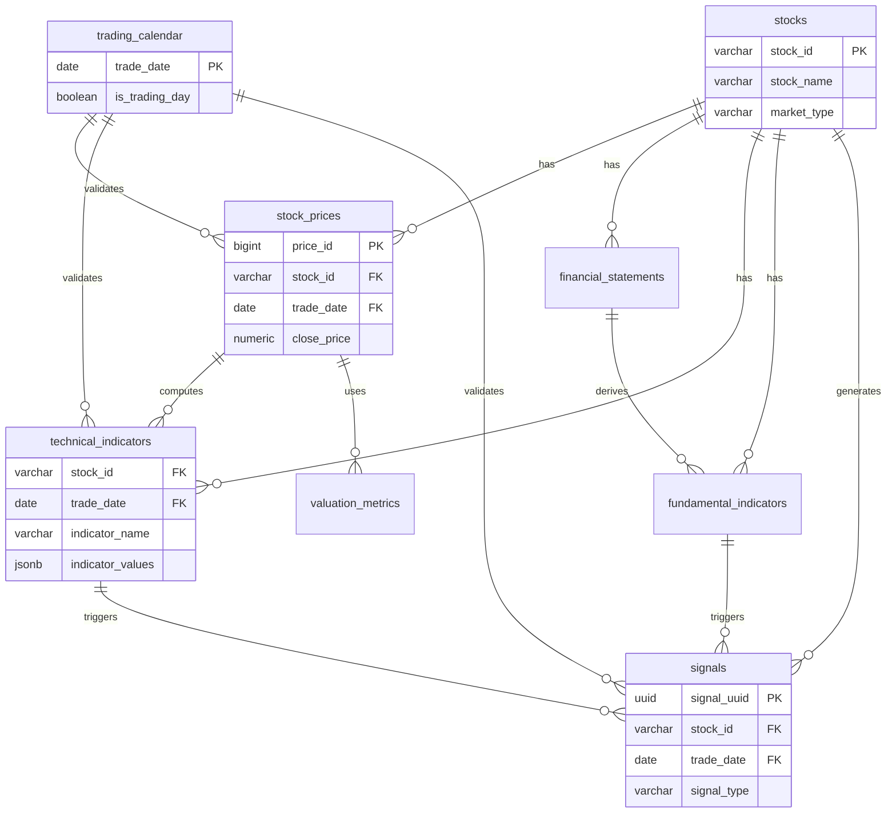

# database-schema.md - 整合資料庫架構設計

> **文件編號**: DB-SCHEMA-00  
> **文件名稱**: 整合資料庫架構設計  
> **版本**: v2.0  
> **最後更新**: 2025-12-31  
> **狀態**: Draft

---

## 📑 目錄

1. [資料庫概述](#1-資料庫概述)
2. [資料庫分區策略](#2-資料庫分區策略)
3. [所有資料表清單](#3-所有資料表清單)
4. [跨模組關聯](#4-跨模組關聯)
5. [索引策略](#5-索引策略)
6. [分區與歸檔](#6-分區與歸檔)
7. [備份與恢復](#7-備份與恢復)

---

## 1. 資料庫概述

### 1.1 資料庫技術選型

| 項目 | 選型 | 理由 |
|-----|------|------|
| **主資料庫** | PostgreSQL 15+ | 支援 JSONB、陣列、分區、GIN 索引，適合金融資料 |
| **快取資料庫** | Redis 7.0+ | 高效能 KV 儲存，支援多種資料結構 |
| **訊息佇列** | RabbitMQ / Kafka | 事件驅動架構，解耦模組 |

### 1.2 資料庫規模估算

| 資料類型 | 單筆大小 | 每日新增 | 保留期限 | 預估總量 |
|---------|---------|---------|---------|---------|
| 股價資料 | ~200 bytes | 180萬筆 (1800股) | 20年 | ~1.3TB |
| 技術指標 | ~500 bytes | 540萬筆 (71指標) | 5年 | ~1.0TB |
| 財報資料 | ~2KB | 7,200筆 (季報) | 永久 | ~100GB |
| 籌碼資料 | ~300 bytes | 180萬筆 | 5年 | ~270GB |
| 信號資料 | ~400 bytes | 100萬筆 | 3年 | ~120GB |
| **總計** | - | - | - | **~2.8TB** |

### 1.3 資料庫連線配置

```yaml
spring:
  datasource:
    hikari:
      maximum-pool-size: 20        # 最大連線數
      minimum-idle: 5              # 最小閒置連線
      connection-timeout: 30000    # 連線超時 (30秒)
      idle-timeout: 600000         # 閒置超時 (10分鐘)
      max-lifetime: 1800000        # 連線最大生命週期 (30分鐘)
```

---

## 2. 資料庫分區策略

### 2.1 按模組分區

| Schema | 模組 | 說明 |
|--------|------|------|
| `public` | 共用 | 交易日曆、股票基本資料 |
| `m06_data` | M06 資料管理 | 股價、財報、籌碼原始資料 |
| `m07_technical` | M07 技術分析 | 技術指標資料 |
| `m08_fundamental` | M08 基本面分析 | 基本面指標、估值 |
| `m09_chip` | M09 籌碼分析 | 籌碼分析結果 |
| `m13_signal` | M13 信號判斷 | 信號資料 |
| `job_mgmt` | Job 管理 | Job 執行記錄 |

### 2.2 建立 Schema

```sql
-- 建立各模組的 Schema
CREATE SCHEMA IF NOT EXISTS m06_data;
CREATE SCHEMA IF NOT EXISTS m07_technical;
CREATE SCHEMA IF NOT EXISTS m08_fundamental;
CREATE SCHEMA IF NOT EXISTS m09_chip;
CREATE SCHEMA IF NOT EXISTS m13_signal;
CREATE SCHEMA IF NOT EXISTS job_mgmt;

-- 設定 Schema 搜尋路徑
ALTER DATABASE stock_analysis SET search_path TO public, m06_data, m07_technical;
```

---

## 3. 所有資料表清單

### 3.1 共用資料表 (public schema)

| 表名 | 說明 | 主鍵 | 分區 | 模組 |
|-----|------|------|------|------|
| `stocks` | 股票基本資料 | stock_id | 否 | M06 |
| `trading_calendar` | 交易日曆 | trade_date | 否 | M06 |
| `users` | 使用者資料 | user_id | 否 | - |
| `api_keys` | API 金鑰 | api_key | 否 | - |

### 3.2 M06 資料管理模組 (m06_data schema)

| 表名 | 說明 | 主鍵 | 分區 | 行數估算 |
|-----|------|------|------|---------|
| `stock_prices` | 股價歷史資料 | (price_id, trade_date) | ✅ 按年 | 6.5億 (20年) |
| `financial_statements` | 財務報表 | statement_id | 否 | 28.8萬 |
| `institutional_trading` | 三大法人交易 | (stock_id, trade_date, investor_type) | ✅ 按年 | 1.6億 (5年) |
| `margin_trading` | 融資融券 | (stock_id, trade_date) | ✅ 按年 | 1.6億 (5年) |
| `data_quality_issues` | 資料品質問題 | issue_id | 否 | ~10萬 |

### 3.3 M07 技術分析模組 (m07_technical schema)

| 表名 | 說明 | 主鍵 | 分區 | 行數估算 |
|-----|------|------|------|---------|
| `technical_indicators` | 技術指標資料 | (stock_id, trade_date, indicator_name) | ✅ 按年 | 6.4億 (5年) |
| `indicator_metadata` | 指標元數據 | indicator_name | 否 | 71 |
| `signal_crossovers` | 交叉信號 | signal_id | ✅ 按月 | 1000萬 |
| `indicator_groups` | 指標分組 | group_id | 否 | 10 |
| `indicator_group_mapping` | 指標分組映射 | (group_id, indicator_name) | 否 | 100 |

### 3.4 M08 基本面分析模組 (m08_fundamental schema)

| 表名 | 說明 | 主鍵 | 分區 | 行數估算 |
|-----|------|------|------|---------|
| `fundamental_indicators` | 基本面指標 | (stock_id, year, quarter, indicator_name) | 否 | 576萬 |
| `valuation_metrics` | 估值指標 | (stock_id, trade_date) | ✅ 按年 | 6.5億 (20年) |
| `fundamental_scores` | 基本面評分 | score_id | 否 | 14.4萬 |
| `dividend_history` | 股利歷史 | (stock_id, year) | 否 | 3.6萬 |

### 3.5 M13 信號判斷引擎 (m13_signal schema)

| 表名 | 說明 | 主鍵 | 分區 | 行數估算 |
|-----|------|------|------|---------|
| `signals` | 信號資料 | signal_uuid | ✅ 按月 | 5000萬 (3年) |
| `signal_rules` | 信號規則 | rule_id | 否 | 100 |
| `signal_backtests` | 信號回測結果 | backtest_id | 否 | 1000 |

### 3.6 Job 管理 (job_mgmt schema)

| 表名 | 說明 | 主鍵 | 分區 | 行數估算 |
|-----|------|------|------|---------|
| `job_definitions` | Job 定義 | job_name | 否 | 50 |
| `job_executions` | Job 執行記錄 | execution_id | ✅ 按月 | 100萬 (3年) |
| `job_execution_logs` | Job 執行日誌 | log_id | ✅ 按月 | 1000萬 |

---

## 4. 跨模組關聯

### 4.1 核心實體關聯圖



### 4.2 外鍵約束策略

| 關聯 | 刪除策略 | 理由 |
|-----|---------|------|
| `stock_prices.stock_id → stocks.stock_id` | CASCADE | 刪除股票時同時刪除歷史股價 |
| `technical_indicators.stock_id → stocks.stock_id` | CASCADE | 刪除股票時同時刪除指標 |
| `signals.stock_id → stocks.stock_id` | CASCADE | 刪除股票時同時刪除信號 |
| `*_indicators.trade_date → trading_calendar.trade_date` | RESTRICT | 不可刪除已被參照的交易日 |

---

## 5. 索引策略

### 5.1 索引類型

| 索引類型 | 用途 | 適用欄位 |
|---------|------|---------|
| **B-tree** | 一般查詢、排序 | stock_id, trade_date, 數值欄位 |
| **GIN** | JSONB、陣列查詢 | extra_info, indicator_values, tags |
| **BRIN** | 大表的範圍查詢 | 分區表的 trade_date |
| **Hash** | 精確查詢（少用） | 固定長度的唯一鍵 |

### 5.2 關鍵索引

```sql
-- stocks 表索引
CREATE INDEX idx_stocks_market_type ON stocks(market_type);
CREATE INDEX idx_stocks_industry ON stocks(industry);
CREATE INDEX idx_stocks_tags ON stocks USING GIN(tags);

-- stock_prices 表索引（會自動在每個分區建立）
CREATE INDEX idx_stock_prices_stock_id ON stock_prices(stock_id);
CREATE INDEX idx_stock_prices_trade_date ON stock_prices(trade_date);
CREATE INDEX idx_stock_prices_stock_date ON stock_prices(stock_id, trade_date);

-- technical_indicators 表索引
CREATE INDEX idx_technical_indicators_stock_date ON technical_indicators(stock_id, trade_date);
CREATE INDEX idx_technical_indicators_indicator ON technical_indicators(indicator_name);
CREATE INDEX idx_technical_indicators_values ON technical_indicators USING GIN(indicator_values);

-- signals 表索引
CREATE INDEX idx_signals_stock_id ON signals(stock_id);
CREATE INDEX idx_signals_trade_date ON signals(trade_date);
CREATE INDEX idx_signals_signal_type ON signals(signal_type);
CREATE INDEX idx_signals_stock_date_type ON signals(stock_id, trade_date, signal_type);
```

### 5.3 索引維護

```sql
-- 定期重建索引（每月執行）
REINDEX INDEX CONCURRENTLY idx_stock_prices_stock_id;

-- 分析表統計資訊（每週執行）
ANALYZE stocks;
ANALYZE stock_prices;
ANALYZE technical_indicators;

-- 清理死元組（每日執行）
VACUUM ANALYZE stock_prices;
```

---

## 6. 分區與歸檔

### 6.1 分區表設計

#### 股價資料分區 (按年份)

```sql
-- 主表
CREATE TABLE stock_prices (
    price_id        BIGSERIAL,
    stock_id        VARCHAR(10) NOT NULL,
    trade_date      DATE NOT NULL,
    close_price     NUMERIC(10,2),
    -- ... 其他欄位
    PRIMARY KEY (price_id, trade_date)
) PARTITION BY RANGE (trade_date);

-- 分區
CREATE TABLE stock_prices_2023 PARTITION OF stock_prices
    FOR VALUES FROM ('2023-01-01') TO ('2024-01-01');
CREATE TABLE stock_prices_2024 PARTITION OF stock_prices
    FOR VALUES FROM ('2024-01-01') TO ('2025-01-01');
CREATE TABLE stock_prices_2025 PARTITION OF stock_prices
    FOR VALUES FROM ('2025-01-01') TO ('2026-01-01');
```

#### 信號資料分區 (按月份)

```sql
CREATE TABLE signals (
    signal_uuid     UUID PRIMARY KEY,
    stock_id        VARCHAR(10) NOT NULL,
    signal_date     DATE NOT NULL,
    -- ... 其他欄位
) PARTITION BY RANGE (signal_date);

-- 每月分區
CREATE TABLE signals_2025_01 PARTITION OF signals
    FOR VALUES FROM ('2025-01-01') TO ('2025-02-01');
CREATE TABLE signals_2025_02 PARTITION OF signals
    FOR VALUES FROM ('2025-02-01') TO ('2025-03-01');
```

### 6.2 歸檔策略

| 資料類型 | 保留期限 | 歸檔方式 | 歸檔頻率 |
|---------|---------|---------|---------|
| 股價資料 | 20年 | DETACH + 壓縮 | 每年 |
| 技術指標 | 5年 | DETACH + 壓縮 | 每年 |
| 信號資料 | 3年 | DETACH + 刪除 | 每月 |
| Job 執行記錄 | 3個月 | 匯出至冷儲存 | 每月 |

#### 歸檔腳本範例

```sql
-- 分離舊分區（不刪除資料）
ALTER TABLE stock_prices DETACH PARTITION stock_prices_2003;

-- 壓縮舊分區（節省儲存空間）
CREATE TABLE stock_prices_2003_archive (LIKE stock_prices_2003);
INSERT INTO stock_prices_2003_archive SELECT * FROM stock_prices_2003;
DROP TABLE stock_prices_2003;

-- 匯出到檔案系統
COPY stock_prices_2003_archive TO '/backup/stock_prices_2003.csv' CSV HEADER;
```

---

## 7. 備份與恢復

### 7.1 備份策略

| 備份類型 | 頻率 | 保留期限 | 儲存位置 |
|---------|------|---------|---------|
| **全量備份** | 每週日 | 4週 | S3 / NAS |
| **增量備份** | 每日 | 7天 | 本地 + S3 |
| **WAL 歸檔** | 即時 | 7天 | S3 |
| **邏輯備份** | 每月 | 12個月 | S3 Glacier |

### 7.2 備份腳本

```bash
#!/bin/bash
# PostgreSQL 全量備份腳本

BACKUP_DIR="/backup/postgresql"
TIMESTAMP=$(date +%Y%m%d_%H%M%S)
DATABASE="stock_analysis"

# 全量備份
pg_dump -h localhost -U postgres -F c -b -v -f \
    "${BACKUP_DIR}/full_backup_${TIMESTAMP}.dump" ${DATABASE}

# 壓縮備份檔
gzip "${BACKUP_DIR}/full_backup_${TIMESTAMP}.dump"

# 上傳到 S3
aws s3 cp "${BACKUP_DIR}/full_backup_${TIMESTAMP}.dump.gz" \
    s3://stock-analysis-backup/postgresql/

# 刪除 30 天前的本地備份
find ${BACKUP_DIR} -name "*.dump.gz" -mtime +30 -delete
```

### 7.3 恢復流程

```bash
# 1. 停止應用服務
kubectl scale deployment stock-api --replicas=0

# 2. 恢復資料庫
pg_restore -h localhost -U postgres -d stock_analysis \
    -v /backup/full_backup_20251231.dump

# 3. 驗證資料完整性
psql -U postgres -d stock_analysis -c "SELECT COUNT(*) FROM stocks;"

# 4. 重啟應用服務
kubectl scale deployment stock-api --replicas=3
```

---

## 📚 相關文檔

- [M06 資料庫設計](./M06-資料庫設計.md)
- [M07 資料庫設計](./M07-資料庫設計.md)
- [M08 資料庫設計](./M08-資料庫設計.md)
- [系統架構圖](./00-系統架構圖.md)
- [NFR非功能性需求](../specs/technical/00-NFR非功能性需求.md)

---

**文件維護者**: 資料庫管理員 (DBA)  
**最後更新**: 2025-12-31  
**下次審核**: 2026-01-31
