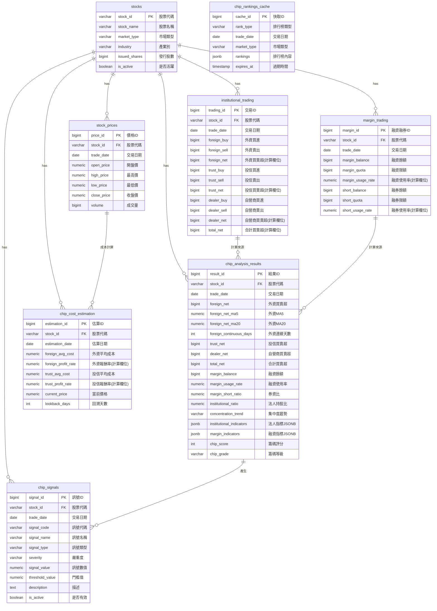

# M09-籌碼分析模組 ERD

> **文件編號**: ERD-M09
> **模組名稱**: 籌碼分析模組
> **版本**: v1.0
> **最後更新**: 2026-01-11
> **狀態**: Draft

---

## 1. ERD 圖 (Mermaid)



---

## 2. 資料表關聯說明

### 2.1 M06 → M09 依賴關係

| 來源表 (M06) | 目標表 (M09) | 關聯類型 | 說明 |
|-------------|-------------|---------|------|
| institutional_trading | chip_analysis_results | 計算依賴 | 三大法人指標計算來源 |
| margin_trading | chip_analysis_results | 計算依賴 | 融資融券指標計算來源 |
| stock_prices | chip_cost_estimation | 計算依賴 | 成本估算需要價格資料 |
| stocks | 所有 M09 表 | 外鍵關聯 | 股票主表 |

### 2.2 M09 內部關聯

| 來源表 | 目標表 | 關聯類型 | 說明 |
|-------|-------|---------|------|
| chip_analysis_results | chip_signals | 產生關係 | 分析結果觸發異常訊號 |

---

## 3. 實體屬性詳細說明

### 3.1 chip_analysis_results

| 欄位 | 類型 | 約束 | 說明 |
|-----|------|------|------|
| result_id | BIGSERIAL | PK | 自增主鍵 |
| stock_id | VARCHAR(10) | FK, NOT NULL | 股票代碼 |
| trade_date | DATE | NOT NULL | 交易日期（分區鍵） |
| foreign_net | BIGINT | | 外資買賣超股數 |
| foreign_net_ma5 | NUMERIC(15,2) | | 外資買賣超 5 日均線 |
| foreign_net_ma20 | NUMERIC(15,2) | | 外資買賣超 20 日均線 |
| foreign_continuous_days | INTEGER | | 外資連續買超天數 |
| trust_net | BIGINT | | 投信買賣超股數 |
| dealer_net | BIGINT | | 自營商買賣超股數 |
| total_net | BIGINT | | 三大法人合計買賣超 |
| margin_balance | BIGINT | | 融資餘額 |
| margin_usage_rate | NUMERIC(5,2) | | 融資使用率 |
| margin_short_ratio | NUMERIC(5,2) | | 券資比 |
| institutional_ratio | NUMERIC(5,2) | | 法人持股比例估算 |
| concentration_trend | VARCHAR(20) | | 籌碼集中趨勢 |
| institutional_indicators | JSONB | | 法人詳細指標 |
| margin_indicators | JSONB | | 融資融券詳細指標 |
| chip_score | INTEGER | | 籌碼評分 (0-100) |
| chip_grade | VARCHAR(2) | | 籌碼等級 (A/B/C/D/F) |

**唯一約束**: (stock_id, trade_date)

### 3.2 chip_signals

| 欄位 | 類型 | 約束 | 說明 |
|-----|------|------|------|
| signal_id | BIGSERIAL | PK | 自增主鍵 |
| stock_id | VARCHAR(10) | FK, NOT NULL | 股票代碼 |
| trade_date | DATE | NOT NULL | 訊號日期 |
| signal_code | VARCHAR(20) | NOT NULL | 訊號代碼 |
| signal_name | VARCHAR(50) | NOT NULL | 訊號名稱 |
| signal_type | VARCHAR(20) | NOT NULL | 訊號類型 |
| severity | VARCHAR(10) | NOT NULL | 嚴重度 |
| signal_value | NUMERIC(20,2) | | 觸發訊號的數值 |
| threshold_value | NUMERIC(20,2) | | 門檻值 |
| deviation | NUMERIC(10,2) | | 偏離程度（標準差） |
| description | TEXT | | 訊號描述 |
| is_active | BOOLEAN | DEFAULT TRUE | 是否有效 |

### 3.3 chip_rankings_cache

| 欄位 | 類型 | 約束 | 說明 |
|-----|------|------|------|
| cache_id | BIGSERIAL | PK | 自增主鍵 |
| rank_type | VARCHAR(30) | NOT NULL | 排行榜類型 |
| trade_date | DATE | NOT NULL | 交易日期 |
| market_type | VARCHAR(10) | | 市場類型 |
| rankings | JSONB | NOT NULL | 排行榜內容 |
| total_count | INTEGER | | 總筆數 |
| expires_at | TIMESTAMP | | 快取過期時間 |

**唯一約束**: (rank_type, trade_date, market_type)

### 3.4 chip_cost_estimation

| 欄位 | 類型 | 約束 | 說明 |
|-----|------|------|------|
| estimation_id | BIGSERIAL | PK | 自增主鍵 |
| stock_id | VARCHAR(10) | FK, NOT NULL | 股票代碼 |
| estimation_date | DATE | NOT NULL | 估算日期 |
| foreign_avg_cost | NUMERIC(10,2) | | 外資平均成本 |
| foreign_profit_rate | NUMERIC(5,2) | GENERATED | 外資報酬率 |
| trust_avg_cost | NUMERIC(10,2) | | 投信平均成本 |
| trust_profit_rate | NUMERIC(5,2) | GENERATED | 投信報酬率 |
| current_price | NUMERIC(10,2) | NOT NULL | 當前價格 |
| lookback_days | INTEGER | DEFAULT 120 | 回溯天數 |

**唯一約束**: (stock_id, estimation_date)

---

## 4. 索引設計

### 4.1 chip_analysis_results 索引

```sql
-- 主要查詢索引
CREATE INDEX idx_chip_results_stock_id ON chip_analysis_results(stock_id);
CREATE INDEX idx_chip_results_trade_date ON chip_analysis_results(trade_date);

-- 排行榜查詢索引
CREATE INDEX idx_chip_results_foreign_net ON chip_analysis_results(foreign_net);
CREATE INDEX idx_chip_results_total_net ON chip_analysis_results(total_net);
CREATE INDEX idx_chip_results_chip_score ON chip_analysis_results(chip_score);

-- JSONB GIN 索引
CREATE INDEX idx_chip_inst_indicators ON chip_analysis_results USING GIN(institutional_indicators);
CREATE INDEX idx_chip_margin_indicators ON chip_analysis_results USING GIN(margin_indicators);
```

### 4.2 chip_signals 索引

```sql
-- 主要查詢索引
CREATE INDEX idx_chip_signals_stock_id ON chip_signals(stock_id);
CREATE INDEX idx_chip_signals_trade_date ON chip_signals(trade_date);
CREATE INDEX idx_chip_signals_severity ON chip_signals(severity);

-- 複合索引
CREATE INDEX idx_chip_signals_date_severity ON chip_signals(trade_date, severity);
CREATE INDEX idx_chip_signals_stock_date ON chip_signals(stock_id, trade_date);
```

---

## 📚 相關文檔

- [M09 資料庫設計](../M09-資料庫設計.md)
- [M09 功能需求](../../specs/functional/M09-籌碼分析功能需求.md)
- [M06 ERD](./M06-ERD.md)

---

**文件維護者**: 資料庫架構師
**最後更新**: 2026-01-11
**下次審核**: 2026-03-31
