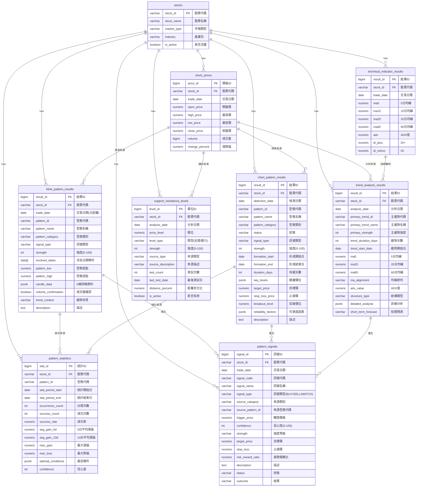

# M10-技術型態辨識模組 ERD

> **文件編號**: ERD-M10
> **模組名稱**: 技術型態辨識模組
> **版本**: v1.0
> **最後更新**: 2026-01-12
> **狀態**: Draft

---

## 1. ERD 圖 (Mermaid)



---

## 2. 資料表關聯說明

### 2.1 M06/M07 → M10 依賴關係

| 來源表 | 模組 | 目標表 (M10) | 關聯類型 | 說明 |
|-------|------|-------------|---------|------|
| stock_prices | M06 | kline_pattern_results | 計算依賴 | K 線型態偵測來源 |
| stock_prices | M06 | chart_pattern_results | 計算依賴 | 圖表型態偵測來源 |
| stock_prices | M06 | trend_analysis_results | 計算依賴 | 趨勢分析來源 |
| stock_prices | M06 | support_resistance_levels | 計算依賴 | 支撐壓力識別來源 |
| technical_indicator_results | M07 | trend_analysis_results | 計算依賴 | 均線、ADX 等指標輔助 |
| stocks | M06 | 所有 M10 表 | 外鍵關聯 | 股票主表 |

### 2.2 M10 內部關聯

| 來源表 | 目標表 | 關聯類型 | 說明 |
|-------|-------|---------|------|
| kline_pattern_results | pattern_signals | 產生關係 | K 線型態觸發訊號 |
| chart_pattern_results | pattern_signals | 產生關係 | 圖表型態觸發訊號 |
| trend_analysis_results | pattern_signals | 產生關係 | 趨勢變化觸發訊號 |
| kline_pattern_results | pattern_statistics | 統計來源 | K 線型態歷史統計 |
| chart_pattern_results | pattern_statistics | 統計來源 | 圖表型態歷史統計 |

---

## 3. 實體屬性詳細說明

### 3.1 kline_pattern_results

| 欄位 | 類型 | 約束 | 說明 |
|-----|------|------|------|
| result_id | BIGSERIAL | PK | 自增主鍵 |
| stock_id | VARCHAR(10) | FK, NOT NULL | 股票代碼 |
| trade_date | DATE | NOT NULL | 交易日期（分區鍵） |
| pattern_id | VARCHAR(20) | NOT NULL | 型態代碼（如 KLINE001） |
| pattern_name | VARCHAR(50) | NOT NULL | 型態名稱 |
| english_name | VARCHAR(50) | | 英文名稱 |
| pattern_category | VARCHAR(20) | NOT NULL | 型態類別 |
| signal_type | VARCHAR(30) | NOT NULL | 訊號類型 |
| strength | INTEGER | NOT NULL | 型態強度 (0-100) |
| confidence | INTEGER | | 信心度 |
| involved_dates | DATE[] | NOT NULL | 涉及日期陣列 |
| pattern_low | NUMERIC(10,2) | | 型態最低價 |
| pattern_high | NUMERIC(10,2) | | 型態最高價 |
| candle_data | JSONB | | K 線詳細資料 |
| volume_confirmation | BOOLEAN | DEFAULT FALSE | 成交量確認 |
| volume_ratio | NUMERIC(5,2) | | 成交量比率 |
| trend_context | VARCHAR(20) | | 趨勢背景 |
| description | TEXT | | 型態描述 |

**約束條件**:
- pattern_category IN ('SINGLE_KLINE', 'DOUBLE_KLINE', 'TRIPLE_KLINE', 'MULTI_KLINE')
- signal_type IN ('BULLISH_REVERSAL', 'BEARISH_REVERSAL', 'BULLISH_CONTINUATION', 'BEARISH_CONTINUATION', 'NEUTRAL_REVERSAL', 'NEUTRAL')
- strength BETWEEN 0 AND 100

### 3.2 chart_pattern_results

| 欄位 | 類型 | 約束 | 說明 |
|-----|------|------|------|
| result_id | BIGSERIAL | PK | 自增主鍵 |
| stock_id | VARCHAR(10) | FK, NOT NULL | 股票代碼 |
| detection_date | DATE | NOT NULL | 偵測日期 |
| pattern_id | VARCHAR(20) | NOT NULL | 型態代碼（如 CHART001） |
| pattern_name | VARCHAR(50) | NOT NULL | 型態名稱 |
| english_name | VARCHAR(50) | | 英文名稱 |
| pattern_category | VARCHAR(20) | NOT NULL | 型態類別 |
| status | VARCHAR(20) | NOT NULL, DEFAULT 'FORMING' | 型態狀態 |
| signal_type | VARCHAR(30) | NOT NULL | 訊號類型 |
| strength | INTEGER | NOT NULL | 型態強度 (0-100) |
| formation_start | DATE | NOT NULL | 形成開始日期 |
| formation_end | DATE | | 形成結束日期 |
| duration_days | INTEGER | | 持續天數 |
| key_levels | JSONB | NOT NULL | 關鍵價位 |
| target_price | NUMERIC(10,2) | | 目標價 |
| stop_loss_price | NUMERIC(10,2) | | 止損價 |
| potential_move_pct | NUMERIC(5,2) | | 潛在漲跌幅 |
| risk_reward_ratio | NUMERIC(5,2) | | 風險報酬比 |
| completion_criteria | TEXT | | 完成標準 |
| breakout_level | NUMERIC(10,2) | | 突破價位 |
| breakout_direction | VARCHAR(10) | | 突破方向 |
| volume_pattern | VARCHAR(50) | | 成交量型態 |
| volume_confirmation | BOOLEAN | | 成交量確認 |
| reliability_factors | JSONB | | 可靠度因素 |
| description | TEXT | | 型態描述 |

**約束條件**:
- pattern_category IN ('REVERSAL', 'CONTINUATION', 'GAP', 'BILATERAL')
- status IN ('FORMING', 'CONFIRMED', 'COMPLETED', 'FAILED', 'INVALIDATED')
- breakout_direction IN ('UP', 'DOWN', NULL)

### 3.3 trend_analysis_results

| 欄位 | 類型 | 約束 | 說明 |
|-----|------|------|------|
| result_id | BIGSERIAL | PK | 自增主鍵 |
| stock_id | VARCHAR(10) | FK, NOT NULL | 股票代碼 |
| analysis_date | DATE | NOT NULL | 分析日期 |
| primary_trend_id | VARCHAR(20) | NOT NULL | 主趨勢代碼 |
| primary_trend_name | VARCHAR(30) | NOT NULL | 主趨勢名稱 |
| primary_strength | INTEGER | NOT NULL | 主趨勢強度 |
| trend_duration_days | INTEGER | | 趨勢持續天數 |
| trend_start_date | DATE | | 趨勢開始日期 |
| trend_start_price | NUMERIC(10,2) | | 趨勢開始價格 |
| trend_gain_pct | NUMERIC(8,2) | | 趨勢漲跌幅 |
| secondary_trend_id | VARCHAR(20) | | 次趨勢代碼 |
| secondary_trend_name | VARCHAR(30) | | 次趨勢名稱 |
| secondary_strength | INTEGER | | 次趨勢強度 |
| ma5 | NUMERIC(10,2) | | 5 日均線 |
| ma10 | NUMERIC(10,2) | | 10 日均線 |
| ma20 | NUMERIC(10,2) | | 20 日均線 |
| ma60 | NUMERIC(10,2) | | 60 日均線 |
| ma120 | NUMERIC(10,2) | | 120 日均線 |
| ma_alignment | VARCHAR(20) | | 均線排列狀態 |
| ma_alignment_strength | INTEGER | | 均線排列強度 |
| adx_value | NUMERIC(5,2) | | ADX 值 |
| di_plus | NUMERIC(5,2) | | DI+ 值 |
| di_minus | NUMERIC(5,2) | | DI- 值 |
| trend_strength_level | VARCHAR(20) | | 趨勢強度等級 |
| higher_highs_count | INTEGER | DEFAULT 0 | 更高高點數量 |
| higher_lows_count | INTEGER | DEFAULT 0 | 更高低點數量 |
| lower_highs_count | INTEGER | DEFAULT 0 | 更低高點數量 |
| lower_lows_count | INTEGER | DEFAULT 0 | 更低低點數量 |
| structure_type | VARCHAR(20) | | 價格結構類型 |
| consistency | NUMERIC(5,2) | | 一致性分數 |
| volatility | NUMERIC(5,2) | | 波動率 |
| momentum | VARCHAR(20) | | 動能狀態 |
| detailed_analysis | JSONB | DEFAULT '{}' | 詳細分析 |
| warnings | TEXT[] | | 警示訊息陣列 |
| short_term_forecast | VARCHAR(20) | | 短期預測 |
| medium_term_forecast | VARCHAR(20) | | 中期預測 |
| forecast_confidence | INTEGER | | 預測信心度 |

**唯一約束**: (stock_id, analysis_date)

### 3.4 support_resistance_levels

| 欄位 | 類型 | 約束 | 說明 |
|-----|------|------|------|
| level_id | BIGSERIAL | PK | 自增主鍵 |
| stock_id | VARCHAR(10) | FK, NOT NULL | 股票代碼 |
| analysis_date | DATE | NOT NULL | 分析日期 |
| price_level | NUMERIC(10,2) | NOT NULL | 價格水平 |
| level_type | VARCHAR(15) | NOT NULL | 類型（SUPPORT/RESISTANCE） |
| strength | INTEGER | NOT NULL | 強度 (0-100) |
| source_type | VARCHAR(30) | NOT NULL | 來源類型 |
| source_description | VARCHAR(100) | | 來源描述 |
| test_count | INTEGER | DEFAULT 0 | 測試次數 |
| last_test_date | DATE | | 最後測試日期 |
| break_count | INTEGER | DEFAULT 0 | 突破次數 |
| current_price | NUMERIC(10,2) | | 當前價格 |
| distance_percent | NUMERIC(8,2) | | 距離百分比 |
| is_active | BOOLEAN | DEFAULT TRUE | 是否有效 |
| invalidated_at | TIMESTAMP | | 失效時間 |
| invalidation_reason | VARCHAR(100) | | 失效原因 |

**約束條件**:
- level_type IN ('SUPPORT', 'RESISTANCE')
- source_type IN ('WAVE_PEAK', 'WAVE_TROUGH', 'MOVING_AVERAGE', 'VOLUME_PROFILE', 'PSYCHOLOGICAL', 'GAP', 'FIBONACCI', 'HISTORICAL', 'PIVOT')

### 3.5 pattern_signals

| 欄位 | 類型 | 約束 | 說明 |
|-----|------|------|------|
| signal_id | BIGSERIAL | PK | 自增主鍵 |
| stock_id | VARCHAR(10) | FK, NOT NULL | 股票代碼 |
| trade_date | DATE | NOT NULL | 訊號日期 |
| signal_code | VARCHAR(20) | NOT NULL | 訊號代碼 |
| signal_name | VARCHAR(50) | NOT NULL | 訊號名稱 |
| signal_type | VARCHAR(10) | NOT NULL | 訊號類型 |
| source_category | VARCHAR(15) | NOT NULL | 來源類別 |
| source_pattern_id | VARCHAR(20) | | 來源型態代碼 |
| source_pattern_name | VARCHAR(50) | | 來源型態名稱 |
| trigger_price | NUMERIC(10,2) | | 觸發價格 |
| current_price | NUMERIC(10,2) | | 當前價格 |
| confidence | INTEGER | NOT NULL | 信心度 (0-100) |
| strength | VARCHAR(15) | NOT NULL | 強度等級 |
| target_price | NUMERIC(10,2) | | 目標價 |
| stop_loss | NUMERIC(10,2) | | 止損價 |
| target_gain_pct | NUMERIC(5,2) | | 目標漲幅 |
| stop_loss_pct | NUMERIC(5,2) | | 止損幅度 |
| risk_reward_ratio | NUMERIC(5,2) | | 風險報酬比 |
| supporting_factors | TEXT[] | | 支持因素陣列 |
| description | TEXT | | 訊號描述 |
| status | VARCHAR(20) | DEFAULT 'ACTIVE' | 狀態 |
| outcome | VARCHAR(20) | | 結果 |
| outcome_date | DATE | | 結果日期 |
| actual_gain_pct | NUMERIC(8,2) | | 實際漲跌幅 |

**約束條件**:
- signal_type IN ('BUY', 'SELL', 'WATCH')
- source_category IN ('KLINE', 'CHART', 'TREND', 'SUPPORT_RESISTANCE')
- strength IN ('CRITICAL', 'HIGH', 'MEDIUM', 'LOW')
- status IN ('ACTIVE', 'TRIGGERED', 'EXPIRED', 'CANCELLED')
- outcome IN ('SUCCESS', 'FAILURE', 'PARTIAL', NULL)

### 3.6 pattern_statistics

| 欄位 | 類型 | 約束 | 說明 |
|-----|------|------|------|
| stat_id | BIGSERIAL | PK | 自增主鍵 |
| stock_id | VARCHAR(10) | FK, NOT NULL | 股票代碼 |
| pattern_id | VARCHAR(20) | NOT NULL | 型態代碼 |
| stat_period_start | DATE | NOT NULL | 統計期間開始 |
| stat_period_end | DATE | NOT NULL | 統計期間結束 |
| trading_days | INTEGER | | 交易日數 |
| occurrence_count | INTEGER | NOT NULL, DEFAULT 0 | 出現次數 |
| success_count | INTEGER | NOT NULL, DEFAULT 0 | 成功次數 |
| failure_count | INTEGER | NOT NULL, DEFAULT 0 | 失敗次數 |
| pending_count | INTEGER | NOT NULL, DEFAULT 0 | 待確認次數 |
| success_rate | NUMERIC(5,2) | | 成功率 |
| avg_gain_1d | NUMERIC(8,4) | | 1 日平均漲幅 |
| avg_gain_3d | NUMERIC(8,4) | | 3 日平均漲幅 |
| avg_gain_5d | NUMERIC(8,4) | | 5 日平均漲幅 |
| avg_gain_10d | NUMERIC(8,4) | | 10 日平均漲幅 |
| avg_gain_20d | NUMERIC(8,4) | | 20 日平均漲幅 |
| max_gain | NUMERIC(8,4) | | 最大漲幅 |
| max_loss | NUMERIC(8,4) | | 最大跌幅 |
| avg_loss_when_failed | NUMERIC(8,4) | | 失敗時平均跌幅 |
| optimal_conditions | JSONB | DEFAULT '{}' | 最佳條件 |
| confidence | INTEGER | | 信心度 |

**唯一約束**: (stock_id, pattern_id, stat_period_start, stat_period_end)

---

## 4. 索引設計

### 4.1 kline_pattern_results 索引

```sql
-- 主要查詢索引
CREATE INDEX idx_kline_ptn_stock_id ON kline_pattern_results(stock_id);
CREATE INDEX idx_kline_ptn_trade_date ON kline_pattern_results(trade_date);
CREATE INDEX idx_kline_ptn_pattern_id ON kline_pattern_results(pattern_id);
CREATE INDEX idx_kline_ptn_signal_type ON kline_pattern_results(signal_type);
CREATE INDEX idx_kline_ptn_strength ON kline_pattern_results(strength);

-- 複合索引
CREATE INDEX idx_kline_ptn_stock_date ON kline_pattern_results(stock_id, trade_date);
CREATE INDEX idx_kline_ptn_date_signal ON kline_pattern_results(trade_date, signal_type);
```

### 4.2 chart_pattern_results 索引

```sql
-- 主要查詢索引
CREATE INDEX idx_chart_ptn_stock_id ON chart_pattern_results(stock_id);
CREATE INDEX idx_chart_ptn_detection_date ON chart_pattern_results(detection_date);
CREATE INDEX idx_chart_ptn_status ON chart_pattern_results(status);

-- 複合索引
CREATE INDEX idx_chart_ptn_stock_status ON chart_pattern_results(stock_id, status);

-- JSONB GIN 索引
CREATE INDEX idx_chart_ptn_key_levels ON chart_pattern_results USING GIN(key_levels);
```

### 4.3 pattern_signals 索引

```sql
-- 主要查詢索引
CREATE INDEX idx_ptn_sig_stock_id ON pattern_signals(stock_id);
CREATE INDEX idx_ptn_sig_trade_date ON pattern_signals(trade_date);
CREATE INDEX idx_ptn_sig_signal_type ON pattern_signals(signal_type);
CREATE INDEX idx_ptn_sig_status ON pattern_signals(status);

-- 複合索引
CREATE INDEX idx_ptn_sig_date_type ON pattern_signals(trade_date, signal_type);
CREATE INDEX idx_ptn_sig_stock_date ON pattern_signals(stock_id, trade_date);
```

---

## 📚 相關文檔

- [M10 資料庫設計](../M10-資料庫設計.md)
- [M10 功能需求](../../specs/functional/M10-技術型態辨識功能需求.md)
- [M06 ERD](./M06-ERD.md)
- [M07 ERD](./M07-ERD.md)

---

**文件維護者**: 資料庫架構師
**最後更新**: 2026-01-12
**下次審核**: 2026-03-31
