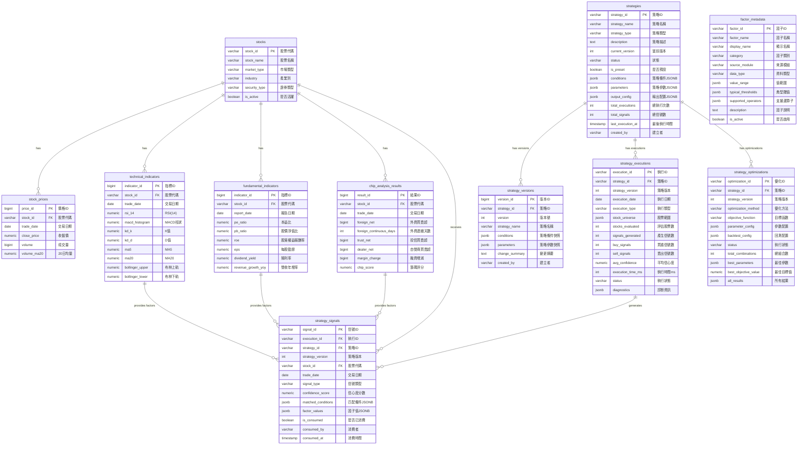

# M11-量化策略模組 ERD

> **文件編號**: ERD-M11
> **模組名稱**: 量化策略模組
> **版本**: v1.0
> **最後更新**: 2026-01-14
> **狀態**: Draft

---

## 1. ERD 圖 (Mermaid)



---

## 2. 資料表關聯說明

### 2.1 M11 內部關聯

| 來源表 | 目標表 | 關聯類型 | 說明 |
|-------|-------|---------|------|
| strategies | strategy_versions | 1:N | 策略擁有多個版本歷史 |
| strategies | strategy_executions | 1:N | 策略擁有多次執行記錄 |
| strategies | strategy_optimizations | 1:N | 策略擁有多次優化記錄 |
| strategy_executions | strategy_signals | 1:N | 每次執行產生多個信號 |

### 2.2 上游依賴關係（只讀）

| 來源表 (上游) | 目標用途 (M11) | 關聯類型 | 說明 |
|-------------|---------------|---------|------|
| stocks (M06) | 股票篩選 | 參考 | 取得股票基本資訊 |
| stock_prices (M06) | 價量因子 | 讀取 | 取得價格、成交量數據 |
| technical_indicators (M07) | 技術面因子 | 讀取 | RSI、MACD、MA 等指標 |
| fundamental_indicators (M08) | 基本面因子 | 讀取 | PE、ROE、EPS 等指標 |
| chip_analysis_results (M09) | 籌碼面因子 | 讀取 | 法人買賣超、融資融券等 |

### 2.3 下游消費關係

| 來源表 (M11) | 消費者 (下游) | 說明 |
|-------------|-------------|------|
| strategy_signals | M13 信號引擎 | M13 讀取 strategy_signals 進行信號整合 |

---

## 3. 實體屬性詳細說明

### 3.1 strategies (策略定義表)

| 欄位 | 類型 | 約束 | 說明 |
|-----|------|------|------|
| strategy_id | VARCHAR(20) | PK | 策略唯一識別碼 |
| strategy_name | VARCHAR(100) | NOT NULL | 策略名稱 |
| strategy_type | VARCHAR(20) | NOT NULL | 策略類型（MOMENTUM/VALUE/HYBRID/CUSTOM） |
| description | TEXT | | 策略描述 |
| current_version | INTEGER | DEFAULT 1 | 當前版本號 |
| status | VARCHAR(20) | DEFAULT 'DRAFT' | 狀態（DRAFT/ACTIVE/INACTIVE/ARCHIVED） |
| is_preset | BOOLEAN | DEFAULT FALSE | 是否為系統預設策略 |
| conditions | JSONB | NOT NULL | 策略條件定義 |
| parameters | JSONB | DEFAULT '{}' | 可調整參數 |
| output_config | JSONB | DEFAULT '{}' | 輸出配置（信號類型、信心度公式） |
| total_executions | INTEGER | DEFAULT 0 | 累計執行次數 |
| total_signals | INTEGER | DEFAULT 0 | 累計產生信號數 |
| last_execution_at | TIMESTAMP | | 最後執行時間 |
| created_by | VARCHAR(50) | | 建立者 |

### 3.2 strategy_versions (策略版本歷史表)

| 欄位 | 類型 | 約束 | 說明 |
|-----|------|------|------|
| version_id | BIGSERIAL | PK | 自增主鍵 |
| strategy_id | VARCHAR(20) | FK, NOT NULL | 策略 ID |
| version | INTEGER | NOT NULL | 版本號 |
| strategy_name | VARCHAR(100) | NOT NULL | 版本名稱快照 |
| conditions | JSONB | NOT NULL | 條件快照 |
| parameters | JSONB | DEFAULT '{}' | 參數快照 |
| change_summary | TEXT | | 變更摘要 |
| created_by | VARCHAR(50) | | 建立者 |

**唯一約束**: (strategy_id, version)

### 3.3 strategy_executions (策略執行記錄表)

| 欄位 | 類型 | 約束 | 說明 |
|-----|------|------|------|
| execution_id | VARCHAR(30) | PK | 執行 ID |
| strategy_id | VARCHAR(20) | FK, NOT NULL | 策略 ID |
| strategy_version | INTEGER | NOT NULL | 執行時的策略版本 |
| execution_date | DATE | NOT NULL | 執行日期 |
| execution_type | VARCHAR(20) | DEFAULT 'SCHEDULED' | 執行類型 |
| stock_universe | JSONB | | 股票範圍配置 |
| stocks_evaluated | INTEGER | | 評估的股票數量 |
| signals_generated | INTEGER | DEFAULT 0 | 產生的信號數 |
| buy_signals | INTEGER | DEFAULT 0 | 買進信號數 |
| sell_signals | INTEGER | DEFAULT 0 | 賣出信號數 |
| avg_confidence | NUMERIC(5,2) | | 平均信心度 |
| execution_time_ms | INTEGER | | 執行耗時（毫秒） |
| status | VARCHAR(20) | DEFAULT 'RUNNING' | 執行狀態 |
| diagnostics | JSONB | DEFAULT '{}' | 診斷資訊 |

### 3.4 strategy_signals (策略信號表)

| 欄位 | 類型 | 約束 | 說明 |
|-----|------|------|------|
| signal_id | VARCHAR(30) | PK（複合） | 信號 ID |
| execution_id | VARCHAR(30) | NOT NULL | 執行 ID |
| strategy_id | VARCHAR(20) | NOT NULL | 策略 ID |
| strategy_version | INTEGER | NOT NULL | 策略版本 |
| stock_id | VARCHAR(10) | NOT NULL | 股票代碼 |
| trade_date | DATE | PK（複合） | 交易日期（分區鍵） |
| signal_type | VARCHAR(10) | NOT NULL | 信號類型（BUY/SELL/HOLD） |
| confidence_score | NUMERIC(5,2) | | 信心度分數 |
| matched_conditions | JSONB | NOT NULL | 匹配的條件詳情 |
| factor_values | JSONB | | 因子值快照 |
| is_consumed | BOOLEAN | DEFAULT FALSE | 是否已被 M13 消費 |
| consumed_by | VARCHAR(30) | | 消費者標識 |
| consumed_at | TIMESTAMP | | 消費時間 |

**分區鍵**: trade_date（按月分區）

### 3.5 strategy_optimizations (參數優化記錄表)

| 欄位 | 類型 | 約束 | 說明 |
|-----|------|------|------|
| optimization_id | VARCHAR(30) | PK | 優化 ID |
| strategy_id | VARCHAR(20) | FK, NOT NULL | 策略 ID |
| strategy_version | INTEGER | NOT NULL | 策略版本 |
| optimization_method | VARCHAR(20) | NOT NULL | 優化方法 |
| objective_function | VARCHAR(30) | NOT NULL | 目標函數 |
| parameter_config | JSONB | NOT NULL | 參數搜索空間 |
| backtest_config | JSONB | NOT NULL | 回測配置 |
| status | VARCHAR(20) | DEFAULT 'QUEUED' | 執行狀態 |
| total_combinations | INTEGER | | 總參數組合數 |
| best_parameters | JSONB | | 最佳參數組合 |
| best_objective_value | NUMERIC(10,4) | | 最佳目標值 |
| all_results | JSONB | | 所有結果 |

### 3.6 factor_metadata (因子元數據表)

| 欄位 | 類型 | 約束 | 說明 |
|-----|------|------|------|
| factor_id | VARCHAR(30) | PK | 因子 ID |
| factor_name | VARCHAR(50) | NOT NULL | 因子名稱 |
| display_name | VARCHAR(100) | NOT NULL | 顯示名稱 |
| category | VARCHAR(20) | NOT NULL | 因子類別 |
| source_module | VARCHAR(10) | NOT NULL | 來源模組 |
| data_type | VARCHAR(20) | NOT NULL | 資料類型 |
| value_range | JSONB | | 值範圍 |
| typical_thresholds | JSONB | | 典型閾值 |
| supported_operators | JSONB | NOT NULL | 支援的運算子 |
| description | TEXT | | 因子說明 |
| is_active | BOOLEAN | DEFAULT TRUE | 是否啟用 |

---

## 4. 索引設計

### 4.1 strategies 索引

```sql
CREATE INDEX idx_strategies_type ON strategies(strategy_type);
CREATE INDEX idx_strategies_status ON strategies(status);
CREATE INDEX idx_strategies_is_preset ON strategies(is_preset);
CREATE INDEX idx_strategies_conditions ON strategies USING GIN(conditions);
```

### 4.2 strategy_signals 索引

```sql
-- 主要查詢索引
CREATE INDEX idx_strategy_signals_strategy_id ON strategy_signals(strategy_id);
CREATE INDEX idx_strategy_signals_stock_id ON strategy_signals(stock_id);
CREATE INDEX idx_strategy_signals_trade_date ON strategy_signals(trade_date);
CREATE INDEX idx_strategy_signals_signal_type ON strategy_signals(signal_type);
CREATE INDEX idx_strategy_signals_is_consumed ON strategy_signals(is_consumed);

-- 複合索引
CREATE INDEX idx_strategy_signals_strategy_date ON strategy_signals(strategy_id, trade_date);
CREATE INDEX idx_strategy_signals_stock_date ON strategy_signals(stock_id, trade_date);

-- JSONB GIN 索引
CREATE INDEX idx_strategy_signals_matched ON strategy_signals USING GIN(matched_conditions);
```

### 4.3 strategy_executions 索引

```sql
CREATE INDEX idx_strategy_executions_strategy_id ON strategy_executions(strategy_id);
CREATE INDEX idx_strategy_executions_date ON strategy_executions(execution_date);
CREATE INDEX idx_strategy_executions_status ON strategy_executions(status);
CREATE INDEX idx_strategy_executions_strategy_date ON strategy_executions(strategy_id, execution_date);
```

---

## 5. 資料流向圖

```
                    ┌───────────────────────────────────────────────┐
                    │              M11 策略執行流程                   │
                    └───────────────────────────────────────────────┘

┌─────────────────┐
│   strategies    │ ← 1. 載入策略定義
└────────┬────────┘
         │
         ▼
┌─────────────────┐     ┌──────────────────────────────────────────┐
│factor_metadata  │ ←── │ 2. 確認策略使用的因子                       │
└─────────────────┘     └──────────────────────────────────────────┘
         │
         ▼
┌─────────────────┐     ┌──────────────────────────────────────────┐
│     stocks      │ ←── │ 3. 取得股票清單                            │
│   (M06 依賴)    │     └──────────────────────────────────────────┘
└────────┬────────┘
         │
         ├────────────────────────────────────────┐
         ▼                                        ▼
┌─────────────────┐  ┌─────────────────┐  ┌─────────────────┐
│technical_       │  │fundamental_     │  │chip_analysis_   │
│indicators (M07) │  │indicators (M08) │  │results (M09)    │
└────────┬────────┘  └────────┬────────┘  └────────┬────────┘
         │                    │                    │
         └────────────────────┼────────────────────┘
                              │
                              ▼ 4. 載入因子數據
                    ┌─────────────────┐
                    │ StrategyEngine  │ ← 5. 執行策略評估
                    │   (引擎處理)     │
                    └────────┬────────┘
                             │
                             ▼
                    ┌─────────────────┐
                    │strategy_        │ ← 6. 記錄執行結果
                    │executions       │
                    └────────┬────────┘
                             │
                             ▼
                    ┌─────────────────┐
                    │strategy_signals │ ← 7. 儲存策略信號
                    └────────┬────────┘
                             │
                             ▼
                    ┌─────────────────┐
                    │  M13 信號引擎   │ ← 8. 下游消費
                    │  (is_consumed)  │
                    └─────────────────┘
```

---

## 📚 相關文檔

- [M11 資料庫設計](../M11-資料庫設計.md)
- [M11 功能需求](../../specs/functional/M11-量化策略功能需求.md)
- [M07 ERD](./M07-ERD.md)
- [M08 ERD](./M08-ERD.md)
- [M09 ERD](./M09-ERD.md)

---

**文件維護者**: 資料庫架構師
**最後更新**: 2026-01-14
**下次審核**: 2026-04-14
