# M12-總經與產業分析模組 ERD

> **文件編號**: ERD-M12
> **模組名稱**: 總經與產業分析模組
> **版本**: v1.0
> **最後更新**: 2026-01-14
> **狀態**: Draft

---

## 1. ERD 總覽

### 1.1 Mermaid ERD 圖

```mermaid
erDiagram
    %% ==================== 總經指標區塊 ====================
    macro_indicators {
        varchar indicator_code PK "指標代碼"
        varchar indicator_name "指標名稱"
        varchar region "地區"
        varchar category "類別"
        varchar unit "單位"
        varchar frequency "更新頻率"
        varchar source "資料來源"
        boolean is_active "是否啟用"
    }

    macro_indicator_values {
        bigint id PK "流水號"
        varchar indicator_code FK "指標代碼"
        date value_date "數值日期"
        decimal value "數值"
        decimal previous_value "前期數值"
        decimal change_percent "變動率"
        boolean is_preliminary "是否初值"
    }

    economic_cycles {
        bigint cycle_id PK "週期ID"
        varchar cycle_stage "週期階段"
        varchar stage_name "階段名稱"
        date start_date "開始日期"
        date end_date "結束日期"
        decimal confidence "信心度"
        jsonb key_indicators "關鍵指標"
        boolean is_current "是否當前"
    }

    %% ==================== 產業分類區塊 ====================
    sectors {
        varchar sector_code PK "產業代碼"
        varchar sector_name "產業名稱"
        int level "分類層級"
        varchar parent_code FK "父分類代碼"
        varchar classification_type "分類體系"
        boolean is_active "是否啟用"
    }

    stock_classifications {
        bigint id PK "流水號"
        varchar stock_id FK "股票代碼"
        varchar sector_code FK "產業代碼"
        varchar classification_type "分類體系"
        boolean is_primary "是否主分類"
        date effective_date "生效日期"
        date end_date "結束日期"
    }

    %% ==================== 主題分類區塊 ====================
    themes {
        varchar theme_code PK "主題代碼"
        varchar theme_name "主題名稱"
        text description "說明"
        boolean is_active "是否啟用"
    }

    theme_stocks {
        bigint id PK "流水號"
        varchar theme_code FK "主題代碼"
        varchar stock_id FK "股票代碼"
        text inclusion_reason "納入原因"
        decimal weight "權重"
        date effective_date "生效日期"
    }

    %% ==================== 產業績效區塊 ====================
    sector_performance {
        bigint id PK "流水號"
        varchar sector_code FK "產業代碼"
        date trade_date "交易日期"
        decimal return_1d "單日報酬"
        decimal return_20d "月報酬"
        decimal momentum_20d "20日動能"
        decimal relative_strength "相對強度"
        int return_rank "報酬排名"
        int momentum_rank "動能排名"
        bigint total_market_cap "總市值"
    }

    sector_valuation {
        bigint id PK "流水號"
        varchar sector_code FK "產業代碼"
        date trade_date "交易日期"
        decimal pe_ratio "本益比"
        decimal pe_percentile "PE百分位"
        decimal pb_ratio "股價淨值比"
        decimal dividend_yield "股利率"
        varchar valuation_signal "估值信號"
    }

    %% ==================== 信號區塊 ====================
    industry_signals {
        varchar signal_id PK "信號ID"
        varchar signal_type "信號類型"
        varchar signal_code "信號代碼"
        varchar target_type "目標類型"
        varchar target_id "目標ID"
        date signal_date "信號日期"
        jsonb signal_value "信號數值"
        decimal confidence_score "信心分數"
        boolean is_consumed "是否已消費"
        timestamp consumed_at "消費時間"
    }

    %% ==================== 外部依賴 (M06) ====================
    stocks {
        varchar stock_id PK "股票代碼"
        varchar stock_name "股票名稱"
        bigint market_cap "市值"
    }

    %% ==================== 關聯定義 ====================
    macro_indicators ||--o{ macro_indicator_values : "has values"
    sectors ||--o{ sectors : "parent-child"
    sectors ||--o{ stock_classifications : "classifies"
    sectors ||--o{ sector_performance : "has performance"
    sectors ||--o{ sector_valuation : "has valuation"
    themes ||--o{ theme_stocks : "contains"
    stocks ||--o{ stock_classifications : "classified by"
    stocks ||--o{ theme_stocks : "belongs to theme"
```



---

## 2. 實體關聯說明

### 2.1 總經指標群組

```
┌────────────────────┐
│ macro_indicators   │
│ (總經指標定義)     │
├────────────────────┤
│ PK: indicator_code │
└────────────────────┘
         │
         │ 1:N
         ▼
┌────────────────────────┐
│ macro_indicator_values │
│ (總經指標歷史值)       │
├────────────────────────┤
│ PK: id                 │
│ FK: indicator_code     │
│ UK: (indicator_code,   │
│     value_date)        │
└────────────────────────┘


┌────────────────────┐
│ economic_cycles    │
│ (經濟週期記錄)     │
├────────────────────┤
│ PK: cycle_id       │
│ 獨立表，記錄週期   │
│ 判斷歷史           │
└────────────────────┘
```

**關聯說明**:
- `macro_indicators` 與 `macro_indicator_values` 為 1:N 關係
- 每個總經指標有多筆歷史數值記錄
- `economic_cycles` 為獨立表，記錄經濟週期判斷結果

---

### 2.2 產業分類群組

```
┌────────────────────┐
│     sectors        │◄──────┐
│ (產業分類定義)     │       │ 自參照
├────────────────────┤       │ (parent-child)
│ PK: sector_code    │───────┘
│ FK: parent_code    │
└────────────────────┘
         │
         │ 1:N
         ▼
┌────────────────────────┐         ┌────────────────────┐
│ stock_classifications  │◄────────│      stocks        │
│ (股票產業分類)         │   N:1   │   (M06 股票資料)   │
├────────────────────────┤         ├────────────────────┤
│ PK: id                 │         │ PK: stock_id       │
│ FK: sector_code        │         └────────────────────┘
│ FK: stock_id           │
└────────────────────────┘


         sectors
            │
    ┌───────┴───────┐
    │               │
    ▼               ▼
┌───────────────┐ ┌──────────────────┐
│ sector_       │ │ sector_          │
│ performance   │ │ valuation        │
│ (產業績效)    │ │ (產業估值)       │
└───────────────┘ └──────────────────┘
```

**關聯說明**:
- `sectors` 支援自參照，實現多層級產業分類
- `stock_classifications` 為 M:N 中間表，連接股票與產業
- 同一股票可屬於多個產業（主分類 + 次分類）
- `sector_performance` 與 `sector_valuation` 每日記錄各產業數據

---

### 2.3 主題分類群組

```
┌────────────────────┐
│      themes        │
│ (主題定義)         │
├────────────────────┤
│ PK: theme_code     │
└────────────────────┘
         │
         │ 1:N
         ▼
┌────────────────────┐         ┌────────────────────┐
│   theme_stocks     │◄────────│      stocks        │
│ (主題成分股)       │   N:1   │   (M06 股票資料)   │
├────────────────────┤         ├────────────────────┤
│ PK: id             │         │ PK: stock_id       │
│ FK: theme_code     │         └────────────────────┘
│ FK: stock_id       │
└────────────────────┘
```

**關聯說明**:
- `themes` 與 `theme_stocks` 為 1:N 關係
- 同一股票可屬於多個主題
- 主題分類獨立於證交所產業分類

---

### 2.4 信號輸出群組

```
┌────────────────────────┐
│   industry_signals     │
│ (產業信號記錄)         │
├────────────────────────┤
│ PK: signal_id          │
│                        │
│ target_type:           │
│   - SECTOR  → sectors  │
│   - THEME   → themes   │
│   - MACRO   → 總經指標 │
└────────────────────────┘
         │
         │ 供 M13 消費
         ▼
┌────────────────────────┐
│     M13 信號引擎       │
│ (下游消費者)           │
└────────────────────────┘
```

**關聯說明**:
- `industry_signals` 使用 `target_type` + `target_id` 多型關聯
- 可指向 SECTOR（產業）、THEME（主題）或 MACRO（總經指標）
- `is_consumed` 標記是否已被 M13 消費

---

## 3. 跨模組依賴關係

### 3.1 依賴圖

```
┌─────────────────────────────────────────────────────────────────┐
│                          M12 總經產業分析                        │
└─────────────────────────────────────────────────────────────────┘
                              │
          ┌───────────────────┼───────────────────┐
          ▼                   ▼                   ▼
┌─────────────────┐  ┌─────────────────┐  ┌─────────────────┐
│      M06        │  │      M08        │  │      M13        │
│    資料管理     │  │   基本面分析    │  │    信號引擎     │
│                 │  │                 │  │                 │
│ 提供:           │  │ 提供:           │  │ 消費:           │
│ - stocks        │  │ - 財務指標      │  │ - industry_     │
│ - stock_prices  │  │ - PE, PB, ROE   │  │   signals       │
│ - trading_      │  │   (估值計算用)  │  │                 │
│   calendar      │  │                 │  │                 │
└─────────────────┘  └─────────────────┘  └─────────────────┘
```

### 3.2 依賴資料表

| 來源模組 | 資料表 | 用途 |
|---------|-------|------|
| M06 | stocks | 股票基本資料、市值 |
| M06 | stock_prices | 股價資料（計算產業績效） |
| M06 | trading_calendar | 交易日曆 |
| M08 | fundamental_indicators | PE、PB 等估值指標（產業估值） |

---

## 4. 資料流向圖

### 4.1 總經資料流

```
外部資料來源                    M12 儲存                    M13 消費
────────────────────────────────────────────────────────────────────

主計總處 ──┐
央行 ──────┤      ┌───────────────────┐
財政部 ────┼─────▶│ macro_indicator_  │
國發會 ────┤      │ values            │
Fed ───────┘      └─────────┬─────────┘
                            │
                            ▼
                   ┌────────────────────┐
                   │ 經濟週期判斷       │
                   │ (MacroAnalyzer)    │
                   └─────────┬──────────┘
                             │
              ┌──────────────┴──────────────┐
              ▼                              ▼
    ┌─────────────────┐           ┌──────────────────┐
    │ economic_cycles │           │ industry_signals │
    │ (週期記錄)      │           │ (MACRO_* 信號)   │
    └─────────────────┘           └────────┬─────────┘
                                           │
                                           ▼
                                  ┌────────────────┐
                                  │     M13        │
                                  │   信號引擎     │
                                  └────────────────┘
```

### 4.2 產業分析資料流

```
M06 資料                     M12 處理                     M12 輸出
────────────────────────────────────────────────────────────────────

stocks ─────────┐
                │    ┌───────────────────────┐
stock_prices ───┼───▶│ 產業績效計算          │
                │    │ (IndustryAnalyzer)    │
sectors ────────┘    └───────────┬───────────┘
                                 │
                    ┌────────────┴────────────┐
                    ▼                         ▼
          ┌─────────────────┐      ┌──────────────────┐
          │ sector_         │      │ sector_          │
          │ performance     │      │ valuation        │
          └────────┬────────┘      └─────────┬────────┘
                   │                         │
                   └──────────┬──────────────┘
                              ▼
                   ┌──────────────────────┐
                   │ 產業輪動分析         │
                   │ (RotationAnalyzer)   │
                   └──────────┬───────────┘
                              │
                              ▼
                   ┌──────────────────────┐
                   │ industry_signals     │
                   │ (INDUSTRY_* 信號)    │
                   └──────────┬───────────┘
                              │
                              ▼
                   ┌──────────────────────┐
                   │        M13           │
                   │      信號引擎        │
                   └──────────────────────┘
```

---

## 5. 索引設計摘要

### 5.1 主要索引

| 資料表 | 索引名稱 | 索引欄位 | 用途 |
|-------|---------|---------|------|
| macro_indicator_values | idx_macro_values_composite | (indicator_code, value_date DESC) | 指標歷史查詢 |
| sector_performance | idx_sector_perf_composite | (sector_code, trade_date DESC) | 產業績效查詢 |
| sector_performance | idx_sector_perf_return_rank | (trade_date, return_rank) | 排行榜查詢 |
| sector_valuation | idx_sector_val_signal | (trade_date, valuation_signal) | 估值信號篩選 |
| industry_signals | idx_ind_signals_unconsumed | (signal_date, is_consumed) | M13 消費查詢 |
| stock_classifications | idx_stock_class_active | (stock_id, sector_code) WHERE end_date IS NULL | 有效分類查詢 |

---

## 6. 資料量估算

| 資料表 | 每日新增 | 每年累積 | 5 年總量 |
|-------|---------|---------|---------|
| macro_indicator_values | ~10 筆 | ~3,000 筆 | ~15,000 筆 |
| economic_cycles | ~0.1 筆 | ~2 筆 | ~10 筆 |
| sector_performance | ~50 筆 | ~12,500 筆 | ~62,500 筆 |
| sector_valuation | ~50 筆 | ~12,500 筆 | ~62,500 筆 |
| industry_signals | ~10 筆 | ~2,500 筆 | ~12,500 筆 |

**儲存空間估算**: 約 500 MB（含索引）

---

## 📚 相關文檔

- [M12 資料庫設計](../M12-資料庫設計.md)
- [M12 功能需求](../../specs/functional/M12-總經產業分析功能需求.md)
- [M06 ERD](./M06-ERD.md)
- [M08 ERD](./M08-ERD.md)
- [M13 ERD](./M13-ERD.md)

---

**文件維護者**: 資料庫管理員
**最後更新**: 2026-01-14
**下次審核**: 2026-04-14
