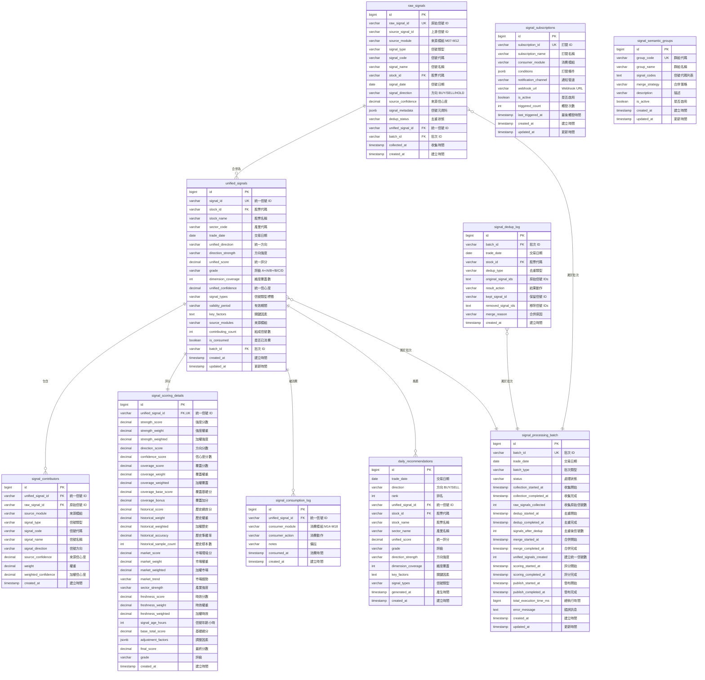
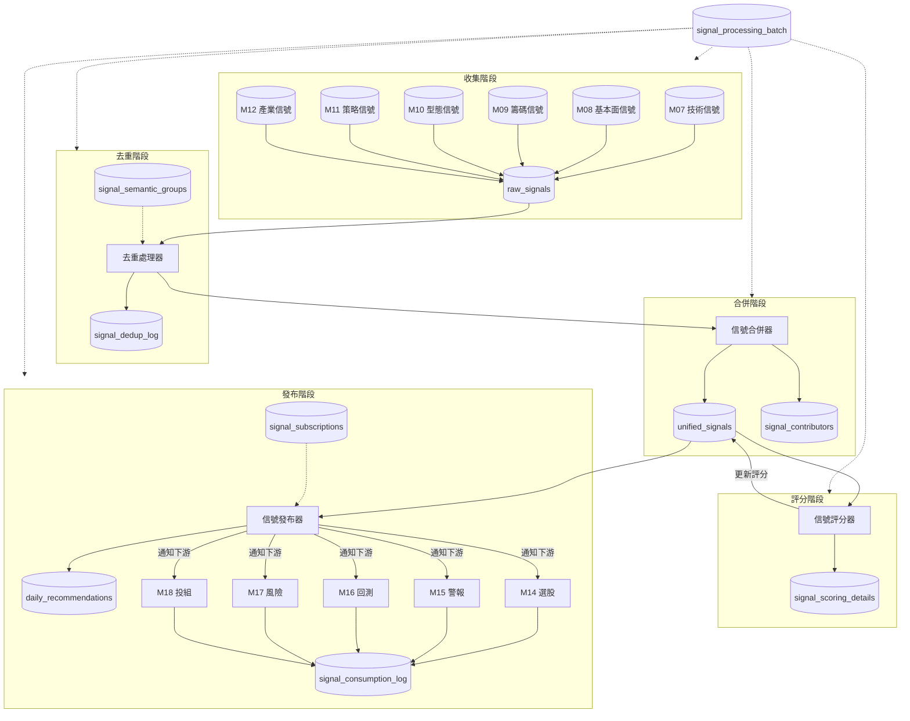
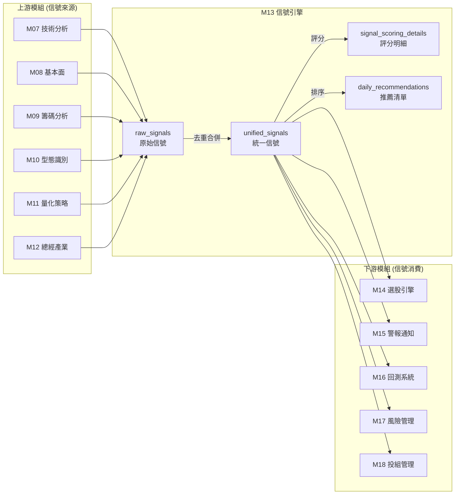

# M13-信號判斷引擎 ERD

> **文件編號**: ERD-M13
> **模組名稱**: 信號判斷引擎 (Signal Judgment Engine)
> **版本**: v1.0
> **最後更新**: 2026-01-14
> **狀態**: Draft

---

## 1. 實體關聯圖

---

## 2. 關聯說明

### 2.1 核心關聯

| 關聯 | 類型 | 說明 |
|-----|------|------|
| raw_signals → unified_signals | 多對一 | 多個原始信號合併為一個統一信號 |
| unified_signals → signal_contributors | 一對多 | 一個統一信號由多個原始信號組成 |
| unified_signals → signal_scoring_details | 一對一 | 每個統一信號有一份評分明細 |
| unified_signals → signal_consumption_log | 一對多 | 一個信號可被多個模組消費 |
| unified_signals → daily_recommendations | 一對多 | 一個信號可出現在多天推薦清單 |

### 2.2 批次關聯

| 關聯 | 類型 | 說明 |
|-----|------|------|
| signal_processing_batch → raw_signals | 一對多 | 一個批次收集多個原始信號 |
| signal_processing_batch → unified_signals | 一對多 | 一個批次產生多個統一信號 |
| signal_processing_batch → signal_dedup_log | 一對多 | 一個批次有多條去重記錄 |

---

## 3. 信號處理流程圖

---

## 4. 資料流向圖

---

## 5. 表格關聯矩陣

| 表格 | raw | unified | contrib | dedup | scoring | consume | subs | reco | semantic | batch |
|-----|-----|---------|---------|-------|---------|---------|------|------|----------|-------|
| raw_signals | - | FK | - | - | - | - | - | - | - | FK |
| unified_signals | - | - | PK | - | PK | PK | - | PK | - | FK |
| signal_contributors | - | FK | - | - | - | - | - | - | - | - |
| signal_dedup_log | - | - | - | - | - | - | - | - | - | FK |
| signal_scoring_details | - | FK | - | - | - | - | - | - | - | - |
| signal_consumption_log | - | FK | - | - | - | - | - | - | - | - |
| signal_subscriptions | - | - | - | - | - | - | - | - | - | - |
| daily_recommendations | - | FK | - | - | - | - | - | - | - | - |
| signal_semantic_groups | - | - | - | - | - | - | - | - | - | - |
| signal_processing_batch | PK | PK | - | PK | - | - | - | - | - | - |

**圖例**: PK = 被參照, FK = 參照外表, - = 無直接關聯

---

## 6. 相關文檔

- [M13 功能需求](../../specs/functional/M13-信號引擎功能需求.md)
- [M13 API 規格](../../specs/api/M13-API規格.md)
- [M13 資料庫設計](../M13-資料庫設計.md)

---

**文件維護者**: 後端工程師
**最後更新**: 2026-01-14
**下次審核**: 2026-04-14
