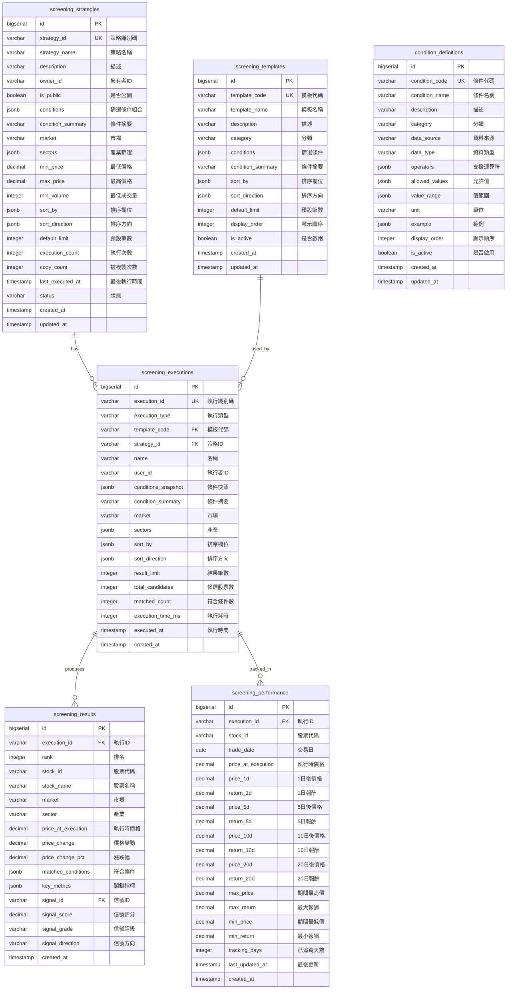
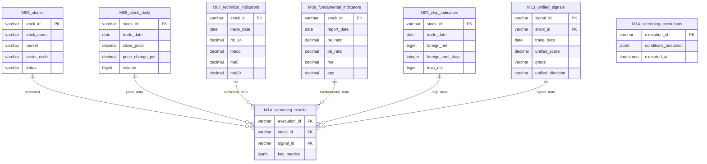

# M14-選股引擎 ERD

> **文件編號**: ERD-M14
> **模組名稱**: 選股引擎 (Stock Screening Engine)
> **版本**: v1.0
> **最後更新**: 2026-01-15
> **狀態**: Draft

---

## 1. 實體關聯圖



---

## 2. 表格關係矩陣

| 主表 | 關聯表 | 關係類型 | 外鍵欄位 | 說明 |
|-----|-------|---------|---------|------|
| screening_strategies | screening_executions | 1:N | strategy_id | 策略的執行記錄 |
| screening_templates | screening_executions | 1:N | template_code | 模板的執行記錄 |
| screening_executions | screening_results | 1:N | execution_id | 執行的結果明細 |
| screening_executions | screening_performance | 1:N | execution_id | 執行的績效追蹤 |

---

## 3. 跨模組關聯



---

## 4. 跨模組依賴說明

| 來源模組 | 依賴說明 | 用途 |
|---------|---------|------|
| M06 | stocks, stock_daily | 股票基本資料、價量資料 |
| M07 | technical_indicators | 技術指標篩選（RSI, MACD, MA等） |
| M08 | fundamental_indicators | 基本面篩選（PE, ROE, EPS等） |
| M09 | chip_indicators | 籌碼面篩選（外資買賣超、連買天數等） |
| M13 | unified_signals | 信號篩選（評級、評分、方向等） |

---

## 5. 資料流說明

### 5.1 篩選執行流程

```
┌─────────────────────────────────────────────────────────────────────┐
│                        選股執行資料流                                 │
├─────────────────────────────────────────────────────────────────────┤
│                                                                      │
│  ┌─────────────────┐                                                │
│  │ condition_      │ ◄── 定義可用篩選條件                            │
│  │ definitions     │                                                │
│  └────────┬────────┘                                                │
│           │ 參照                                                     │
│           ▼                                                         │
│  ┌─────────────────┐     ┌─────────────────┐                       │
│  │ screening_      │     │ screening_      │                       │
│  │ strategies      │────►│ executions      │ ◄── 執行記錄          │
│  │ (自訂策略)       │     │                 │                       │
│  └─────────────────┘     └────────┬────────┘                       │
│                                   │                                  │
│  ┌─────────────────┐              │                                 │
│  │ screening_      │──────────────┤                                 │
│  │ templates       │              │                                 │
│  │ (快速選股)       │              │                                 │
│  └─────────────────┘              │                                 │
│                                   │                                  │
│           ┌───────────────────────┼───────────────────────┐         │
│           │                       │                       │         │
│           ▼                       ▼                       ▼         │
│  ┌─────────────────┐     ┌─────────────────┐     ┌────────────┐    │
│  │ screening_      │     │ screening_      │     │ M06-M13    │    │
│  │ results         │◄────│ 動態查詢         │────►│ 資料表      │    │
│  │ (結果明細)       │     │ (多維度JOIN)     │     │ (資料來源)  │    │
│  └────────┬────────┘     └─────────────────┘     └────────────┘    │
│           │                                                         │
│           │ 績效追蹤                                                 │
│           ▼                                                         │
│  ┌─────────────────┐                                                │
│  │ screening_      │                                                │
│  │ performance     │ ◄── 1d/5d/10d/20d 報酬追蹤                     │
│  └─────────────────┘                                                │
│                                                                      │
└─────────────────────────────────────────────────────────────────────┘
```

### 5.2 動態查詢 JOIN 策略

```
┌─────────────────────────────────────────────────────────────────────┐
│                     動態多維度篩選查詢                               │
├─────────────────────────────────────────────────────────────────────┤
│                                                                      │
│                    ┌──────────────────┐                             │
│                    │  stocks (M06)    │ ◄── 基礎表（必定 JOIN）      │
│                    │  stock_daily     │                             │
│                    └────────┬─────────┘                             │
│                             │                                        │
│       ┌─────────────────────┼─────────────────────┐                 │
│       │                     │                     │                  │
│       ▼                     ▼                     ▼                  │
│  ┌─────────┐          ┌─────────┐          ┌─────────┐              │
│  │  M07    │          │  M08    │          │  M09    │              │
│  │ 技術指標 │          │ 基本面  │          │ 籌碼    │              │
│  │         │          │         │          │         │              │
│  │ LEFT    │          │ LEFT    │          │ LEFT    │              │
│  │ JOIN if │          │ JOIN if │          │ JOIN if │              │
│  │條件需要  │          │條件需要  │          │條件需要  │              │
│  └────┬────┘          └────┬────┘          └────┬────┘              │
│       │                    │                    │                    │
│       └────────────────────┼────────────────────┘                   │
│                            │                                         │
│                            ▼                                         │
│                    ┌──────────────────┐                             │
│                    │  M13 統一信號    │                             │
│                    │  LEFT JOIN if    │                             │
│                    │  信號條件存在     │                             │
│                    └────────┬─────────┘                             │
│                             │                                        │
│                             ▼                                        │
│                    ┌──────────────────┐                             │
│                    │  WHERE 動態條件   │                             │
│                    │  AND/OR 組合     │                             │
│                    └────────┬─────────┘                             │
│                             │                                        │
│                             ▼                                        │
│                    ┌──────────────────┐                             │
│                    │  篩選結果         │                             │
│                    └──────────────────┘                             │
│                                                                      │
└─────────────────────────────────────────────────────────────────────┘
```

---

## 6. 索引設計摘要

| 表格 | 索引名稱 | 欄位 | 用途 |
|-----|---------|------|------|
| screening_strategies | idx_strategies_owner | owner_id, status | 用戶策略列表 |
| screening_strategies | idx_strategies_public | is_public, status | 公開策略查詢 |
| screening_executions | idx_executions_user_date | user_id, executed_at | 執行歷史查詢 |
| screening_executions | idx_executions_strategy | strategy_id, executed_at | 策略執行記錄 |
| screening_results | idx_results_execution | execution_id | 結果查詢 |
| screening_results | idx_results_stock | stock_id, created_at | 股票被選記錄 |
| screening_performance | idx_performance_pending | tracking_days | 待追蹤績效 |

---

## 7. 相關文檔

- [M14 功能需求](../../specs/functional/M14-選股引擎功能需求.md)
- [M14 API 規格](../../specs/api/M14-API規格.md)
- [M14 資料庫設計](../M14-資料庫設計.md)

---

**文件維護者**: 後端工程師
**最後更新**: 2026-01-15
**下次審核**: 2026-04-15
