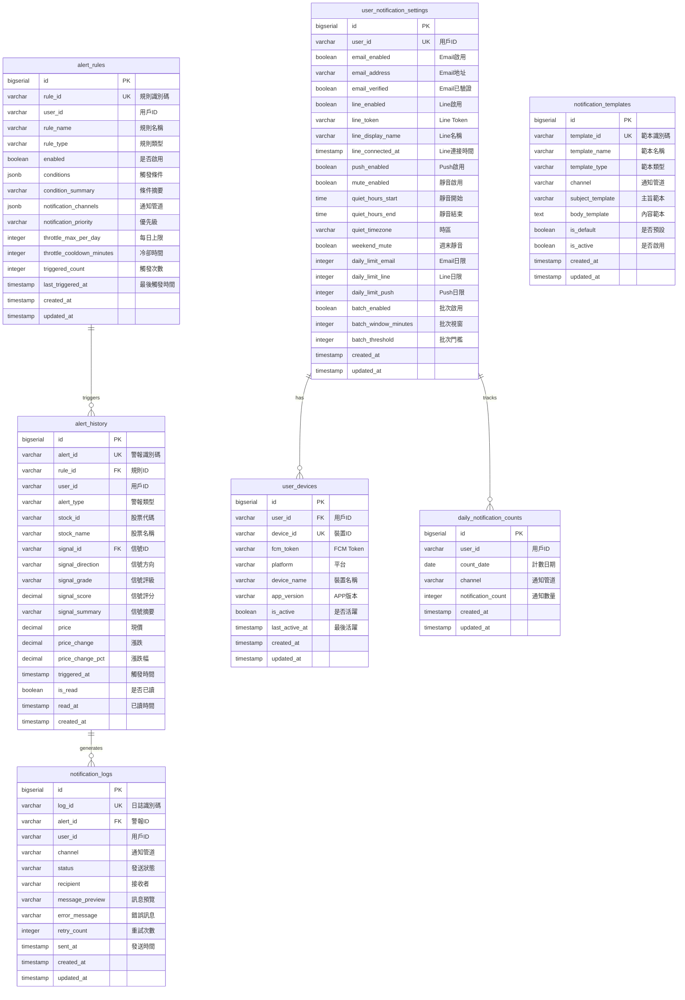
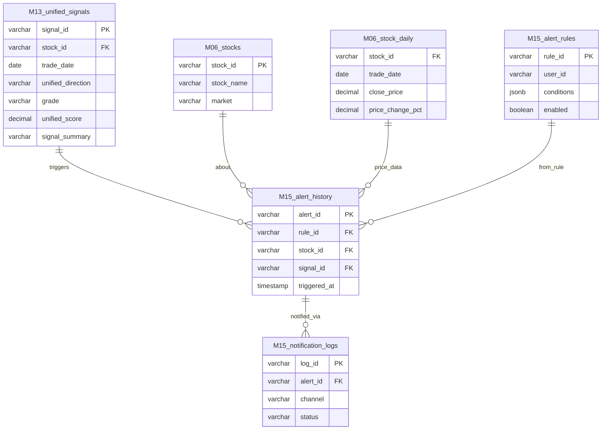

# M15-警報通知系統 ERD

> **文件編號**: ERD-M15
> **模組名稱**: 警報通知系統 (Alert Notification System)
> **版本**: v1.0
> **最後更新**: 2026-01-15
> **狀態**: Draft

---

## 1. 實體關聯圖



---

## 2. 表格關係矩陣

| 主表 | 關聯表 | 關係類型 | 外鍵欄位 | 說明 |
|-----|-------|---------|---------|------|
| alert_rules | alert_history | 1:N | rule_id | 規則觸發的警報 |
| alert_history | notification_logs | 1:N | alert_id | 警報的通知日誌 |
| user_notification_settings | user_devices | 1:N | user_id | 用戶的裝置 |
| user_notification_settings | daily_notification_counts | 1:N | user_id | 每日通知計數 |

---

## 3. 跨模組關聯



---

## 4. 跨模組依賴說明

| 來源模組 | 依賴說明 | 用途 |
|---------|---------|------|
| M13 | unified_signals | 信號觸發來源 |
| M06 | stocks | 股票基本資料（名稱、市場） |
| M06 | stock_daily | 即時價格資料（通知內容） |

---

## 5. 資料流說明

### 5.1 警報觸發流程

```
┌─────────────────────────────────────────────────────────────────────┐
│                        警報觸發資料流                                │
├─────────────────────────────────────────────────────────────────────┤
│                                                                      │
│  ┌─────────────────────┐                                            │
│  │  M13 信號引擎       │ ◄── 信號來源                                │
│  │  unified_signals    │                                            │
│  └──────────┬──────────┘                                            │
│             │ 新信號產生                                             │
│             ▼                                                        │
│  ┌─────────────────────┐                                            │
│  │  alert_rules        │ ◄── 比對用戶規則                           │
│  │  (enabled = true)   │                                            │
│  └──────────┬──────────┘                                            │
│             │ 條件符合                                               │
│             ▼                                                        │
│  ┌─────────────────────┐                                            │
│  │  alert_history      │ ◄── 建立警報記錄                           │
│  └──────────┬──────────┘                                            │
│             │                                                        │
│    ┌────────┼────────────────────────────┐                          │
│    │        │                            │                          │
│    ▼        ▼                            ▼                          │
│  ┌──────┐ ┌──────┐                 ┌──────────────┐                 │
│  │Email │ │Line  │                 │ notification │                 │
│  │發送  │ │發送  │ ...             │ _logs        │                 │
│  └──────┘ └──────┘                 └──────────────┘                 │
│                                    ◄── 記錄發送狀態                 │
│                                                                      │
└─────────────────────────────────────────────────────────────────────┘
```

### 5.2 通知派發流程

```
┌─────────────────────────────────────────────────────────────────────┐
│                        通知派發資料流                                │
├─────────────────────────────────────────────────────────────────────┤
│                                                                      │
│  ┌─────────────────────┐                                            │
│  │  alert_history      │ ◄── 待發送警報                             │
│  └──────────┬──────────┘                                            │
│             │                                                        │
│             ▼                                                        │
│  ┌─────────────────────┐                                            │
│  │ user_notification   │ ◄── 檢查用戶設定                           │
│  │ _settings           │                                            │
│  └──────────┬──────────┘                                            │
│             │                                                        │
│    ┌────────┼────────────────────────────┐                          │
│    │        │                            │                          │
│    ▼        ▼                            ▼                          │
│  ┌─────────────┐  ┌─────────────┐  ┌─────────────┐                  │
│  │ 檢查靜音    │  │ 檢查每日   │  │ 檢查管道    │                  │
│  │ 時段       │  │ 限額       │  │ 啟用狀態    │                  │
│  └──────┬──────┘  └──────┬──────┘  └──────┬──────┘                  │
│         │                │                │                         │
│         └────────────────┼────────────────┘                         │
│                          │                                          │
│                          ▼ 通過檢查                                 │
│  ┌──────────────────────────────────────────────────────────────┐   │
│  │                    通知範本渲染                                │   │
│  │  notification_templates + alert data                          │   │
│  └──────────────────────────┬───────────────────────────────────┘   │
│                             │                                       │
│         ┌───────────────────┼───────────────────┐                   │
│         ▼                   ▼                   ▼                   │
│    ┌─────────┐        ┌─────────┐        ┌─────────┐               │
│    │  Email  │        │  Line   │        │  FCM    │               │
│    │  Sender │        │  Sender │        │  Sender │               │
│    └────┬────┘        └────┬────┘        └────┬────┘               │
│         │                  │                  │                     │
│         └──────────────────┼──────────────────┘                     │
│                            │                                        │
│                            ▼                                        │
│                   ┌─────────────────┐                               │
│                   │ notification    │                               │
│                   │ _logs           │ ◄── 記錄發送結果              │
│                   └─────────────────┘                               │
│                            │                                        │
│                            ▼                                        │
│                   ┌─────────────────┐                               │
│                   │ daily_          │ ◄── 更新每日計數              │
│                   │ notification    │                               │
│                   │ _counts         │                               │
│                   └─────────────────┘                               │
│                                                                      │
└─────────────────────────────────────────────────────────────────────┘
```

---

## 6. 索引設計摘要

| 表格 | 索引名稱 | 欄位 | 用途 |
|-----|---------|------|------|
| alert_rules | idx_rules_user | user_id, enabled | 用戶規則查詢 |
| alert_rules | idx_rules_type | rule_type, enabled | 類型篩選 |
| alert_history | idx_history_user_date | user_id, triggered_at | 歷史分頁 |
| alert_history | idx_history_user_unread | user_id, is_read | 未讀計數 |
| notification_logs | idx_logs_alert | alert_id | 警報日誌查詢 |
| notification_logs | idx_logs_pending | status | 待發送查詢 |
| user_devices | idx_devices_user | user_id, is_active | 用戶裝置 |
| daily_notification_counts | idx_daily_count | user_id, count_date | 限額查詢 |

---

## 7. 相關文檔

- [M15 功能需求](../../specs/functional/M15-警報通知系統功能需求.md)
- [M15 API 規格](../../specs/api/M15-API規格.md)
- [M15 資料庫設計](../M15-資料庫設計.md)

---

**文件維護者**: 後端工程師
**最後更新**: 2026-01-15
**下次審核**: 2026-04-15
