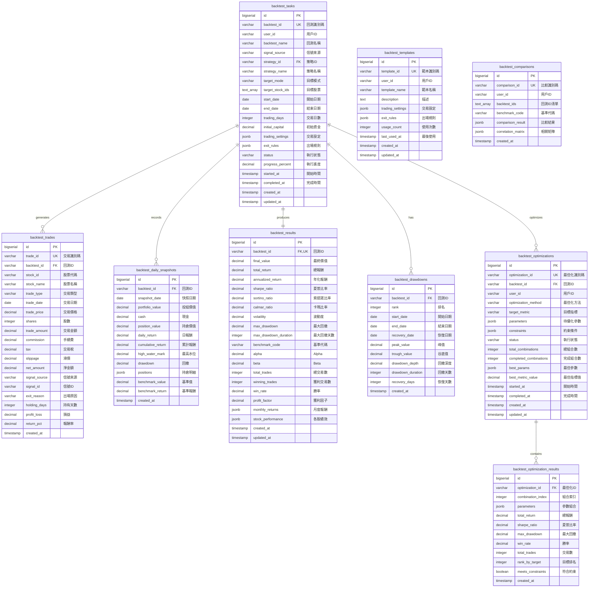
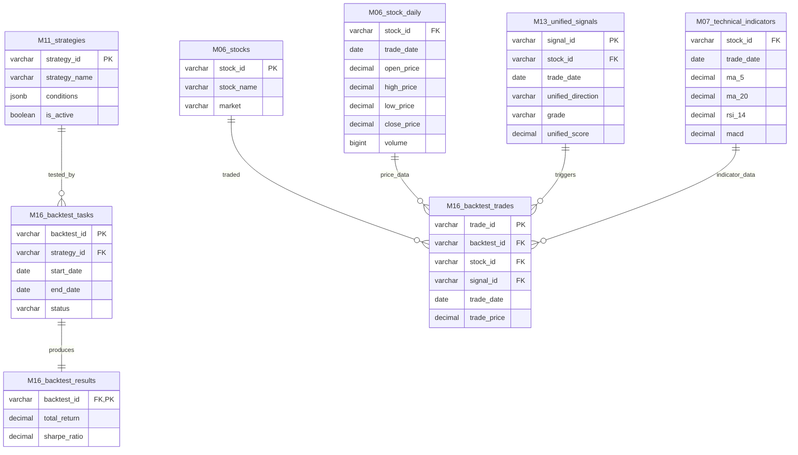

# M16-回測系統 ERD

> **文件編號**: ERD-M16
> **模組名稱**: 回測系統 (Backtesting System)
> **版本**: v1.0
> **最後更新**: 2026-01-15
> **狀態**: Draft

---

## 1. 實體關聯圖



---

## 2. 表格關係矩陣

| 主表 | 關聯表 | 關係類型 | 外鍵欄位 | 說明 |
|-----|-------|---------|---------|------|
| backtest_tasks | backtest_trades | 1:N | backtest_id | 回測的交易記錄 |
| backtest_tasks | backtest_daily_snapshots | 1:N | backtest_id | 回測的每日快照 |
| backtest_tasks | backtest_results | 1:1 | backtest_id | 回測的績效結果 |
| backtest_tasks | backtest_drawdowns | 1:N | backtest_id | 回測的回撤記錄 |
| backtest_tasks | backtest_optimizations | 1:N | backtest_id | 回測的最佳化任務 |
| backtest_optimizations | backtest_optimization_results | 1:N | optimization_id | 最佳化的各組合結果 |

---

## 3. 跨模組關聯



---

## 4. 跨模組依賴說明

| 來源模組 | 依賴說明 | 用途 |
|---------|---------|------|
| M06 | stocks, stock_daily | 歷史價格數據、股票基本資料 |
| M07 | technical_indicators | 技術指標數據（回測信號依據） |
| M11 | strategies | 策略定義（回測策略來源） |
| M13 | unified_signals | 統一信號（回測觸發點） |

---

## 5. 資料流說明

### 5.1 回測執行資料流

```
┌─────────────────────────────────────────────────────────────────┐
│                      回測執行資料流                              │
├─────────────────────────────────────────────────────────────────┤
│                                                                  │
│  ┌─────────────────────┐                                        │
│  │  backtest_tasks     │ ◄── 用戶建立回測任務                   │
│  │  (設定與狀態)        │                                        │
│  └──────────┬──────────┘                                        │
│             │ 執行回測                                           │
│             ▼                                                    │
│  ┌──────────────────────────────────────────────────────────┐   │
│  │                    回測引擎執行                            │   │
│  │                                                           │   │
│  │  ┌────────────┐   ┌────────────┐   ┌────────────┐        │   │
│  │  │ M06 價格   │   │ M07 指標   │   │ M13 信號   │        │   │
│  │  │ stock_daily│   │ indicators │   │ unified    │        │   │
│  │  └─────┬──────┘   └─────┬──────┘   └─────┬──────┘        │   │
│  │        │                │                │               │   │
│  │        └────────────────┴────────────────┘               │   │
│  │                         │                                │   │
│  │                         ▼                                │   │
│  │              ┌─────────────────────┐                     │   │
│  │              │   逐日掃描與模擬     │                     │   │
│  │              └─────────┬───────────┘                     │   │
│  │                        │                                 │   │
│  └────────────────────────┼─────────────────────────────────┘   │
│                           │                                     │
│         ┌─────────────────┼─────────────────┐                   │
│         │                 │                 │                   │
│         ▼                 ▼                 ▼                   │
│  ┌──────────────┐  ┌──────────────┐  ┌──────────────┐          │
│  │ backtest_    │  │ backtest_    │  │ backtest_    │          │
│  │ trades       │  │ daily_       │  │ drawdowns    │          │
│  │ (交易記錄)    │  │ snapshots    │  │ (回撤記錄)    │          │
│  └──────────────┘  │ (每日快照)    │  └──────────────┘          │
│                    └──────────────┘                             │
│                           │                                     │
│                           ▼                                     │
│                    ┌──────────────┐                             │
│                    │ backtest_    │                             │
│                    │ results      │ ◄── 績效計算                │
│                    │ (績效指標)    │                             │
│                    └──────────────┘                             │
│                                                                  │
└─────────────────────────────────────────────────────────────────┘
```

### 5.2 參數最佳化資料流

```
┌─────────────────────────────────────────────────────────────────┐
│                    參數最佳化資料流                              │
├─────────────────────────────────────────────────────────────────┤
│                                                                  │
│  ┌─────────────────────┐                                        │
│  │  backtest_tasks     │ ◄── 基準回測任務                       │
│  │  (原始設定)          │                                        │
│  └──────────┬──────────┘                                        │
│             │                                                    │
│             ▼                                                    │
│  ┌─────────────────────┐                                        │
│  │ backtest_           │ ◄── 建立最佳化任務                     │
│  │ optimizations       │                                        │
│  │ • parameters        │ ◄── 待優化參數範圍                     │
│  │ • target_metric     │ ◄── 目標指標                           │
│  │ • constraints       │ ◄── 約束條件                           │
│  └──────────┬──────────┘                                        │
│             │                                                    │
│             ▼                                                    │
│  ┌──────────────────────────────────────────────────────────┐   │
│  │                  網格搜尋 / 隨機搜尋                       │   │
│  │                                                           │   │
│  │   參數組合 1 ──► 回測 ──► 績效                            │   │
│  │   參數組合 2 ──► 回測 ──► 績效                            │   │
│  │   參數組合 3 ──► 回測 ──► 績效                            │   │
│  │        ...                                                │   │
│  │   參數組合 N ──► 回測 ──► 績效                            │   │
│  │                                                           │   │
│  └──────────────────────────┬────────────────────────────────┘   │
│                             │                                    │
│                             ▼                                    │
│  ┌─────────────────────────────────────────────────────────┐    │
│  │           backtest_optimization_results                  │    │
│  │                                                          │    │
│  │  ┌─────────────────────────────────────────────────┐    │    │
│  │  │ 組合 | stopLoss | takeProfit | sharpe | return │    │    │
│  │  ├─────────────────────────────────────────────────┤    │    │
│  │  │   1  │   0.07   │    0.20    │  1.45  │  0.35  │    │    │
│  │  │   2  │   0.06   │    0.18    │  1.42  │  0.33  │    │    │
│  │  │  ... │   ...    │    ...     │  ...   │  ...   │    │    │
│  │  └─────────────────────────────────────────────────┘    │    │
│  │                                                          │    │
│  └─────────────────────────────────────────────────────────┘    │
│                             │                                    │
│                             ▼                                    │
│                    ┌──────────────┐                             │
│                    │ 更新最佳結果  │                             │
│                    │ best_params  │                             │
│                    └──────────────┘                             │
│                                                                  │
└─────────────────────────────────────────────────────────────────┘
```

---

## 6. 索引設計摘要

| 表格 | 索引名稱 | 欄位 | 用途 |
|-----|---------|------|------|
| backtest_tasks | idx_tasks_user | user_id, created_at DESC | 用戶回測清單 |
| backtest_tasks | idx_tasks_status | status | 狀態篩選 |
| backtest_tasks | idx_tasks_strategy | strategy_id | 策略篩選 |
| backtest_trades | idx_trades_backtest | backtest_id, trade_date | 交易清單查詢 |
| backtest_trades | idx_trades_stock | backtest_id, stock_id | 股票篩選 |
| backtest_daily_snapshots | idx_snapshots_backtest | backtest_id, snapshot_date | 淨值曲線 |
| backtest_drawdowns | idx_drawdowns_backtest | backtest_id, rank | 回撤排名 |
| backtest_optimizations | idx_opt_backtest | backtest_id | 最佳化查詢 |
| backtest_optimization_results | idx_opt_results | optimization_id, rank_by_target | 結果排名 |
| backtest_templates | idx_templates_user | user_id | 用戶範本 |
| backtest_comparisons | idx_comparisons_user | user_id, created_at DESC | 比較歷史 |

---

## 7. 相關文檔

- [M16 功能需求](../../specs/functional/M16-回測系統功能需求.md)
- [M16 API 規格](../../specs/api/M16-API規格.md)
- [M16 資料庫設計](../M16-資料庫設計.md)

---

**文件維護者**: 後端工程師
**最後更新**: 2026-01-15
**下次審核**: 2026-04-15
