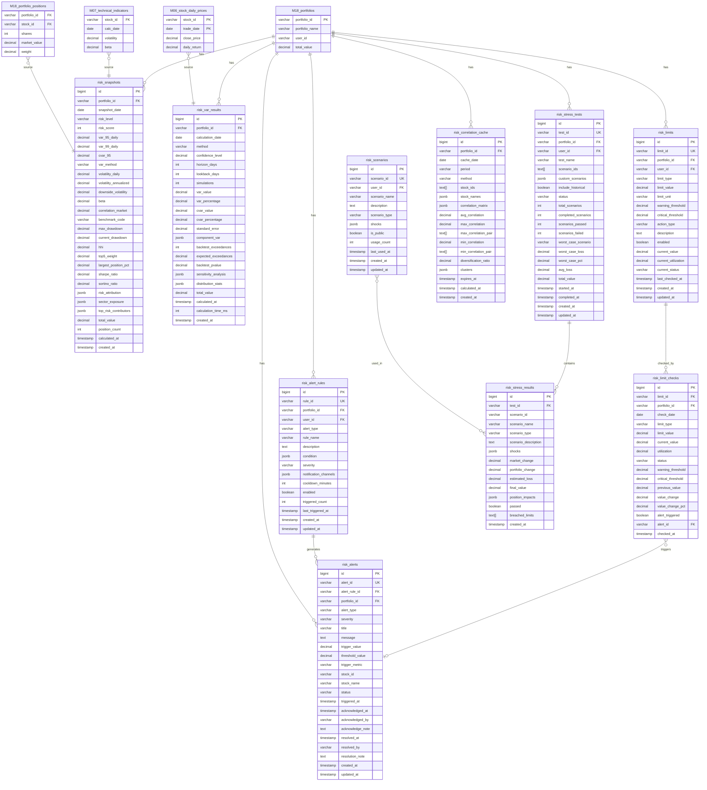

# M17-風險管理模組 ERD

> **文件編號**: ERD-M17
> **模組名稱**: 風險管理模組 (Risk Management Module)
> **版本**: v1.0
> **最後更新**: 2026-01-15
> **狀態**: Draft

---

## 1. ERD 總覽



---

## 2. 實體關聯說明

### 2.1 核心風險計算

| 來源表 | 目標表 | 關聯類型 | 說明 |
|-------|-------|---------|------|
| M18_portfolios | risk_snapshots | 1:N | 每個投組每日一筆風險快照 |
| M18_portfolios | risk_var_results | 1:N | 每個投組可有多種 VaR 計算結果 |
| M06_stock_daily_prices | risk_var_results | N:1 | VaR 計算依賴歷史價格 |
| M07_technical_indicators | risk_snapshots | N:1 | 風險快照參考技術指標 |

### 2.2 限額與預警

| 來源表 | 目標表 | 關聯類型 | 說明 |
|-------|-------|---------|------|
| risk_limits | risk_limit_checks | 1:N | 每個限額每日檢查一次 |
| risk_limit_checks | risk_alerts | 1:0..1 | 檢查可能觸發預警 |
| risk_alert_rules | risk_alerts | 1:N | 規則可觸發多個預警 |
| M18_portfolios | risk_alerts | 1:N | 投組可有多個預警 |

### 2.3 壓力測試

| 來源表 | 目標表 | 關聯類型 | 說明 |
|-------|-------|---------|------|
| risk_stress_tests | risk_stress_results | 1:N | 每次測試包含多個情境結果 |
| risk_scenarios | risk_stress_results | N:M | 情境可用於多次測試 |

---

## 3. 資料流向圖

```
┌─────────────────────────────────────────────────────────────────────────┐
│                          M17 風險管理資料流向                             │
├─────────────────────────────────────────────────────────────────────────┤
│                                                                          │
│  ┌─────────────────────────────────────────────────────────────────┐   │
│  │                         輸入資料來源                              │   │
│  ├─────────────────────────────────────────────────────────────────┤   │
│  │                                                                   │   │
│  │  ┌───────────────┐  ┌───────────────┐  ┌───────────────┐        │   │
│  │  │ M06 股價資料   │  │ M07 技術指標   │  │ M18 投組持倉   │        │   │
│  │  │ daily_prices  │  │ indicators    │  │ positions     │        │   │
│  │  └───────┬───────┘  └───────┬───────┘  └───────┬───────┘        │   │
│  │          │                  │                  │                 │   │
│  └──────────┼──────────────────┼──────────────────┼─────────────────┘   │
│             │                  │                  │                      │
│             ▼                  ▼                  ▼                      │
│  ┌─────────────────────────────────────────────────────────────────┐   │
│  │                       風險計算引擎                                │   │
│  ├─────────────────────────────────────────────────────────────────┤   │
│  │                                                                   │   │
│  │  ┌─────────────┐    ┌─────────────┐    ┌─────────────┐          │   │
│  │  │ VaR Engine  │    │ Volatility  │    │ Correlation │          │   │
│  │  │             │    │ Calculator  │    │ Analyzer    │          │   │
│  │  └──────┬──────┘    └──────┬──────┘    └──────┬──────┘          │   │
│  │         │                  │                  │                  │   │
│  └─────────┼──────────────────┼──────────────────┼──────────────────┘   │
│            │                  │                  │                       │
│            ▼                  ▼                  ▼                       │
│  ┌─────────────────────────────────────────────────────────────────┐   │
│  │                        風險資料儲存                               │   │
│  ├─────────────────────────────────────────────────────────────────┤   │
│  │                                                                   │   │
│  │  ┌───────────────┐  ┌───────────────┐  ┌───────────────┐        │   │
│  │  │risk_snapshots │  │risk_var_results│ │correlation    │        │   │
│  │  │ (每日快照)     │  │ (VaR 結果)     │  │_cache         │        │   │
│  │  └───────────────┘  └───────────────┘  └───────────────┘        │   │
│  │                                                                   │   │
│  └─────────────────────────────────────────────────────────────────┘   │
│                                    │                                     │
│            ┌───────────────────────┼───────────────────────┐            │
│            ▼                       ▼                       ▼            │
│  ┌─────────────────┐    ┌─────────────────┐    ┌─────────────────┐    │
│  │   限額檢查       │    │   預警觸發       │    │   壓力測試       │    │
│  ├─────────────────┤    ├─────────────────┤    ├─────────────────┤    │
│  │ risk_limits     │    │ risk_alert_rules│    │risk_stress_tests│    │
│  │       │         │    │       │         │    │       │         │    │
│  │       ▼         │    │       ▼         │    │       ▼         │    │
│  │limit_checks     │    │  risk_alerts    │    │stress_results   │    │
│  └─────────────────┘    └─────────────────┘    └─────────────────┘    │
│            │                       │                       │            │
│            └───────────────────────┼───────────────────────┘            │
│                                    ▼                                     │
│  ┌─────────────────────────────────────────────────────────────────┐   │
│  │                          輸出服務                                 │   │
│  ├─────────────────────────────────────────────────────────────────┤   │
│  │  • 風險報告生成                                                   │   │
│  │  • 預警通知發送                                                   │   │
│  │  • M18 投組管理 (下游)                                            │   │
│  └─────────────────────────────────────────────────────────────────┘   │
│                                                                          │
└─────────────────────────────────────────────────────────────────────────┘
```

---

## 4. 索引策略

### 4.1 查詢模式分析

| 查詢場景 | 頻率 | 對應索引 |
|---------|------|---------|
| 取得投組最新風險快照 | 高 | `idx_risk_snapshots_portfolio` |
| 查詢歷史風險趨勢 | 中 | `idx_risk_snapshots_date` |
| 取得有效預警 | 高 | `idx_alerts_active` |
| 限額狀態檢查 | 高 | `idx_risk_limits_portfolio` |
| 壓力測試結果 | 低 | `idx_stress_results_test` |

### 4.2 關鍵索引

```sql
-- 風險快照：投組+日期查詢
CREATE INDEX idx_risk_snapshots_portfolio ON risk_snapshots(portfolio_id, snapshot_date DESC);

-- VaR 結果：按方法查詢
CREATE INDEX idx_var_results_method ON risk_var_results(portfolio_id, method, calculation_date DESC);

-- 限額：啟用中的限額
CREATE INDEX idx_risk_limits_active ON risk_limits(portfolio_id, enabled) WHERE enabled = TRUE;

-- 預警：有效預警快速查詢
CREATE INDEX idx_alerts_active ON risk_alerts(portfolio_id, status) WHERE status = 'ACTIVE';

-- 相關性快取：過期清理
CREATE INDEX idx_correlation_cache_expires ON risk_correlation_cache(expires_at);
```

---

## 5. 資料生命週期

### 5.1 保留策略

| 資料表 | 保留期限 | 清理策略 |
|-------|---------|---------|
| risk_snapshots | 3 年 | 按月保留月底快照 |
| risk_var_results | 1 年 | 保留每日最新計算 |
| risk_limit_checks | 1 年 | 定期清理 |
| risk_alerts | 2 年 | 已解決超過 1 年可清理 |
| risk_stress_tests | 1 年 | 保留結果摘要 |
| risk_correlation_cache | 7 天 | 自動過期 |

### 5.2 資料量預估

| 資料表 | 每投組每日筆數 | 100 投組/年預估 |
|-------|--------------|---------------|
| risk_snapshots | 1 | 36,500 筆 |
| risk_var_results | 3 (不同方法) | 109,500 筆 |
| risk_limit_checks | 8 (限額類型) | 292,000 筆 |
| risk_alerts | 0.5 (平均) | 18,250 筆 |

---

## 6. 跨模組依賴

### 6.1 上游依賴

```
┌─────────────────────────────────────────────────────────────┐
│                    M17 上游依賴                              │
├─────────────────────────────────────────────────────────────┤
│                                                              │
│  ┌─────────────┐      ┌─────────────┐      ┌─────────────┐ │
│  │    M06      │      │    M07      │      │    M18      │ │
│  │  資料管理    │      │  技術分析    │      │  投組管理    │ │
│  ├─────────────┤      ├─────────────┤      ├─────────────┤ │
│  │ • 股價資料   │      │ • 波動度     │      │ • 投組定義   │ │
│  │ • 成交量     │      │ • Beta      │      │ • 持倉明細   │ │
│  │ • 歷史報酬   │      │ • 技術指標   │      │ • 市值權重   │ │
│  └──────┬──────┘      └──────┬──────┘      └──────┬──────┘ │
│         │                    │                    │         │
│         └────────────────────┼────────────────────┘         │
│                              ▼                               │
│                     ┌─────────────┐                         │
│                     │    M17      │                         │
│                     │  風險管理    │                         │
│                     └─────────────┘                         │
│                                                              │
└─────────────────────────────────────────────────────────────┘
```

### 6.2 下游輸出

```
┌─────────────────────────────────────────────────────────────┐
│                    M17 下游輸出                              │
├─────────────────────────────────────────────────────────────┤
│                                                              │
│                     ┌─────────────┐                         │
│                     │    M17      │                         │
│                     │  風險管理    │                         │
│                     └──────┬──────┘                         │
│                            │                                 │
│         ┌──────────────────┼──────────────────┐             │
│         ▼                  ▼                  ▼             │
│  ┌─────────────┐    ┌─────────────┐    ┌─────────────┐     │
│  │    M18      │    │   通知系統   │    │   報表系統   │     │
│  │  投組管理    │    │             │    │             │     │
│  ├─────────────┤    ├─────────────┤    ├─────────────┤     │
│  │ • 風險控制   │    │ • 預警通知   │    │ • 風險報告   │     │
│  │ • 再平衡建議 │    │ • Email     │    │ • 儀表板     │     │
│  │ • 限額檢查   │    │ • Push      │    │ • PDF 匯出   │     │
│  └─────────────┘    └─────────────┘    └─────────────┘     │
│                                                              │
└─────────────────────────────────────────────────────────────┘
```

---

## 7. 相關文檔

- [M17 功能需求](../../specs/functional/M17-風險管理功能需求.md)
- [M17 API 規格](../../specs/api/M17-API規格.md)
- [M17 資料庫設計](../M17-資料庫設計.md)
- [M18 ERD](./M18-ERD.md)

---

**文件維護者**: 後端工程師
**最後更新**: 2026-01-15
**下次審核**: 2026-04-15
