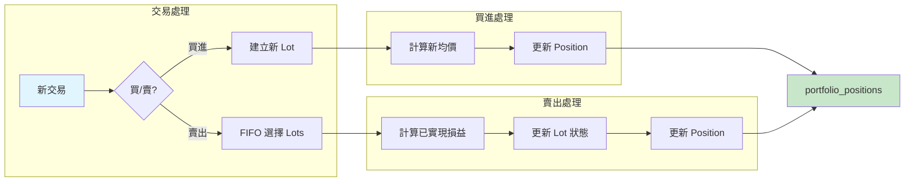
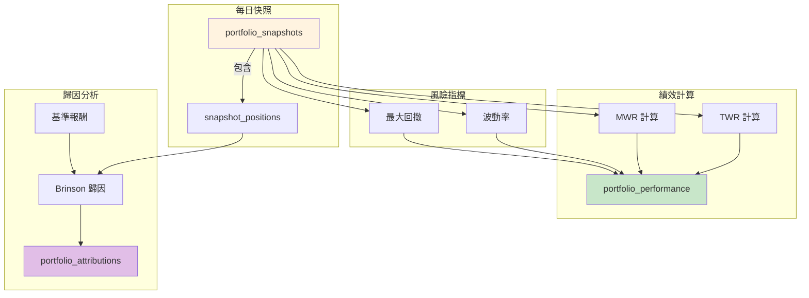
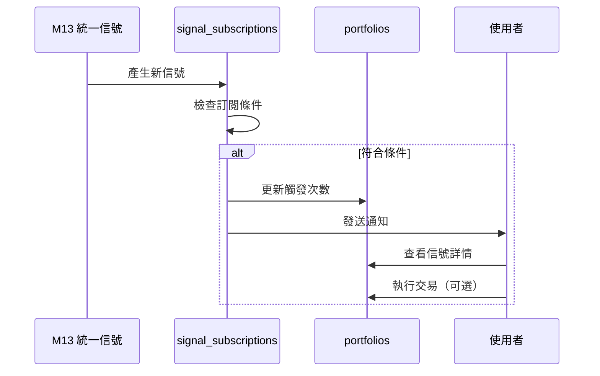

# M18 投資組合管理 ERD

## 文件資訊
| 項目 | 內容 |
|------|------|
| 模組代號 | M18 |
| 模組名稱 | 投資組合管理 Portfolio Management |
| 文件版本 | 1.0 |
| 建立日期 | 2026-01-15 |

---

## Entity Relationship Diagram

```mermaid
erDiagram
    %% ==================== 核心實體 ====================

    portfolios {
        varchar id PK "投資組合ID"
        varchar name "名稱"
        varchar description "描述"
        varchar currency "幣別"
        varchar benchmark_id FK "基準ID"
        decimal initial_cash "初始資金"
        decimal cash_balance "現金餘額"
        decimal total_value "總價值"
        decimal market_value "市值"
        decimal unrealized_pnl "未實現損益"
        decimal realized_pnl "已實現損益"
        varchar status "狀態"
        decimal rebalance_threshold "再平衡閾值"
        boolean auto_rebalance "自動再平衡"
        boolean track_dividends "追蹤股利"
        boolean dividend_reinvest "股利再投資"
        timestamp created_at "建立時間"
        timestamp updated_at "更新時間"
        timestamp closed_at "關閉時間"
    }

    portfolio_target_allocations {
        varchar id PK "配置ID"
        varchar portfolio_id FK "投資組合ID"
        varchar stock_id FK "股票代碼"
        decimal target_weight "目標權重"
        decimal min_weight "最低權重"
        decimal max_weight "最高權重"
        integer priority "優先順序"
        timestamp created_at "建立時間"
    }

    portfolio_positions {
        varchar id PK "持倉ID"
        varchar portfolio_id FK "投資組合ID"
        varchar stock_id FK "股票代碼"
        decimal shares "持有股數"
        decimal avg_cost "平均成本"
        decimal total_cost "總成本"
        decimal current_price "現價"
        decimal market_value "市值"
        decimal weight "權重"
        decimal unrealized_pnl "未實現損益"
        decimal unrealized_pnl_pct "未實現報酬率"
        decimal realized_pnl "已實現損益"
        date first_buy_date "首次買入日"
        date last_trade_date "最後交易日"
        timestamp updated_at "更新時間"
    }

    portfolio_position_lots {
        varchar id PK "批次ID"
        varchar portfolio_id FK "投資組合ID"
        varchar position_id FK "持倉ID"
        varchar stock_id FK "股票代碼"
        varchar trade_id FK "交易ID"
        date purchase_date "買入日期"
        decimal original_shares "原始股數"
        decimal remaining_shares "剩餘股數"
        decimal cost_per_share "每股成本"
        decimal total_cost "總成本"
        varchar status "狀態"
        date closed_date "結清日期"
        decimal realized_pnl "已實現損益"
    }

    portfolio_trades {
        varchar id PK "交易ID"
        varchar portfolio_id FK "投資組合ID"
        varchar stock_id FK "股票代碼"
        date trade_date "交易日期"
        time trade_time "交易時間"
        varchar trade_type "交易類型"
        decimal shares "股數"
        decimal price "價格"
        decimal gross_amount "總金額"
        decimal fees "手續費"
        decimal tax "稅金"
        decimal net_amount "淨金額"
        decimal position_shares "成交後股數"
        decimal position_avg_cost "成交後均價"
        decimal realized_pnl "已實現損益"
        varchar notes "備註"
        timestamp created_at "建立時間"
    }

    %% ==================== 快照與績效 ====================

    portfolio_snapshots {
        varchar id PK "快照ID"
        varchar portfolio_id FK "投資組合ID"
        date snapshot_date "快照日期"
        time snapshot_time "快照時間"
        decimal total_value "總價值"
        decimal market_value "市值"
        decimal cash_balance "現金餘額"
        decimal unrealized_pnl "未實現損益"
        decimal realized_pnl "已實現損益"
        decimal daily_pnl "當日損益"
        decimal daily_return "當日報酬率"
        integer position_count "持倉數量"
        decimal cumulative_return "累積報酬率"
        decimal cash_inflow "現金流入"
        decimal cash_outflow "現金流出"
    }

    portfolio_snapshot_positions {
        varchar id PK "ID"
        varchar snapshot_id FK "快照ID"
        varchar portfolio_id FK "投資組合ID"
        date snapshot_date "快照日期"
        varchar stock_id FK "股票代碼"
        decimal shares "股數"
        decimal avg_cost "平均成本"
        decimal close_price "收盤價"
        decimal market_value "市值"
        decimal weight "權重"
        decimal unrealized_pnl "未實現損益"
        decimal daily_change "當日漲跌"
        decimal daily_change_pct "當日漲跌幅"
    }

    portfolio_performance {
        varchar id PK "績效ID"
        varchar portfolio_id FK "投資組合ID"
        date calc_date "計算日期"
        varchar period_type "期間類型"
        date period_start "期間起始"
        date period_end "期間結束"
        decimal twr "時間加權報酬率"
        decimal twr_annualized "年化TWR"
        decimal mwr "金額加權報酬率"
        decimal mwr_annualized "年化MWR"
        decimal volatility "波動率"
        decimal sharpe_ratio "夏普比率"
        decimal sortino_ratio "索提諾比率"
        decimal max_drawdown "最大回撤"
        decimal beta "Beta"
        decimal alpha "Alpha"
        decimal information_ratio "資訊比率"
        decimal tracking_error "追蹤誤差"
        varchar benchmark_id FK "基準ID"
        decimal benchmark_return "基準報酬"
        decimal excess_return "超額報酬"
    }

    portfolio_attributions {
        varchar id PK "歸因ID"
        varchar portfolio_id FK "投資組合ID"
        date calc_date "計算日期"
        date period_start "期間起始"
        date period_end "期間結束"
        varchar method "歸因方法"
        decimal total_return "總報酬"
        decimal benchmark_return "基準報酬"
        decimal active_return "主動報酬"
        decimal allocation_effect "配置效果"
        decimal selection_effect "選股效果"
        decimal interaction_effect "交互效果"
        jsonb sector_attribution "產業歸因"
        jsonb stock_attribution "個股歸因"
    }

    %% ==================== 現金與股利 ====================

    portfolio_cash_transactions {
        varchar id PK "異動ID"
        varchar portfolio_id FK "投資組合ID"
        date transaction_date "異動日期"
        varchar transaction_type "異動類型"
        decimal amount "金額"
        decimal balance_before "異動前餘額"
        decimal balance_after "異動後餘額"
        varchar reference_type "參考類型"
        varchar reference_id "參考ID"
        varchar description "說明"
        timestamp created_at "建立時間"
    }

    portfolio_dividends {
        varchar id PK "股利ID"
        varchar portfolio_id FK "投資組合ID"
        varchar position_id FK "持倉ID"
        varchar stock_id FK "股票代碼"
        date ex_date "除息日"
        date record_date "基準日"
        date pay_date "發放日"
        varchar dividend_type "股利類型"
        decimal shares_held "持有股數"
        decimal dividend_per_share "每股股利"
        decimal gross_amount "總金額"
        decimal tax_withheld "扣繳稅額"
        decimal net_amount "淨金額"
        decimal shares_received "配發股數"
        varchar status "狀態"
        boolean reinvested "已再投資"
        varchar reinvest_trade_id FK "再投資交易ID"
    }

    %% ==================== 信號與報告 ====================

    portfolio_signal_subscriptions {
        varchar id PK "訂閱ID"
        varchar portfolio_id FK "投資組合ID"
        varchar stock_id FK "股票代碼"
        varchar signal_types "信號類型"
        decimal min_strength "最低強度"
        boolean notify_email "Email通知"
        boolean notify_push "推播通知"
        varchar status "狀態"
        timestamp last_triggered_at "最後觸發時間"
        integer trigger_count "觸發次數"
    }

    portfolio_reports {
        varchar id PK "報告ID"
        varchar portfolio_id FK "投資組合ID"
        varchar report_type "報告類型"
        date period_start "期間起始"
        date period_end "期間結束"
        varchar format "檔案格式"
        varchar language "語言"
        varchar sections "報告區段"
        varchar status "狀態"
        varchar file_path "檔案路徑"
        bigint file_size "檔案大小"
        timestamp generated_at "產生時間"
        timestamp expires_at "過期時間"
    }

    portfolio_benchmarks {
        varchar id PK "基準ID"
        varchar name "名稱"
        varchar benchmark_type "基準類型"
        varchar description "描述"
        varchar ticker "代碼"
        varchar data_source "資料來源"
        date inception_date "成立日期"
        boolean is_active "是否啟用"
    }

    %% ==================== 跨模組參考 ====================

    stocks {
        varchar stock_id PK "股票代碼"
        varchar name "股票名稱"
        varchar industry "產業"
    }

    unified_signals {
        varchar id PK "信號ID"
        varchar stock_id FK "股票代碼"
        varchar signal_type "信號類型"
        varchar source_module "來源模組"
        decimal strength "信號強度"
    }

    %% ==================== 關聯定義 ====================

    portfolios ||--o{ portfolio_target_allocations : "has targets"
    portfolios ||--o{ portfolio_positions : "has positions"
    portfolios ||--o{ portfolio_trades : "has trades"
    portfolios ||--o{ portfolio_snapshots : "has snapshots"
    portfolios ||--o{ portfolio_performance : "has performance"
    portfolios ||--o{ portfolio_attributions : "has attributions"
    portfolios ||--o{ portfolio_cash_transactions : "has cash tx"
    portfolios ||--o{ portfolio_dividends : "has dividends"
    portfolios ||--o{ portfolio_signal_subscriptions : "has subscriptions"
    portfolios ||--o{ portfolio_reports : "has reports"
    portfolios }o--|| portfolio_benchmarks : "benchmarks against"

    portfolio_positions ||--o{ portfolio_position_lots : "has lots"
    portfolio_positions ||--o{ portfolio_dividends : "receives dividends"

    portfolio_snapshots ||--o{ portfolio_snapshot_positions : "contains"

    portfolio_trades ||--o{ portfolio_position_lots : "creates lot"
    portfolio_trades ||--o| portfolio_dividends : "reinvest creates"

    portfolio_target_allocations }o--|| stocks : "targets"
    portfolio_positions }o--|| stocks : "holds"
    portfolio_position_lots }o--|| stocks : "for stock"
    portfolio_trades }o--|| stocks : "trades"
    portfolio_dividends }o--|| stocks : "from stock"
    portfolio_snapshot_positions }o--|| stocks : "snapshot of"
    portfolio_signal_subscriptions }o--|| stocks : "subscribes"

    portfolio_signal_subscriptions }o--o{ unified_signals : "receives from M13"
```



---

## 實體關聯說明

### 核心關聯

| 父實體 | 子實體 | 關聯類型 | 說明 |
|--------|--------|----------|------|
| portfolios | portfolio_target_allocations | 1:N | 一個投組有多個目標配置 |
| portfolios | portfolio_positions | 1:N | 一個投組有多個持倉 |
| portfolios | portfolio_trades | 1:N | 一個投組有多筆交易 |
| portfolios | portfolio_snapshots | 1:N | 一個投組有多個每日快照 |
| portfolio_positions | portfolio_position_lots | 1:N | 一個持倉有多個成本批次 |
| portfolio_snapshots | portfolio_snapshot_positions | 1:N | 一個快照有多個持倉明細 |

### 績效與分析

| 父實體 | 子實體 | 關聯類型 | 說明 |
|--------|--------|----------|------|
| portfolios | portfolio_performance | 1:N | 各期間績效指標 |
| portfolios | portfolio_attributions | 1:N | Brinson 績效歸因 |
| portfolios | portfolio_benchmarks | N:1 | 投組對應一個基準 |

### 現金與股利

| 父實體 | 子實體 | 關聯類型 | 說明 |
|--------|--------|----------|------|
| portfolios | portfolio_cash_transactions | 1:N | 現金帳戶異動記錄 |
| portfolios | portfolio_dividends | 1:N | 股利發放記錄 |
| portfolio_positions | portfolio_dividends | 1:N | 持倉對應的股利 |
| portfolio_trades | portfolio_dividends | 1:1 | 股利再投資交易 |

### 跨模組整合

| 來源模組 | 目標實體 | 關聯說明 |
|----------|----------|----------|
| M06 (stocks) | portfolio_positions | 持倉股票基本資料 |
| M06 (stock_prices) | portfolio_positions | 股票現價更新 |
| M13 (unified_signals) | portfolio_signal_subscriptions | 信號訂閱整合 |
| M17 (risk_snapshots) | portfolios | 風險指標整合 |

---

## 資料流向

```
┌─────────────────────────────────────────────────────────────────┐
│                     M18 投資組合管理模組                          │
├─────────────────────────────────────────────────────────────────┤
│                                                                 │
│   ┌─────────────┐    ┌─────────────┐    ┌─────────────┐        │
│   │ portfolios  │───>│  positions  │───>│    lots     │        │
│   └──────┬──────┘    └──────┬──────┘    └─────────────┘        │
│          │                  │                                   │
│          │    ┌─────────────┴─────────────┐                    │
│          │    │                           │                    │
│          v    v                           v                    │
│   ┌─────────────┐    ┌─────────────┐    ┌─────────────┐        │
│   │   trades    │───>│  snapshots  │───>│ snap_pos    │        │
│   └──────┬──────┘    └──────┬──────┘    └─────────────┘        │
│          │                  │                                   │
│          │                  v                                   │
│          │           ┌─────────────┐                           │
│          │           │ performance │                           │
│          │           └──────┬──────┘                           │
│          │                  │                                   │
│          v                  v                                   │
│   ┌─────────────┐    ┌─────────────┐                           │
│   │  dividends  │    │ attribution │                           │
│   └─────────────┘    └─────────────┘                           │
│                                                                 │
└─────────────────────────────────────────────────────────────────┘
                              │
                              │ 跨模組整合
                              v
┌─────────────────────────────────────────────────────────────────┐
│                                                                 │
│   ┌─────────────┐    ┌─────────────┐    ┌─────────────┐        │
│   │ M06 Stocks  │    │ M13 Signals │    │  M17 Risk   │        │
│   │  股票資料    │    │  統一信號    │    │   風險管理   │        │
│   └─────────────┘    └─────────────┘    └─────────────┘        │
│                                                                 │
└─────────────────────────────────────────────────────────────────┘
```

---

## 成本計算流程



### 移動加權平均成本公式

```
新均價 = (原股數 × 原均價 + 新買股數 × 新買價格) / (原股數 + 新買股數)
```

### 已實現損益計算 (FIFO)

```
已實現損益 = 賣出金額 - Σ(各批次賣出股數 × 各批次成本)
```

---

## 績效計算架構



---

## 信號整合流程


