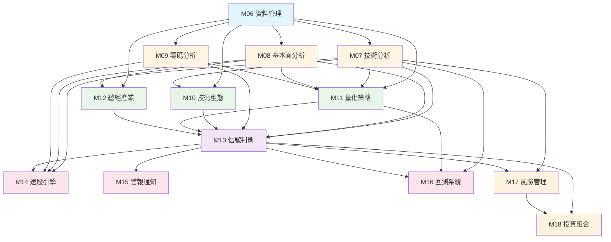

# 模組清單與依賴關係

> **文件編號**: SPEC-MODULE-00  
> **文件名稱**: 模組清單與依賴關係  
> **版本**: v2.0  
> **最後更新**: 2025-12-31  
> **狀態**: Draft

---

## 📑 目錄

1. [模組清單](#1-模組清單)
2. [模組依賴關係圖](#2-模組依賴關係圖)
3. [模組分層說明](#3-模組分層說明)
4. [模組間通訊方式](#4-模組間通訊方式)
5. [模組開發優先級](#5-模組開發優先級)

---

## 1. 模組清單

### 1.1 完整模組列表

| 模組編號 | 模組名稱 | 職責說明 | 持久層選擇 | 依賴模組 | 文件編號 |
|---------|---------|---------|----------|---------|---------|
| M06 | 資料管理模組 | 資料獲取、清洗、儲存、更新排程 | JPA (主) + MyBatis (批次) | 無 | DOC-01-M06 |
| M07 | 技術分析模組 | 計算 71 個技術指標 | JPA + MyBatis | M06 | DOC-02-M07 |
| M08 | 基本面分析模組 | 計算 75 個財務指標 | MyBatis (主) + JPA | M06 | DOC-03-M08 |
| M09 | 籌碼分析模組 | 分析三大法人、融資融券 | MyBatis | M06 | DOC-04-M09 |
| M10 | 技術型態辨識模組 | 識別 K 線、圖表、趨勢型態 | JPA + MyBatis | M06, M07 | DOC-05-M10 |
| M11 | 量化策略模組 | 策略框架、策略庫、參數優化 | MyBatis | M06, M07, M08, M09 | DOC-06-M11 |
| M12 | 總經與產業分析模組 | 總經指標、產業分類、產業輪動 | JPA (主) | M06, M08 | DOC-07-M12 |
| M13 | 信號判斷引擎 | 統一信號生成、去重、合併、評分 | JPA + MyBatis | M07, M08, M09, M10, M11, M12 | DOC-08-M13 |
| M14 | 選股引擎 | 多條件篩選、預設策略、排序排名 | MyBatis (主) | M06, M07, M08, M09, M13 | DOC-09-M14 |
| M15 | 警報通知系統 | 警報設定、多通道通知、頻率控制 | JPA (主) | M13 | DOC-10-M15 |
| M16 | 回測系統 | 策略回測、績效評估、參數優化 | MyBatis | M06, M07, M11, M13 | DOC-11-M16 |
| M17 | 風險管理模組 | 停損停利、部位管理、風險指標 | JPA + MyBatis | M06, M07, M13 | DOC-12-M17 |
| M18 | 投資組合管理 | 持股記錄、損益計算、績效分析 | JPA + MyBatis | M06, M13, M17 | DOC-13-M18 |

### 1.2 持久層選擇說明

| 選擇 | 說明 | 適用場景 |
|-----|------|---------|
| **JPA (主)** | 該模組主要使用 JPA 處理 CRUD | 簡單的實體操作、標準 CRUD |
| **MyBatis (主)** | 該模組主要使用 MyBatis 處理複雜查詢 | 複雜查詢、動態 SQL、批次操作 |
| **JPA + MyBatis** | 該模組需要混合使用兩者 | CRUD + 複雜查詢並存 |

---

## 2. 模組依賴關係圖

### 2.1 ASCII 依賴圖

```
                        ┌─────────┐
                        │   M06   │
                        │資料管理  │
                        │JPA+MyBa │
                        └─────────┘
                             │
                  ┌──────────┼──────────┐
                  ↓          ↓          ↓
            ┌─────────┐ ┌─────────┐ ┌─────────┐
            │   M07   │ │   M08   │ │   M09   │
            │技術分析  │ │基本面    │ │籌碼分析  │
            │JPA+MyBa │ │MyBatis  │ │MyBatis  │
            └─────────┘ └─────────┘ └─────────┘
                  │          │          │
                  └──────────┼──────────┘
                             ↓
                  ┌──────────┴──────────┐
                  ↓          ↓          ↓
            ┌─────────┐ ┌─────────┐ ┌─────────┐
            │   M10   │ │   M11   │ │   M12   │
            │型態辨識  │ │量化策略  │ │總經產業  │
            │JPA+MyBa │ │MyBatis  │ │  JPA    │
            └─────────┘ └─────────┘ └─────────┘
                  │          │          │
                  └──────────┼──────────┘
                             ↓
                       ┌─────────┐
                       │   M13   │
                       │信號引擎  │
                       │JPA+MyBa │
                       └─────────┘
                             │
                  ┌──────────┼──────────┐
                  ↓          ↓          ↓
            ┌─────────┐ ┌─────────┐ ┌─────────┐
            │   M14   │ │   M15   │ │   M16   │
            │選股引擎  │ │警報通知  │ │回測系統  │
            │MyBatis  │ │  JPA    │ │MyBatis  │
            └─────────┘ └─────────┘ └─────────┘
                  │                       │
                  └───────┬───────────────┘
                          ↓
                    ┌────────────┐
                    │   M17      │
                    │風險管理     │
                    │JPA+MyBatis │
                    └────────────┘
                          ↓
                    ┌────────────┐
                    │   M18      │
                    │投資組合     │
                    │JPA+MyBatis │
                    └────────────┘
```

### 2.2 Mermaid 依賴圖



---

## 3. 模組分層說明

### 3.1 六層架構

#### Layer 1: 資料層（基礎）
- **模組**: M06 資料管理模組
- **職責**: 提供乾淨、正確的資料給其他模組
- **特性**: 獨立，無依賴
- **核心功能**:
  - 股價資料獲取與同步
  - 財報資料獲取與解析
  - 籌碼資料獲取
  - 資料品質檢核
  - 交易日曆管理

#### Layer 2: 分析層（核心）
- **模組**: M07 技術分析、M08 基本面分析、M09 籌碼分析
- **職責**: 基於原始資料進行各類分析與指標計算
- **依賴**: M06
- **核心功能**:
  - M07: 計算 71 個技術指標
  - M08: 計算 75 個基本面指標
  - M09: 分析三大法人、融資融券

#### Layer 3: 進階分析層
- **模組**: M10 技術型態辨識、M11 量化策略、M12 總經與產業分析
- **職責**: 基於 Layer 2 的分析結果進行更高層次的判斷
- **依賴**: M06, M07, M08, M09
- **核心功能**:
  - M10: K 線型態、圖表型態識別
  - M11: 策略框架與參數優化
  - M12: 總經指標、產業輪動

#### Layer 4: 信號層
- **模組**: M13 信號判斷引擎
- **職責**: 整合所有分析結果，產生統一的買賣信號
- **依賴**: M07, M08, M09, M10, M11, M12
- **核心功能**:
  - 統一信號生成
  - 信號去重與合併
  - 信號評分與排序

#### Layer 5: 應用層
- **模組**: M14 選股引擎、M15 警報通知系統、M16 回測系統
- **職責**: 基於信號提供各類應用功能
- **依賴**: M13（主要）
- **核心功能**:
  - M14: 多條件篩選、排序排名
  - M15: 警報設定、多通道通知
  - M16: 策略回測、績效評估

#### Layer 6: 管理層
- **模組**: M17 風險管理、M18 投資組合管理
- **職責**: 資金管理與績效追蹤
- **依賴**: M06, M13, M17
- **核心功能**:
  - M17: 停損停利、部位管理
  - M18: 持股記錄、損益計算

### 3.2 分層特性

| 層級 | 特性 | 耦合度 | 擴展性 |
|-----|------|-------|-------|
| Layer 1 | 基礎、穩定 | 無依賴 | 低 |
| Layer 2 | 核心、獨立 | 僅依賴 L1 | 中 |
| Layer 3 | 進階、組合 | 依賴 L1+L2 | 中 |
| Layer 4 | 整合、統一 | 依賴 L2+L3 | 高 |
| Layer 5 | 應用、多樣 | 依賴 L4 | 高 |
| Layer 6 | 管理、追蹤 | 依賴 L1+L4+L5 | 中 |

---

## 4. 模組間通訊方式

### 4.1 通訊方式對比

| 通訊方式 | 使用場景 | 範例 | 優點 | 缺點 |
|---------|---------|------|------|------|
| **直接呼叫** | 同步處理，實時回應 | Controller → Service → Repository | 簡單直接 | 強耦合 |
| **事件驅動** | 非同步處理，解耦模組 | 信號產生 → 發布事件 → 通知系統監聽 | 解耦，擴展性好 | 複雜度較高 |
| **Job 排程** | 批次處理，定時執行 | 每日資料更新、指標計算 | 可控時間 | 不適合即時處理 |
| **訊息佇列** | 高併發、可靠性要求 | 大量通知發送（可選，未來擴充） | 高可靠性 | 增加系統複雜度 |

### 4.2 通訊方式選擇準則

**同步直接呼叫** (適用於):
- API 請求處理
- 即時查詢
- 依賴關係明確的模組

**事件驅動** (適用於):
- 模組間解耦
- 一對多通知
- 非即時處理

**Job 排程** (適用於):
- 批次資料處理
- 定時任務
- 資源密集型操作

---

## 5. 模組開發優先級

### 5.1 Phase 1: MVP 核心（必須）
**目標**: 建立最小可用系統，驗證核心功能

| 順序 | 模組 | 開發範圍 | 預估時間 |
|-----|------|---------|---------|
| 1 | M06 資料管理模組 | 股價資料獲取、基礎 CRUD | 2 週 |
| 2 | M07 技術分析模組（部分） | 5-10 個常用指標（MA、MACD、RSI、KD） | 1 週 |
| 3 | M13 信號判斷引擎（簡化版） | 基礎信號生成、儲存 | 1 週 |
| 4 | M15 警報通知系統（基礎） | Email 通知、簡單條件設定 | 1 週 |

**里程碑**: 能夠監控指定股票並發送警報

---

### 5.2 Phase 2: 核心功能完善
**目標**: 完善分析能力，提供完整功能

| 順序 | 模組 | 開發範圍 | 預估時間 |
|-----|------|---------|---------|
| 1 | M07 技術分析模組（完整） | 全部 71 個技術指標 | 2 週 |
| 2 | M08 基本面分析模組 | 75 個財務指標 | 2 週 |
| 3 | M09 籌碼分析模組 | 三大法人、融資融券分析 | 1 週 |
| 4 | M14 選股引擎 | 多條件篩選、排序 | 1 週 |

**里程碑**: 提供完整的多維度分析與選股功能

---

### 5.3 Phase 3: 進階功能
**目標**: 增加策略與回測能力

| 順序 | 模組 | 開發範圍 | 預估時間 |
|-----|------|---------|---------|
| 1 | M10 技術型態辨識模組 | K 線型態、圖表型態 | 2 週 |
| 2 | M11 量化策略模組 | 策略框架、預設策略 | 2 週 |
| 3 | M16 回測系統 | 策略回測、績效評估 | 2 週 |
| 4 | M17 風險管理模組 | 停損停利、部位管理 | 1 週 |
| 5 | M18 投資組合管理 | 持股追蹤、損益計算 | 1 週 |

**里程碑**: 支援策略開發、回測與投資組合管理

---

### 5.4 Phase 4: 擴展功能
**目標**: 總經分析與系統優化

| 順序 | 模組/功能 | 開發範圍 | 預估時間 |
|-----|----------|---------|---------|
| 1 | M12 總經與產業分析模組 | 總經指標、產業輪動 | 2 週 |
| 2 | 前端整合 | Web UI、儀表板 | 3 週 |
| 3 | 效能優化 | 快取優化、查詢優化 | 1 週 |
| 4 | 監控與告警完善 | Prometheus、Grafana | 1 週 |

**里程碑**: 系統功能完整，效能穩定

---

## 📚 相關文檔

- [系統功能總覽](./00-系統功能總覽.md)
- [全系統契約](./00-全系統契約.md)
- [技術架構](./00-技術架構.md)
- [系統架構圖](../design/00-系統架構圖.md)

---

**文件維護者**: 系統架構師  
**最後更新**: 2025-12-31  
**下次審核**: 2026-01-31
